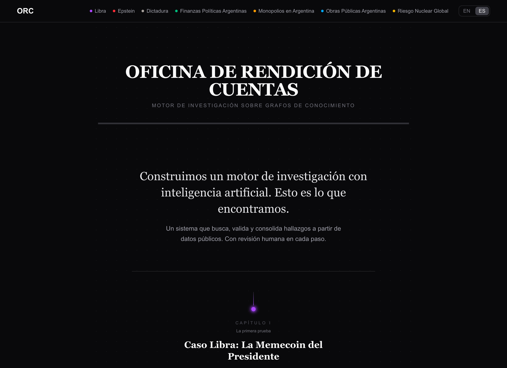
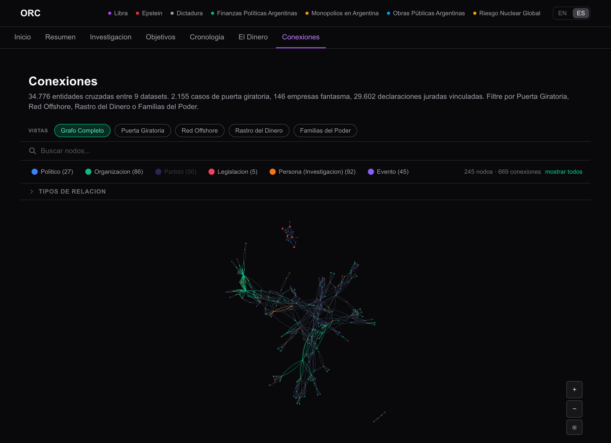
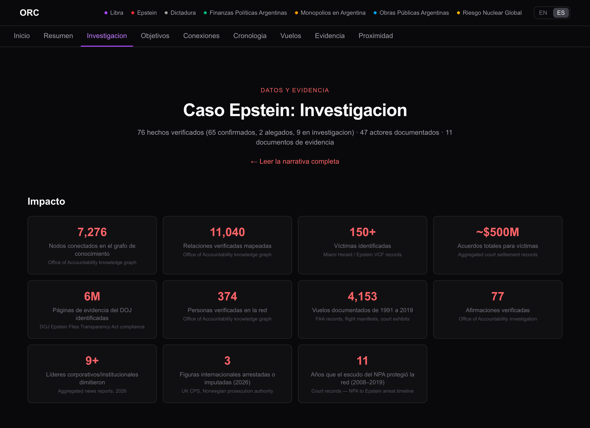
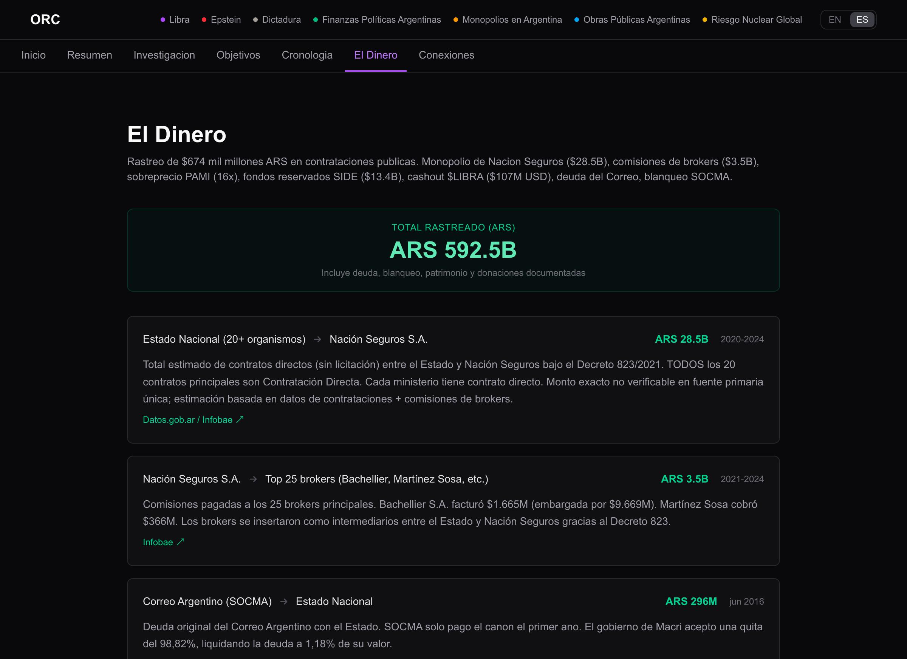

# Office of Accountability

> Civic knowledge platform that transforms fragmented public records into navigable knowledge graphs. Cross-reference entities across datasets to reveal connections between persons, organizations, documents, and financial flows.



---

## Investigations

### Chapter I -- Caso Libra: La Memecoin del Presidente
Milei promoted **$LIBRA** to 19 million followers. The price collapsed 94% in hours. The engine processed blockchain transactions, parliamentary documents, and social media. **$251M+** in losses, **114K** wallets affected.

### Chapter II -- Caso Epstein: Trafficking Network
**7,276** entities, **374** verified actors, **1,044** court documents. Decades of history consolidated into a single graph. Flight records, court filings, testimonies, financial flows -- all connected.

### Chapter III -- Finanzas Politicas Argentinas
Congressional voting records, asset declarations, offshore companies, campaign financing. **329** legislators, **7** cross-referenced data sources mapping the connections between politicians and money.

### Chapter IV -- Obras Publicas, Monopolios & Caso Adorni
**87,725** public works contracts cross-referenced against international bribery cases. **18 sectors** analyzed for market concentration. The engine flagged a **$3,650M** tender awarded to a company with **11** cross-references to prior investigations.

### Chapter V -- Caso Dictadura: 1976-1983
Argentine military dictatorship. **9,415** documented victims, **774** clandestine detention centers, **14,512** nodes. 81.5% of documented represors have no judicial link.

### Chapter VI -- Global Nuclear Risk *(in development)*
Daily monitoring of nuclear escalation signals. **31** sources, **9** nuclear states, **7** theaters monitored.

---

## Features

### Interactive Graph Explorer



Force-directed graph visualization with real-time search, keyboard navigation, path finding between nodes, and filtering by entity type and confidence tier.

### Investigation Engine



Each investigation includes factchecks, timelines, actor profiles, evidence documents, and financial flow tracking -- all linked to the underlying knowledge graph.

### Money Flow Tracking



Fund tracing based on court documents, congressional reports, and financial disclosures. Every flow is cited to its source.

---

## Stack

| Layer | Technology |
|-------|-----------|
| **Framework** | Next.js 16 + Vite 8 + React 19 |
| **Database** | Neo4j 5 Community (knowledge graph) |
| **Styling** | TailwindCSS 4 |
| **Language** | TypeScript 5, Zod 4 |
| **i18n** | next-intl (ES primary, EN secondary) |
| **Visualization** | react-force-graph-2d + dagre layouts |
| **Rich Text** | Tiptap editor |
| **Local LLM** | MiroFish (llama.cpp on GPU) |

---

## Quick Start

```bash
# 1. Clone and install
git clone https://github.com/GabrielRuizVarela/office-of-accountability.git
cd office-of-accountability/webapp
pnpm install

# 2. Start Neo4j
docker compose -f ../docker-compose.yml up -d

# 3. Configure environment
cp ../.env.example .env
# Edit .env — generate AUTH_SECRET: openssl rand -base64 32

# 4. Initialize database schema
pnpm run db:init-schema

# 5. Start dev server
pnpm run dev
```

Open [http://localhost:5173](http://localhost:5173).

---

## Environment Variables

| Variable | Required | Description |
|----------|----------|-------------|
| `NEO4J_URI` | Yes | Bolt connection (`bolt://localhost:7687`) |
| `NEO4J_USER` | Yes | Neo4j username (default: `neo4j`) |
| `NEO4J_PASSWORD` | Yes | Neo4j password (empty for local dev) |
| `APP_URL` | Yes | Application URL (`http://localhost:3000`) |
| `AUTH_SECRET` | Yes | `openssl rand -base64 32` |
| `MIROFISH_API_URL` | No | llama.cpp server for simulation engine |
| `INVESTIGATION_API_KEY` | Prod | API key for investigation submissions |

---

## Scripts

### Development

```bash
pnpm run dev            # Vite dev server with HMR
pnpm run build          # Production build
pnpm run start          # Preview production build
pnpm run lint           # ESLint
pnpm run typecheck      # TypeScript strict check
pnpm run test           # Vitest unit tests
```

### ETL & Ingestion

```bash
pnpm run etl:como-voto           # Congressional voting records
pnpm run etl:comprar             # Federal procurement (Comprar)
pnpm run etl:contratar           # Federal contracts (ContratAR)
pnpm run etl:mapa-inversiones    # Public works investment map
pnpm run ingest:debarment        # World Bank/IDB sanctions
pnpm run cross-ref               # CUIT/DNI entity resolution
pnpm run obras:cross-ref         # Public works cross-reference
```

Discover all scripts: `grep -E '"[^"]+":' webapp/package.json | grep -i "ingest\|cross\|etl\|seed"`

---

## Project Structure

```
webapp/src/
├── app/                      # Next.js App Router
│   ├── caso/                 # Investigation case pages
│   │   ├── [slug]/           # Dynamic routes (resumen, grafo, evidencia, etc.)
│   │   ├── adorni/           # Caso Adorni
│   │   ├── caso-epstein/     # Caso Epstein
│   │   ├── caso-dictadura/   # Caso Dictadura
│   │   └── ...
│   ├── api/                  # API routes
│   │   ├── caso/[slug]/      # Graph, flights, proximity, simulation
│   │   ├── caso-libra/       # Investigation, wallets, simulate
│   │   ├── graph/            # Search, query, path, expand
│   │   └── og/               # Open Graph image generation
│   └── explorar/             # Interactive graph explorer
│
├── components/
│   ├── graph/                # ForceGraph, NodeDetailPanel, PathFinder, SearchBar
│   ├── landing/              # Masthead, Chapter, NarrativeIntro, WhatsNext
│   └── ...                   # Investigation, layout, UI components
│
├── etl/                      # ETL pipeline modules
│   ├── cross-reference/      # CUIT/DNI entity resolution engine
│   ├── comprar/              # Federal procurement
│   ├── cne-finance/          # Campaign finance
│   └── ...                   # 15+ data source modules
│
├── lib/
│   ├── caso-*/               # Per-case data, queries, types (8 cases)
│   ├── neo4j/                # Driver, schema, config
│   ├── auth/                 # CSRF protection
│   ├── ingestion/            # Pipeline utilities, dedup, quality
│   ├── graph/                # Query builders, algorithms
│   └── rate-limit/           # API rate limiting
│
├── config/                   # Investigation registry, roadmap
├── i18n/                     # Internationalization
└── types/                    # Shared TypeScript types
```

---

## Architecture

### Knowledge Graph

All investigation data lives in Neo4j with typed nodes and relationships:

- **24 node labels:** Person, Organization, Document, Event, Location, Flight, LegalCase, Contract, Politician, Legislation, and case-specific labels
- **40+ relationship types:** ASSOCIATED_WITH, FLEW_WITH, FINANCED, AWARDED_TO, DONATED_TO, MENTIONED_IN, and more
- **Confidence tiers:** `gold` (curated, 2+ sources) > `silver` (web-verified) > `bronze` (raw ingested)

### Security

- **Parameterized Cypher** -- never string interpolation
- **CSRF** -- signed double-submit cookies on all mutations
- **Rate limiting** -- 60/min reads, 30/min mutations per IP
- **Security headers** -- X-Content-Type-Options, X-Frame-Options, Referrer-Policy
- **Input sanitization** -- Tiptap XSS sanitizer, Zod validation at boundaries
- **Query timeouts** -- 5s default, 15s for graph queries

### Data Sources

| Source | Type |
|--------|------|
| Como Voto | Congressional voting records |
| Comprar / ContratAR | Federal procurement & contracts |
| IGJ (OpenCorporates) | Corporate registry |
| Boletin Oficial | Official gazette |
| Mapa de Inversiones | Public works investment |
| CNE | Campaign finance |
| ICIJ | Offshore leaks |
| World Bank / IDB | Debarment lists |
| DOJ / FBI / State Dept | Declassified documents (FOIA) |
| RUVTE / SIDE | Dictatorship records |

---

## Roadmap

```
Phase 1  [COMPLETED]    Knowledge graph + investigations
━━━━━━━━━━━━━━━━━━━━━━━━━━━━━━━━━━━━━━━━━━━━━━━━━━━━━━━━━

  Interactive graph explorer (Neo4j)
  Automated legislative data ingestion
  Politician profiles with voting history
  8 published investigations

Phase 2  [IN PROGRESS]  Autonomous investigation engine
━━━━━━━━━━━━━━━━━━━━━━━

  Ingestion -> verification -> enrichment -> report pipeline
  LLM-assisted with human review at every gate
  Reusable templates for new domains
  Data connectors: APIs, scrapers, court documents

Phase 3  [NEXT]         MCP + manual investigations

  MCP server for creating and running investigations
  Graph queries, cross-referencing, and reports via MCP
  Integration with MCP clients (Claude, Cursor, custom agents)
  Investigation export (PDF, open data)

Phase 4  [FUTURE]       Community governance

  Endorsement system for claims and evidence
  Investigation coalitions with roles and reputation
  Identity verification (DNI/CUIL)
  Consensus mechanisms for validating findings

Phase 5  [FUTURE]       Accountability scoring

  Algorithmic accountability scoring (A/B/C/D per politician)
  Citizen mandates linked to the knowledge graph
  Liquid democracy and quadratic voting
```

---

## Testing

```bash
pnpm run test                    # Unit tests (Vitest)
npx playwright test              # E2E tests (needs dev server + Neo4j)
pnpm run typecheck               # TypeScript strict check
```

**117 E2E tests** covering auth, graph visualization, security headers, CSRF, input sanitization, rate limiting, mobile responsiveness, and critical user flows.

---

## Deployment

Automatic on push to `main` via GitHub Actions. Health check every 10 minutes with auto-rescue.

See [docs/RUNBOOK.md](docs/RUNBOOK.md) for deployment procedures, monitoring, and troubleshooting.

---

## Contributing

See [docs/CONTRIBUTING.md](docs/CONTRIBUTING.md) for setup, code standards, and investigation data guidelines.

---

## Architecture Decisions

Key decisions documented in [docs/adr/](docs/adr/):

| ADR | Decision |
|-----|----------|
| [0001](docs/adr/0001-neo4j-graph-database.md) | Neo4j as primary database |
| [0002](docs/adr/0002-confidence-tier-system.md) | Gold/silver/bronze confidence tiers |
| [0003](docs/adr/0003-two-pass-graph-queries.md) | Two-pass queries to avoid cartesian products |
| [0004](docs/adr/0004-in-memory-cross-reference.md) | In-memory Map joins for entity resolution |
| [0005](docs/adr/0005-vite-over-next-bundler.md) | Vite as build system via vinext |
| [0006](docs/adr/0006-bilingual-investigation-data.md) | Bilingual data (ES primary, EN secondary) |
| [0007](docs/adr/0007-csrf-double-submit.md) | CSRF via signed double-submit cookie |
| [0008](docs/adr/0008-force-graph-freeze.md) | Freeze graph nodes after layout converges |
| [0009](docs/adr/0009-agpl-dual-license.md) | AGPL-3.0 with dual commercial license |

---

## License

**AGPL-3.0** -- see [LICENSE](LICENSE).

For commercial licensing, see [NOTICE.md](NOTICE.md).
