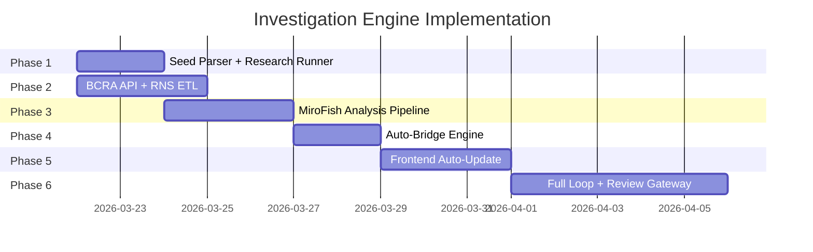

# Tasks — Office of Accountability

**Version:** 0.3
**Date:** 2026-03-17
**Stack:** Vinext (App Router) + Neo4j 5 Community + react-force-graph-2d + Cloudflare Workers
**Neo4j transport:** Bolt over WebSocket (neo4j-driver-lite browser/ESM build) — HTTP API as fallback only (deprecated in 5.26)

---

## Milestone 0: Project Scaffolding

**Goal:** Bootable dev environment with Neo4j running, Workers ↔ Neo4j connectivity proven, CI green.

### Setup
- [x] Initialize Vinext app (App Router, TypeScript, Tailwind CSS)
- [x] Set up Docker Compose: Neo4j 5 Community + Vinext dev server
- [x] Create Neo4j schema initialization script (constraints + indexes)
  - Unique constraints: Politician.id, Legislation.expediente_id, LegislativeVote.acta_id
  - Full-text indexes: Politician.name, Legislation.title
  - Inspired by br-acc's `init.cypher` pattern
- [x] Establish project structure:
  ```
  app/              — Vinext App Router pages + API routes
  lib/neo4j/        — Bolt/WS client wrapper, query helpers
  lib/graph/        — Graph data transforms (Neo4j records -> API responses)
  components/       — React components
  etl/              — Data ingestion scripts
  ```
- [x] Create `.env.example` with Neo4j connection config (NEO4J_URI, NEO4J_USER, NEO4J_PASSWORD)
  - NEO4J_URI uses `wss://` scheme for Bolt over WebSocket (e.g., `wss://neo4j.example.com:7688`)
- [x] Add ESLint + Prettier config
- [x] Configure `vinext.config.ts` for Cloudflare Workers deployment

### Neo4j Connectivity Spike (CRITICAL PATH)

Workers run on V8 isolates — no Node.js `net`/`tls` modules. Standard `neo4j-driver` uses TCP sockets and won't work. Three options evaluated:

| Option | Transport | Status | Risk |
|--------|-----------|--------|------|
| **A: neo4j-driver-lite over WebSocket** | Bolt over WS | **Primary — validate first** | Browser build may need polyfills in Workers |
| B: Neo4j HTTP API | HTTP fetch() | Fallback only | Deprecated in Neo4j 5.26, will be removed |
| C: Workers TCP connect() + Bolt | Raw TCP | Rejected | Would require forking driver transport layer |

**Primary path: Option A (Bolt over WebSocket)**

- [x] **SPIKE-1:** neo4j-driver-lite ESM build imports cleanly in Vinext/Workers
  - Install `neo4j-driver-lite` — browser/ESM build uses WebSocket transport
  - Verify: import resolves, no Node.js-only APIs referenced at build time
  - If import fails: identify missing polyfills (likely `globalThis.WebSocket` — Workers have it natively)
- [x] **SPIKE-2:** Neo4j WebSocket listener configuration
  - Enable Bolt over WebSocket on Neo4j instance (Docker + production)
  - Docker Compose: add `NEO4J_server_bolt_listen__address__ws=0.0.0.0:7688` or equivalent config
  - Production (Railway/Fly.io): configure WS listener, expose port, enable TLS
  - Connection URI: `wss://host:7688` for production, `ws://localhost:7688` for dev
- [x] **SPIKE-3:** Round-trip query from Worker → Neo4j via Bolt/WS
  - Deploy minimal Worker with one Cypher query: `RETURN 1 AS ok`
  - Verify: response arrives, latency acceptable (expect 20-80ms edge → Railway)
  - Test multiple queries in single invocation (no connection pool — each invocation opens fresh)
  - Test error case: Neo4j down → Worker returns 503 gracefully
- [x] **SPIKE-4:** Validate Workers constraints don't break driver
  - Workers have 6 simultaneous connections per invocation — each query is 1 connection
  - Workers have 128MB memory — verify driver memory footprint
  - Workers have 30s CPU time — verify query round-trip within budget
  - No persistent state between invocations — driver session must be created per request

**Fallback path: Option B (HTTP API) — only if Option A fails**

- [ ] If Bolt/WS fails: build thin HTTP client (`lib/neo4j/http-fallback.ts`)
  - `POST /db/neo4j/tx/commit` with `fetch()` — parameterized Cypher over JSON
  - Pin Neo4j version below 5.26 (we control the instance)
  - Accept deprecation risk — plan migration to Bolt/WS when driver support improves
  - Track Neo4j HTTP API removal timeline

**Client wrapper (built on whichever transport wins)**

- [x] `lib/neo4j/client.ts` — unified client interface regardless of transport
  - `query(cypher, params)` → typed results
  - `queryGraph(cypher, params)` → `{ nodes, links }` format for react-force-graph-2d
  - Transaction support: read/write transactions per request lifecycle
  - Error handling: connection errors → 503, query errors → 400/500, timeout → 504
  - Retry: single retry on connection drop (Workers invocations are short-lived)
  - Auth: Neo4j credentials from Cloudflare Workers secrets

### Security & Observability (M0)
- [ ] Sentry error monitoring setup (Cloudflare Workers integration)
- [ ] Structured logging (JSON, correlation IDs per request)
- [ ] Neo4j credentials: Cloudflare Workers secrets (not env vars in plaintext)
- [ ] CORS configuration: allowlist production domain only
- [x] Security headers middleware: `X-Content-Type-Options`, `X-Frame-Options`, `Strict-Transport-Security`, `Content-Security-Policy`

### CI/CD
- [ ] GitHub Actions: lint, type-check, test on PR
- [ ] GitHub Actions: `vinext deploy` to Cloudflare on merge to main
- [ ] Branch protection: require CI pass before merge

### Verification
- [ ] `docker compose up` → Neo4j healthy (Bolt + WS listeners), schema constraints exist, app loads at localhost:3000
- [ ] Local: `neo4j-driver-lite` connects to Neo4j via `ws://localhost:7688`, runs `RETURN 1 AS ok`
- [ ] Deployed: Worker connects to Neo4j via `wss://`, runs parameterized Cypher query, returns JSON
- [ ] Deployed: Neo4j unreachable → Worker returns `{ error: "Service unavailable" }` with 503
- [ ] Deployed: multiple queries in single invocation succeed (test with 3 sequential queries)
- [ ] `vinext deploy` → deploys to Cloudflare Workers successfully
- [ ] Sentry test event fires from deployed Worker
- [ ] Spike decision documented: which transport won and why

**Dependencies:** None
**Spike exit criteria:** If Option A (Bolt/WS) fails after 2 days of effort, switch to Option B (HTTP API) and document blockers for future revisit.

---

## Milestone 1: Como Voto Data Ingestion

**Goal:** All 329 current legislators with full vote history queryable in Neo4j.

### ETL Pipeline
- [x] ETL script to fetch Como Voto JSON output (`etl/como-voto.ts`)
- [x] Normalize Como Voto data to Neo4j nodes:
  - `Politician` — name, bloc, coalition, chamber, photo_url
  - `LegislativeVote` — acta_id, date, position (afirmativo/negativo/abstencion/ausente)
  - `Legislation` — title, expediente_id, status, chamber
  - `Jurisdiction` — level, name (province)
- [x] Create relationships:
  - `(:Politician)-[:CAST_VOTE]->(:LegislativeVote)`
  - `(:LegislativeVote)-[:ON_LEGISLATION]->(:Legislation)`
  - `(:Politician)-[:REPRESENTS]->(:Jurisdiction)`
- [x] Data validation: reject malformed records, log warnings with line/record context
- [x] Deduplication: match politicians across chambers/sessions by name + jurisdiction
- [x] Seed script: `npm run seed` — one-command full ingestion

### Security
- [x] ETL runs locally or in CI — never from Workers (no user input path)
- [x] Sanitize all string fields before Neo4j insertion (prevent Cypher injection via data)
- [x] Validate Como Voto JSON schema with Zod before processing

### Verification
- [ ] 329 Politician nodes (257 Diputados + 72 Senadores)
- [ ] Every Politician has at least one `CAST_VOTE` relationship
- [ ] Every LegislativeVote has exactly one `ON_LEGISLATION` relationship
- [ ] Every Politician has exactly one `REPRESENTS` relationship to a Jurisdiction
- [ ] No orphan nodes (votes without legislation, politicians without jurisdiction)
- [ ] Idempotency: run `npm run seed` twice → same node count, no duplicates
- [ ] `MATCH (p:Politician)-[:CAST_VOTE]->(v)-[:ON_LEGISLATION]->(l) RETURN p.name, v.position, l.title LIMIT 10` → returns results

**Dependencies:** Milestone 0

---

## Milestone 2: Graph API Layer

**Goal:** API routes that serve graph data in a format compatible with react-force-graph-2d.

### Neo4j Client
- [x] Typed query helpers built on M0 client wrapper (`lib/neo4j/queries.ts`)
- [x] Graph response transformer: Neo4j records → `{ nodes, links }` for react-force-graph-2d
  - Nodes: `{ id, label, type, properties }`
  - Links: `{ source, target, type, properties }`

### API Routes
- [x] `GET /api/graph/node/[id]` — single node + 1-hop connections
- [x] `GET /api/graph/expand/[id]?depth=1` — expand connections (configurable depth, default 1, max 3)
- [x] `GET /api/graph/search?q=` — full-text search across Politician.name, Legislation.title
- [x] `GET /api/graph/query` — structured graph queries (node type filters, date range, jurisdiction)
- [x] Cursor-based pagination on search and query endpoints

### Security & Rate Limiting
- [x] Input validation with Zod on all query parameters
- [x] Depth parameter clamped to max 3 (prevent expensive traversals)
- [x] Query timeout: 5s max per Neo4j query (prevent graph bombs)
- [x] Rate limiting via Cloudflare Rate Limiting Rules:
  - Read endpoints: 60 req/min per IP
  - Search endpoint: 30 req/min per IP (heavier query)
- [x] Error handling: structured error responses, no Neo4j internals leaked
- [x] Node ID validation: reject non-UUID/non-integer IDs before query
- [x] Response size cap: max 500 nodes per response (prevent memory exhaustion)

### Verification
- [x] `GET /api/graph/node/{politician_id}` → returns node + connections in `{ nodes, links }` format
- [x] `GET /api/graph/expand/{id}?depth=2` → returns 2-hop neighborhood (51 nodes, 50 links)
- [x] `GET /api/graph/expand/{id}?depth=5` → returns 400 "must be integer 1-3" (rejects out-of-range depth)
- [x] `GET /api/graph/search?q=cristina` → returns 20 fuzzy matches
- [x] `GET /api/graph/search?q=` (empty) → returns 400 with structured error
- [x] `GET /api/graph/node/nonexistent` → returns 404 with structured error
- [x] 100+ requests in 1 minute → returns 429 (rate limit at 60 req/min per IP)
- [x] Malformed query params → 400, not 500
- [x] Neo4j down → graceful 503 "Database unavailable", no stack trace leaked

**Dependencies:** Milestone 1

---

## Milestone 3: Graph Explorer (Frontend)

**Goal:** Interactive graph visualization — click a politician, see connections fan out.

*Can run in parallel with Milestone 4.*

### Graph Canvas
- [x] react-force-graph-2d integration (following br-acc's GraphCanvas pattern)
- [x] Node rendering by type — distinct colors, sizes, labels per node type:
  - Politician (blue, large), LegislativeVote (green/red by position), Legislation (purple), Jurisdiction (gray)
  - Follow br-acc's `nodeRendering.ts` pattern
- [x] Edge rendering by relationship type (line style, color, label)
- [x] Click-to-expand: click a node → fetch + display 1-hop connections
- [x] Node tooltip on hover: key properties (name, party, province for Politician; title, date for Vote)

### Controls & Navigation
- [x] Filter sidebar: filter by node type (checkboxes), date range (for votes/legislation)
- [x] Zoom controls + minimap for orientation
- [x] Search bar with autocomplete (hits `/api/graph/search`)
- [x] Keyboard navigation: Tab between nodes, Enter to expand, Escape to deselect
- [x] Loading states + empty states

### Mobile
- [x] Mobile-responsive layout (graph fills viewport, sidebar collapses to bottom sheet)
- [x] Touch: pinch-to-zoom, tap-to-select, long-press for tooltip

### Security
- [x] Sanitize all node labels/properties before rendering (prevent stored XSS via graph data)
- [x] CSP: restrict script sources, disallow inline scripts

### Verification (E2E)
- [x] Load `/explorar` → graph canvas renders with nodes visible
- [x] Click politician node → triggers expand API call → new nodes appear
- [x] Type in search bar → autocomplete dropdown appears → select result → graph centers on node
- [x] Toggle node type filter off → those nodes disappear from canvas
- [x] Mobile viewport (375px) → sidebar collapses to bottom sheet, graph is interactive
- [x] Tab navigation: can reach and expand nodes via keyboard only

**Dependencies:** Milestone 2

---

## Milestone 4: Politician Profiles (SEO)

**Goal:** Server-rendered politician pages that rank in Google for "[politician name] votaciones".

*Can run in parallel with Milestone 3.*

### Pages
- [x] Page route: `/politico/[slug]` — server-rendered with Server Components, ISR via Cloudflare KV
- [x] Slug generation: normalize name to URL-safe slug (handle accents, spaces)
- [x] Graph sub-view: react-force-graph-2d centered on the politician node (1-hop)
- [x] Tabs layout:
  - **Conexiones** — graph sub-view (default)
  - **Votaciones** — vote history table
  - **Investigaciones** — empty state until M6 ("Proximamente")
- [x] Vote history: filterable by date/legislation, paginated, color-coded by position
  - Afirmativo (green), Negativo (red), Abstencion (yellow), Ausente (gray)
- [x] Province-first browse page: `/provincias/[province]` — list politicians by province
- [x] Fuzzy search with accent handling (e.g., "Cristina" matches "Cristina Fernandez")
- [x] Breadcrumb navigation: Home > Provincia > Politician

### SEO
- [x] Schema.org structured data: `Person` + `GovernmentOrganization`
- [x] OG tags: auto-generated per politician (name, party, province, photo)
- [x] `sitemap.xml` generation: all politician slugs + province pages
- [x] Canonical URLs to prevent duplicate content

### Security
- [x] Slug validation: reject traversal attempts (`../`, encoded slashes)
- [x] ISR cache: set appropriate `stale-while-revalidate` — no serving stale data indefinitely
- [x] Sanitize all politician data before HTML rendering (prevent stored XSS)

### Verification
- [x] `GET /politico/fernandez-de-kirchner-cristina` → 200, contains Schema.org JSON-LD
- [x] `GET /politico/nonexistent-slug` → 404 page
- [x] `curl /politico/fernandez-de-kirchner-cristina` → HTML contains politician name in body (server-rendered, not client-only)
- [x] OG tags present: `og:title`, `og:image`, `og:description`
- [x] Vote history tab: API returns 830 votes paginated (20/page), hasMore=true
- [x] `/provincias/buenos-aires` → lists all Buenos Aires politicians
- [x] `/sitemap.xml` → contains 2257 politician URLs
- [x] `/politico/../../etc/passwd` → 404, not error

**Dependencies:** Milestone 2

---

## Milestone 5: User Accounts + Auth

**Goal:** Users can register, log in, and own content. Auth in place before investigation engine.

### Auth Setup
- [x] Auth.js setup: email + password provider (credentials)
- [x] Optional social login (Google OAuth)
- [x] User registration with email verification
- [x] User profile page (`/perfil`)
- [x] Role system:
  - `observador` — no account, read-only (default)
  - `participante` — registered user, can create investigations

### Security
- [x] Password hashing: bcrypt with cost factor >= 12
- [x] Session tokens: HTTP-only, Secure, SameSite=Lax cookies
- [x] CSRF protection on all state-changing endpoints
- [x] Rate limiting on auth endpoints:
  - Login: 5 attempts/min per IP, 10 attempts/hour per email
  - Registration: 3 accounts/hour per IP
  - Password reset: 3 requests/hour per email
- [x] Account lockout: temporary lock after 10 failed login attempts (15min lockout, counter resets on success or expiry)
- [x] Email verification tokens: expire after 24h, single-use
- [x] Password requirements: min 8 chars, check against breached password list (haveibeenpwned k-anonymity API)
- [x] Auth middleware: protect all mutation API routes
- [x] Session expiry: 7 days idle, 30 days absolute
- [x] Secure password reset flow: time-constant token comparison, expire on use

### Verification
- [x] Register with email → verification email sent → verify → can log in
- [x] Login with correct credentials → session cookie set (HTTP-only, Secure)
- [x] Login with wrong password → generic error ("Invalid credentials"), no user enumeration
- [x] 6th login attempt in 1 minute → 429, account not locked yet
- [x] 11th failed attempt → temporary account lockout
- [x] Unauthenticated `POST /api/investigations` → 401
- [x] Expired session → 401, redirect to login
- [x] CSRF: POST without token → 403
- [x] Registration from same IP 4 times in 1 hour → 429

**Dependencies:** Milestone 0

---

## Milestone 6: Investigation Engine

**Goal:** Users can create, publish, and read investigations that embed graph data.

### Data Model
- [x] Neo4j `Investigation` node: title, slug, body (TipTap JSON), status (draft/published), author_id, tags, referenced_node_ids, created_at, updated_at

### API Routes
- [x] `GET /api/investigations` — list published investigations (paginated, filterable by tag)
- [x] `GET /api/investigations/[slug]` — get single investigation by slug (public)
- [x] `POST /api/investigations` — create investigation (authenticated)
- [x] `PATCH /api/investigations/[id]` — update investigation (author only)
- [x] `DELETE /api/investigations/[id]` — delete investigation (author only, drafts immediate, published require confirm)
- [x] Input validation with Zod on all mutation routes
- [x] On publish: create `(:Investigation)-[:REFERENCES]->(node)` edges for all embedded nodes

### TipTap Editor
- [x] Base TipTap editor: headings, lists, links, images, blockquotes
- [x] Custom extension: **Graph node embed** — renders as interactive card showing node properties
- [x] Custom extension: **Sub-graph embed** — renders react-force-graph-2d inline within the document
- [x] Custom extension: **Edge/relationship citation** — inline reference with provenance tooltip

### Reading Experience
- [x] Page route: `/investigacion/[slug]` — server-rendered for SEO
- [x] Beautiful typography, mobile-first layout
- [x] Embedded graph nodes are interactive (click to navigate to node/profile)
- [x] OG tags with investigation title + summary

### Index Page
- [x] Page route: `/investigaciones` — grid/list of published investigations
- [x] Filter by tag, sort by date
- [x] Investigation cards: title, author, date, tag badges, excerpt

### Cross-linking
- [x] Investigations appear on politician profile pages (Investigations tab) when they reference that politician
- [x] "My investigations" dashboard (`/mis-investigaciones`) — drafts + published

### Security & Rate Limiting
- [x] Authorization: only author can edit/delete their own investigations
- [x] TipTap content sanitization: strip dangerous HTML, validate embed node IDs exist
- [x] Embedded node IDs: validate against Neo4j before saving (prevent phantom references)
- [x] Rate limiting on mutations:
  - Create: 10 investigations/hour per user
  - Update: 60 updates/hour per user
- [x] Body size limit: 500KB max per investigation (prevent storage abuse)
- [x] Slug generation: sanitize, deduplicate (append `-2`, `-3` on collision)
- [x] Image uploads: validate MIME type, max 5MB, scan for embedded scripts

### Verification
- [x] Create investigation with graph node embeds → saves TipTap JSON to Neo4j
- [x] Publish investigation → `REFERENCES` edges created for all embedded nodes
- [x] `GET /investigacion/[slug]` → server-rendered HTML contains embedded node data
- [x] Embedded graph node card → clicking navigates to `/politico/[slug]`
- [x] `/investigaciones` → lists only published investigations, not drafts
- [x] Author edits own investigation → 200
- [x] Other user edits same investigation → 403
- [x] Author deletes own draft → 200, node removed
- [x] Delete published investigation → confirmation required
- [x] Investigation references politician → appears on politician's Investigations tab
- [x] `/mis-investigaciones` → shows only current user's investigations
- [x] TipTap body with `<script>` tag → stripped on save
- [x] Embed with non-existent node ID → rejected with 400
- [x] 11th investigation created in 1 hour → 429

**Dependencies:** Milestones 2, 3 (for graph embeds), 5 (for auth)

---

## Milestone 7: Share & Distribution

**Goal:** Every page on the platform shares beautifully on WhatsApp and social media.

### Share Cards
- [x] WhatsApp-optimized share cards (1200x630, auto-generated):
  - Per investigation: title + graph snippet + key finding
  - Per politician: photo + name + party + key stats
  - Per vote: legislator photo + vote position + legislation title
- [x] OG tag generation for every shareable URL
- [x] "Compartir por WhatsApp" first-class button on every page

### Export
- [x] Share link with preview for investigations
- [x] PDF export for investigations (following br-acc's pattern)
  - Export as clean PDF with embedded graph snapshots
  - Include provenance footer on every page

### Security & Rate Limiting
- [x] OG image generation: rate limit 30 req/min per IP (image generation is CPU-heavy)
- [x] PDF export: rate limit 5 exports/hour per user (N/A — client-side window.print(), no server endpoint)
- [x] OG image: validate slug input, reject path traversal
- [x] PDF: sanitize investigation content before rendering (N/A — client-side print; TipTap sanitize.ts strips scripts on save)
- [x] Share URLs: no auth tokens or session data in shareable links

### Verification
- [x] OG image endpoint → returns 1200x630 PNG for politician, investigation, vote
- [x] WhatsApp: share URL → preview card renders correctly (test with og-image debugger)
- [x] PDF export → contains investigation text + graph snapshot images + provenance footer
- [x] Share link for published investigation → opens without auth
- [x] Share link for draft investigation → 404 (not 403, no information leak)
- [x] 31st OG image request in 1 minute → 429

**Dependencies:** Milestones 4, 6

---

## Milestone 8: Seed Content + Launch

**Goal:** Platform launches with compelling seed investigations and open registration.

### Seed Content
- [x] Author 3-5 seed investigations using ingested data:
  - "Quienes votan siempre juntos a pesar de estar en partidos diferentes?" — voting bloc analysis
  - "Promesas vs. votos" — promise alignment (requires manual promise data entry for 2-3 politicians)
  - Cross-party voting pattern analysis (achievable with existing Como Voto data)
- [ ] Manual data entry: 10-15 promises for 2-3 high-profile politicians (for seed investigation)

### Pre-Launch
- [ ] Internal review and polish: test all flows end-to-end
- [ ] Performance audit: Lighthouse scores > 80 on politician profiles, graph rendering < 2s for 200 nodes
- [ ] Pre-launch: recruit 2-3 anchor investigators (journalists, NGO analysts)

### Security Audit
- [x] Dependency audit: `npm audit`, no critical/high vulnerabilities
- [x] Secret scan: no API keys, passwords, or tokens in repo (use `gitleaks` or equivalent)
- [ ] Penetration test: auth bypass, IDOR on investigations, Cypher injection via search, XSS via graph data
- [ ] Cloudflare WAF rules: block common attack patterns (SQLi, path traversal, etc.)
- [ ] Rate limiting review: all endpoints have appropriate limits
- [ ] Privacy: no PII in logs, no tracking cookies, analytics is privacy-respecting

### Launch Checklist
- [ ] All seed investigations published
- [ ] Registration flow working end-to-end
- [ ] OG tags verified on WhatsApp, Twitter, Facebook
- [ ] Mobile experience tested on Android + iOS (375px, 414px viewports)
- [ ] Error monitoring live (Sentry)
- [ ] Analytics live (Plausible or Umami — privacy-respecting, no cookies)
- [ ] Backup strategy: Neo4j dump scheduled, tested restore
- [ ] Incident response: on-call contact, rollback procedure documented

### Verification (Full E2E)
- [ ] Register → create investigation → embed politician → publish → view on `/investigaciones`
- [ ] Share investigation on WhatsApp → friend opens link → sees server-rendered investigation
- [ ] Visit `/politico/[slug]` → see Investigations tab with linked investigation
- [ ] Search for politician → navigate to profile → explore graph → return to profile
- [ ] Mobile: full flow on 375px viewport
- [ ] All seed investigations render correctly with embedded graph data
- [ ] Lighthouse: performance > 80, accessibility > 90, SEO > 90

**Dependencies:** All previous milestones

---

## Milestone 9: Investigation Standardization — 🔄 Ralph #1 active (Phase 5 API routes)

**Goal:** Standardize three investigations (Caso Libra, Caso Finanzas Politicas, Caso Epstein) under a unified Neo4j-native config and data model with generic labels, `caso_slug` namespace isolation, unified API routes, and schema-driven frontend.

### Current State (as of 2026-03-21)

| Investigation | Backend | Neo4j Labels | Queries | Static Data | Seed Script | API Routes |
|---|---|---|---|---|---|---|
| **Caso Libra** | `lib/caso-libra/` (6 files: types, queries, transform, index, investigation-data, investigation-schema) | `CasoLibra*` prefixed labels (CasoLibraPerson, CasoLibraEvent, etc.) with unique constraints | Full Cypher using CasoLibra* labels | `investigation-data.ts` (103KB — chapters, government responses, editorial content) | `seed-caso-libra.ts` (26KB, CasoLibra* labels) | 8 routes at `/api/caso-libra/*` (graph, person, document, wallets, investigation, simulate) |
| **Caso Finanzas Politicas** | `lib/caso-finanzas-politicas/` (1 file only) | No investigation-specific nodes in Neo4j | No queries.ts — purely client-side | `investigation-data.ts` (48KB — FACTCHECK_ITEMS, TIMELINE_EVENTS, ACTORS, MONEY_FLOWS, IMPACT_STATS) | None | 1 route at `/api/caso/finanzas-politicas/graph/` (queries platform labels, not investigation-specific) |
| **Caso Epstein** | `lib/caso-epstein/` (5 files: types, queries, transform, index, investigation-data) | Generic labels (Person, Event, Document, Location, Flight, Organization, LegalCase) with `caso_slug: "caso-epstein"` | Full Cypher using generic labels + `WHERE n.caso_slug = $casoSlug` | `investigation-data.ts` (130KB — chapters, editorial content) | `seed-caso-epstein.ts` (80KB, generic labels + caso_slug) | 6 routes at `/api/caso/[slug]/*` (graph, flights, proximity, simulation) |

**Key observations:**
- Caso Epstein already follows the target pattern (generic labels + `caso_slug`) — migration is about Libra + Finanzas Politicas alignment and creating the unified infrastructure
- Caso Libra has the most mature backend (Zod submission schemas, 8 API routes, typed queries) but uses the old `CasoLibra*` label prefix
- Caso Finanzas Politicas has no Neo4j backend — all data is static TypeScript arrays
- Neo4j schema (`lib/neo4j/schema.ts`) has CasoLibra* constraints but no generic label constraints or `caso_slug` range indexes
- No `lib/investigations/` directory exists — query builder, registry, config, types all need creation
- No `/api/casos/` unified API exists — current routes split between `/api/caso-libra/*` and `/api/caso/[slug]/*`
- Graph constants (`lib/graph/constants.ts`) have Epstein labels (Person, Flight, etc.) but NOT CasoLibra labels or the new types (ShellCompany, Aircraft, Token, Wallet, Claim, MoneyFlow, GovernmentAction)

### Data Model

Each investigation gets an `InvestigationConfig` node plus its schema subgraph:

```
(InvestigationConfig {id, name, caso_slug, status})
  -[:HAS_SCHEMA]-> (SchemaDefinition {id})
    -[:DEFINES_NODE_TYPE]-> (NodeTypeDefinition {name, properties_json, color, icon})
    -[:DEFINES_REL_TYPE]-> (RelTypeDefinition {name, from_types, to_types})
```

**InvestigationConfig structure:**
```typescript
interface InvestigationConfig {
  id: string           // "caso-libra", "caso-finanzas-politicas", "caso-epstein"
  name: string
  description: string
  caso_slug: string    // Namespace key — matches caso_slug on all data nodes
  status: 'active' | 'draft' | 'archived'
  created_at: string
  tags: string[]
}
```

**Generic labels with caso_slug:** All investigation data nodes use generic labels with a `caso_slug` property for namespace isolation. All queries filter by `WHERE n.caso_slug = $casoSlug`.

| Before (Caso Libra) | After |
|---|---|
| `CasoLibraPerson {id: "cl-person-milei"}` | `Person {id: "caso-libra:cl-person-milei", caso_slug: "caso-libra"}` |
| `CasoLibraEvent {id: "cl-event-launch"}` | `Event {id: "caso-libra:cl-event-launch", caso_slug: "caso-libra"}` |
| `CasoLibraDocument {id: "cl-doc-filing"}` | `Document {id: "caso-libra:cl-doc-filing", caso_slug: "caso-libra"}` |
| `CasoLibraOrganization {id: "cl-org-kip"}` | `Organization {id: "caso-libra:cl-org-kip", caso_slug: "caso-libra"}` |
| `CasoLibraToken {id: "cl-token-libra"}` | `Token {id: "caso-libra:cl-token-libra", caso_slug: "caso-libra"}` |
| `CasoLibraWallet {address: "abc123"}` | `Wallet {id: "caso-libra:abc123", caso_slug: "caso-libra", address: "abc123"}` |

**ID strategy:** Neo4j Community Edition has no composite uniqueness constraints. Node IDs are prefixed: `{caso_slug}:{local_id}`. Helper: `casoNodeId(casoSlug, localId) => \`${casoSlug}:${localId}\``.

**Platform data untouched:** Existing platform labels (`Politician`, `Legislation`, `LegislativeVote`, `Party`, `Province`, `Investigation`, `User`) have no `caso_slug` — they are platform-wide reference data.

### Schema Definitions per Investigation

**Caso Libra (`caso_slug: "caso-libra"`):**

Node types: `Person` (id, name, slug, role, description, photo_url, nationality), `Organization` (id, name, slug, org_type, description, country), `Token` (id, symbol, name, contract_address, chain, launch_date, peak_market_cap), `Event` (id, title, slug, description, date, source_url, event_type), `Document` (id, title, slug, doc_type, summary, source_url, date_published), `Wallet` (id, address, label, owner_id, chain), `GovernmentAction` (id, date, action_es, action_en, effect_es, effect_en, source, source_url)

Relationship types: `CONTROLS` (Person→Wallet), `SENT` (Wallet→Wallet, hash/amount_usd/amount_sol/timestamp), `COMMUNICATED_WITH` (Person→Person, date/medium), `MET_WITH` (Person→Person, date/location), `PARTICIPATED_IN` (Person→Event), `DOCUMENTED_BY` (Event→Document), `MENTIONS` (Document→Person/Org/Token), `PROMOTED` (Person→Token), `CREATED_BY` (Token→Organization), `AFFILIATED_WITH` (Person→Organization)

**Caso Finanzas Politicas (`caso_slug: "caso-finanzas-politicas"`):**

Only narrative investigation data migrated. Platform-graph visualization route (`/api/caso/finanzas-politicas/graph/`) stays as-is — queries platform labels.

Node types: `Person` (id, name, slug, role_es, role_en, description_es, description_en, party, datasets), `Organization` (id, name, slug, type, jurisdiction, incorporation_date), `Event` (id, date, title_es, title_en, description_es, description_en, category, sources), `MoneyFlow` (id, from_label, to_label, amount_ars, description_es, description_en, date, source, source_url), `Claim` (id, claim_es, claim_en, status, tier, source, source_url, detail_es, detail_en)

Relationship types: `OFFICER_OF` (Person→Organization, role/since), `SUBJECT_OF` (Person→Claim), `INVOLVED_IN` (Person→Event), `SOURCE_OF` (MoneyFlow→Person/Org), `DESTINATION_OF` (MoneyFlow→Person/Org)

**Caso Epstein (`caso_slug: "caso-epstein"`):**

Sourced from `_ingestion_data/rhowardstone/` — `knowledge_graph_entities.json` (606 entities), `knowledge_graph_relationships.json` (2,302 relationships), `persons_registry.json` (1,614 persons).

Node types: `Person` (~1,614 merged KG + registry; id, name, slug, aliases, category, entity_type, occupation, legal_status, mention_count, search_terms, sources), `Organization` (9; id, name, slug, aliases, entity_type, metadata), `ShellCompany` (12; id, name, slug, aliases, entity_type, metadata), `Location` (3; id, name, slug, aliases, entity_type, metadata), `Aircraft` (4; id, name, slug, aliases, entity_type, metadata)

Relationship types (10): `ASSOCIATED_WITH`, `COMMUNICATED_WITH`, `TRAVELED_WITH`, `EMPLOYED_BY`, `VICTIM_OF`, `PAID_BY`, `REPRESENTED_BY`, `RECRUITED_BY`, `RELATED_TO`, `OWNED_BY` — all carry weight + optional date_range.

**Victim safeguard:** Any `Person` node that is the source of a `VICTIM_OF` relationship → pseudonymized (`Jane Doe #N` / `John Doe #N`), identifying details stripped. Original name NOT stored in Neo4j.

**Persons registry merge strategy:** 1) Import KG person entities first (stable integer IDs, relationship references). 2) For each registry entry, attempt name match against KG (case-insensitive, alias-aware). 3) If matched: enrich existing KG node with registry fields (slug, category, search_terms, sources). 4) If unmatched: create new Person node. Produces ~1,614 Person nodes.

### InvestigationClientConfig Contract

Each investigation exports a static config for frontend rendering:

```typescript
interface BilingualText { es: string; en: string }

interface InvestigationClientConfig {
  casoSlug: string
  name: BilingualText
  description: BilingualText
  tabs: TabId[]
  features: {
    wallets: boolean        // enables /dinero page
    simulation: boolean     // enables /simular page
    flights: boolean        // enables /vuelos page
    submissions: boolean    // enables evidence submission form
    platformGraph: boolean  // enables /conexiones page
  }
  hero: { title: BilingualText; subtitle: BilingualText }
  chapters?: NarrativeChapter[]  // for /resumen page
  sources?: Array<{ name: string; url: string }>
}

interface NarrativeChapter {
  id: string
  title: BilingualText
  paragraphs: BilingualText[]
  pullQuote?: BilingualText
  citations?: Array<{ id: number; text: string; url?: string }>
}

type TabId = 'resumen' | 'investigacion' | 'cronologia' | 'evidencia' | 'grafo'
           | 'dinero' | 'simular' | 'vuelos' | 'proximidad' | 'conexiones'
```

Feature flags determine conditional page rendering:

| Flag | Page | Investigations |
|---|---|---|
| `wallets` | `/dinero` | caso-libra |
| `simulation` | `/simular` | caso-libra |
| `flights` | `/vuelos` | caso-epstein |
| `submissions` | form on `/investigacion` | caso-libra |
| `platformGraph` | `/conexiones` | caso-finanzas-politicas |

### Query Builder Interface

```typescript
interface InvestigationQueryBuilder {
  getGraph(casoSlug: string): Promise<GraphData>
  getNodesByType(casoSlug: string, nodeType: string, opts?: PaginationOpts): Promise<InvestigationNode[]>
  getNodeBySlug(casoSlug: string, nodeType: string, slug: string): Promise<InvestigationNode | null>
  getNodeConnections(casoSlug: string, nodeId: string, depth?: number): Promise<GraphData>
  getTimeline(casoSlug: string): Promise<TimelineItem[]>
  getStats(casoSlug: string): Promise<InvestigationStats>
  getConfig(casoSlug: string): Promise<InvestigationConfig>
  getSchema(casoSlug: string): Promise<InvestigationSchema>
  getNodeTypes(casoSlug: string): Promise<NodeTypeDefinition[]>
  getRelTypes(casoSlug: string): Promise<RelTypeDefinition[]>
}
```

`getGraph()` reads schema's node types and generates Cypher dynamically:
```cypher
-- Generated for caso-libra (has Person, Organization, Token, Event, Document, Wallet):
MATCH (n {caso_slug: $casoSlug})
WHERE n:Person OR n:Organization OR n:Token OR n:Event OR n:Document OR n:Wallet
OPTIONAL MATCH (n)-[r]-(m {caso_slug: $casoSlug})
RETURN n, r, m
```

Per-investigation `queries.ts` are thin wrappers — slug binding + type-safe transforms. Generic query builder handles Cypher generation.

### Unified API Routes

**Generic routes (validate `casoSlug` against InvestigationConfig nodes, unknown → 404):**
```
/api/casos/[casoSlug]/graph          — full investigation graph
/api/casos/[casoSlug]/nodes/[type]   — list nodes by type (paginated)
/api/casos/[casoSlug]/node/[slug]    — single node by slug + connections
/api/casos/[casoSlug]/timeline       — timeline events
/api/casos/[casoSlug]/schema         — schema introspection (node types, rel types, colors)
/api/casos/[casoSlug]/submissions    — submit/read investigation data
/api/casos/[casoSlug]/stats          — aggregate counts
```

**Investigation-specific extensions:**
```
/api/casos/caso-libra/wallets        — wallet flows (only caso-libra)
/api/casos/caso-libra/simulate/*     — MiroFish simulation (only caso-libra)
```

**Backwards compatibility:** Old `/api/caso-libra/*` (8 routes) and `/api/caso/[slug]/*` (6 routes, currently Epstein-specific) become 301 redirects to unified `/api/casos/` routes. Stubs stay for one release cycle then get removed.

**Preserved routes (untouched):**
```
/api/caso/finanzas-politicas/graph   — keeps querying platform labels (separate concern)
/api/investigations/*                — keeps serving user-authored Investigation documents
```

### Frontend Page Routes (existing, no migration needed)

```
/caso/[slug]                   — investigation landing page
/caso/[slug]/grafo             — graph explorer
/caso/[slug]/actor/[actorSlug] — person profile
/caso/[slug]/evidencia/[docSlug] — document detail
/caso/[slug]/cronologia        — timeline
/caso/[slug]/dinero            — wallet/money flows
/caso/[slug]/investigacion     — investigation data submissions
/caso/[slug]/simular           — MiroFish simulation
/caso/[slug]/simulacion        — simulation panel wrapper
/caso/[slug]/vuelos            — flights visualization
/caso/[slug]/proximidad        — proximity analysis
/caso/[slug]/resumen           — summary page
```

Work is: update hardcoded `/api/caso-libra/*` fetch URLs to use dynamic `slug` param, and refactor pages to use query builder + config registry instead of conditional slug dispatch.

### File Changes (all paths relative to `webapp/`)

**Modified:**

| File | Change |
|---|---|
| `src/lib/neo4j/schema.ts` | Drop `CasoLibra*` constraints/indexes, add generic label constraints + `caso_slug` range indexes, add `InvestigationConfig` constraint |
| `src/lib/caso-libra/queries.ts` | Rewrite Cypher: `CasoLibra*` → `{Label} {caso_slug: $casoSlug}`, delegate to query builder |
| `src/lib/caso-libra/transform.ts` | Minor — node labels change but property shapes same |
| `src/lib/graph/constants.ts` | Add `ShellCompany`, `Aircraft`, `Wallet`, `Token`, `Claim`, `MoneyFlow`, `GovernmentAction` to `LABEL_COLORS` and `LABEL_DISPLAY` |
| `scripts/seed-caso-libra.ts` | Use generic labels + `caso_slug` + prefixed IDs |
| `scripts/init-schema.ts` | Include new constraints and indexes |
| `src/app/api/caso-libra/*/route.ts` (8 routes) | Replace with 301 redirects to `/api/casos/caso-libra/*` |
| `src/app/api/caso/[slug]/*/route.ts` (6 routes: graph, flights, proximity, simulation) | Replace with 301 redirects to `/api/casos/[casoSlug]/*` |
| `src/app/caso/[slug]/evidencia/[docSlug]/page.tsx` | Update hardcoded fetch to use dynamic `slug` |
| `src/app/caso/[slug]/dinero/page.tsx` | Update hardcoded fetch to use dynamic `slug` |
| `src/app/caso/[slug]/investigacion/page.tsx` | Update hardcoded fetch to use dynamic `slug` |
| `src/app/caso/[slug]/actor/[actorSlug]/page.tsx` | Update hardcoded fetch to use dynamic `slug` |
| `scripts/seed-caso-epstein.ts` | Update to align with InvestigationConfig schema (already 80KB, uses generic labels + caso_slug, imports rhowardstone data) |
| `src/app/caso/[slug]/page.tsx` | Refactor to schema-driven landing using `InvestigationLanding` + query builder |
| `src/app/caso/[slug]/resumen/page.tsx` | Refactor to config-driven `NarrativeView` |
| `src/app/caso/[slug]/investigacion/page.tsx` | Refactor to query-builder-driven `InvestigacionView` |
| `src/app/caso/[slug]/evidencia/page.tsx` | Remove conditional slug dispatch, use query builder |
| `src/app/caso/[slug]/cronologia/page.tsx` | Remove conditional slug dispatch, use query builder |
| `src/app/caso/[slug]/grafo/page.tsx` | Update API fetch URL to `/api/casos/${slug}/graph` |
| `src/app/caso/[slug]/vuelos/page.tsx` | Update API fetch URL |
| `src/components/investigation/InvestigationNav.tsx` | Remove hardcoded `CASE_TABS`, read from config |
| `src/lib/caso-libra/investigation-data.ts` | Narrative chapter data moves to `config.ts`; static editorial stays until Neo4j seed verified |
| `src/lib/caso-epstein/types.ts` | Update domain types for generic label format + rhowardstone data properties (aliases, entity_type, metadata) |
| `src/lib/caso-epstein/queries.ts` | Delegate to generic query builder |
| `src/lib/caso-epstein/transform.ts` | Rewrite transforms for generic label format |
| `src/lib/caso-epstein/index.ts` | Update re-exports |

**Created:**

| File | Purpose |
|---|---|
| `src/lib/investigations/query-builder.ts` | Schema-aware generic query builder |
| `src/lib/investigations/types.ts` | `InvestigationNode`, `InvestigationSchema`, `InvestigationConfig`, `InvestigationClientConfig` types |
| `src/lib/investigations/config.ts` | Read/write `InvestigationConfig` nodes from Neo4j |
| `src/lib/investigations/utils.ts` | `casoNodeId()` helper, slug generation |
| `src/lib/investigations/registry.ts` | Central registry: `casoSlug` → investigation module |
| `src/lib/caso-libra/config.ts` | Investigation client config (tabs, features, hero, chapters) |
| `src/lib/caso-finanzas-politicas/types.ts` | Domain types for finanzas-politicas entities |
| `src/lib/caso-finanzas-politicas/queries.ts` | Typed wrappers around query builder |
| `src/lib/caso-finanzas-politicas/transform.ts` | Pure transform functions |
| `src/lib/caso-finanzas-politicas/config.ts` | Investigation client config |
| `src/lib/caso-epstein/config.ts` | Investigation client config |
| `scripts/seed-investigation-configs.ts` | Seeds InvestigationConfig + schema subgraphs for all 3 |
| `scripts/migrate-caso-libra-labels.ts` | Two-phase label migration |
| `scripts/seed-caso-finanzas-politicas.ts` | Imports narrative data into Neo4j |
| `src/app/api/casos/[casoSlug]/graph/route.ts` | Unified graph endpoint |
| `src/app/api/casos/[casoSlug]/nodes/[type]/route.ts` | Unified node list endpoint |
| `src/app/api/casos/[casoSlug]/node/[slug]/route.ts` | Unified node detail endpoint |
| `src/app/api/casos/[casoSlug]/timeline/route.ts` | Unified timeline endpoint |
| `src/app/api/casos/[casoSlug]/schema/route.ts` | Schema introspection endpoint |
| `src/app/api/casos/[casoSlug]/submissions/route.ts` | Unified submission endpoint |
| `src/app/api/casos/[casoSlug]/stats/route.ts` | Unified stats endpoint |
| `src/components/investigation/InvestigationLanding.tsx` | Generic landing page (hero + stats + featured actors) |
| `src/components/investigation/InvestigacionView.tsx` | Factcheck/timeline/actors/money-flows page |
| `src/components/investigation/NarrativeView.tsx` | Chapter-based narrative with bilingual toggle |
| `src/components/investigation/ClaimCard.tsx` | Factcheck claim display with status badge |
| `src/components/investigation/MoneyFlowCard.tsx` | Financial flow visualization card |

**Deleted (after migration confirmed working):**

| File | Reason |
|---|---|
| `src/lib/caso-finanzas-politicas/investigation-data.ts` | Data moves to Neo4j |
| `src/app/caso/finanzas-politicas/page.tsx` | Replaced by generic `[slug]` landing page |
| `src/app/caso/finanzas-politicas/layout.tsx` | Replaced by generic `[slug]` layout |
| `src/app/caso/finanzas-politicas/resumen/page.tsx` | Replaced by generic `[slug]/resumen` page |
| `src/app/caso/finanzas-politicas/investigacion/page.tsx` | Replaced by generic `[slug]/investigacion` page |
| `src/app/caso/finanzas-politicas/cronologia/page.tsx` | Replaced by generic `[slug]/cronologia` page |
| `src/app/caso/finanzas-politicas/dinero/page.tsx` | Replaced by generic `[slug]/dinero` page |
| `src/app/caso/caso-epstein/page.tsx` | Replaced by generic `[slug]` landing page |
| `src/app/caso/caso-epstein/layout.tsx` | Replaced by generic `[slug]` layout |
| `src/app/caso/caso-epstein/resumen/page.tsx` | Replaced by generic `[slug]/resumen` page |
| `src/app/caso/caso-epstein/investigacion/page.tsx` | Replaced by generic `[slug]/investigacion` page |
| `src/app/caso/caso-epstein/cronologia/page.tsx` | Replaced by generic `[slug]/cronologia` page |
| `src/app/caso/caso-epstein/evidencia/page.tsx` | Replaced by generic `[slug]/evidencia` page |

**Untouched:**

| File | Reason |
|---|---|
| `src/lib/neo4j/client.ts` | Infrastructure — no changes |
| `src/lib/investigation/*` | TipTap-based Investigation documents — separate concern |
| `src/lib/caso-libra/types.ts` | Domain types don't change |
| `src/lib/caso-libra/investigation-schema.ts` | Zod submission schemas still valid |
| `src/app/api/caso/finanzas-politicas/graph/route.ts` | Queries platform labels, not investigation-specific |
| `src/app/api/investigations/*` | User-authored investigation CRUD — separate concern |
| `src/app/caso/finanzas-politicas/conexiones/page.tsx` | Platform-graph visualization — separate concern |
| All Como Voto ETL scripts | Platform reference data |
| `_ingestion_data/rhowardstone/*` | Source data consumed by seed script |

### Backend Module Layout

Every investigation gets the same file structure under `webapp/src/lib/caso-{slug}/`:

```
lib/caso-libra/
  types.ts          — Domain types specific to this investigation
  queries.ts        — Typed query wrappers delegating to generic query builder
  transform.ts      — Pure functions: Neo4j records → domain objects
  config.ts         — InvestigationClientConfig (tabs, hero, features, chapters)
  index.ts          — Re-exports
  investigation-schema.ts  — Zod submission schemas (caso-libra only, for now)

lib/caso-finanzas-politicas/
  types.ts, queries.ts, transform.ts, config.ts, index.ts

lib/caso-epstein/
  types.ts, queries.ts, transform.ts, config.ts, index.ts
```

Investigation registry resolves `casoSlug` → module config:
```typescript
import { config as libraConfig } from '../caso-libra/config'
import { config as finanzasConfig } from '../caso-finanzas-politicas/config'
import { config as epsteinConfig } from '../caso-epstein/config'

const REGISTRY: Record<string, InvestigationClientConfig> = {
  'caso-libra': libraConfig,
  'caso-finanzas-politicas': finanzasConfig,
  'caso-epstein': epsteinConfig,
}

export function getInvestigationConfig(slug: string): InvestigationClientConfig | null {
  return REGISTRY[slug] ?? null
}
```

### Frontend Data Fetching Pattern

All pages use: **server component fetches via generic query builder, parameterized by slug.**
```typescript
// Example: app/caso/[slug]/cronologia/page.tsx
import { getInvestigationConfig } from '@/lib/investigations/registry'
import { queryBuilder } from '@/lib/investigations/query-builder'

export default async function CronologiaPage({ params }: { params: Promise<{ slug: string }> }) {
  const { slug } = await params
  const config = getInvestigationConfig(slug)
  if (!config) notFound()
  const events = await queryBuilder.getTimeline(slug)
  return <Timeline events={events} config={config} />
}
```

No more conditional slug dispatch (`if (slug === 'caso-epstein') ...`). No hardcoded data imports.

Client components use unified API: `fetch(\`/api/casos/${casoSlug}/graph\`)`

**Resumen pages:** Narrative chapter arrays (editorial content) move from page files into each investigation's `config.ts`. `NarrativeView` is a client component (`'use client'`) for bilingual toggle.

**Investigacion page:** Refactored from ~1000 lines with hardcoded imports to query-builder-driven `InvestigacionView`. Sections render conditionally — no `Claim` nodes → no factcheck section. `GovernmentAction` maps from existing `GOVERNMENT_RESPONSES` data. **Transitional:** page refactor gated on Phase 3/4 data seed completing.

### Phase 1: Schema & Config Nodes ✅
- [x] Create `scripts/seed-investigation-configs.ts` — idempotent MERGE of `InvestigationConfig`, `SchemaDefinition`, `NodeTypeDefinition`, `RelTypeDefinition` nodes for all 3 investigations using the schema definitions above
- [x] Add generic label constraints + `caso_slug` range indexes to `src/lib/neo4j/schema.ts`:
  - Uniqueness: `Person.id`, `Organization.id`, `Event.id`, `Document.id`, `Token.id`, `Wallet.id`, `Location.id`, `Aircraft.id`, `ShellCompany.id`, `Claim.id`, `MoneyFlow.id`, `GovernmentAction.id`
  - Range indexes on `caso_slug` for all generic labels
  - `InvestigationConfig.id IS UNIQUE`
  - Fulltext indexes on generic labels post-filter with `WHERE n.caso_slug = $casoSlug` in application layer

### Phase 2: Caso Libra Label Migration ✅
- [x] Create `scripts/migrate-caso-libra-labels.ts` — two-phase migration (13KB) *(needs update: add rollback phase — if migration fails midway, some nodes migrated and some not. Add rollback script or make migration idempotent with pre-flight check)
- [x] Update `scripts/seed-caso-libra.ts` to use generic labels + `caso_slug` + prefixed IDs

### Phase 3: Caso Finanzas Politicas Import ✅
- [x] Create `scripts/seed-caso-finanzas-politicas.ts` — reads exported arrays from `investigation-data.ts`, generic labels, prefixed IDs, caso_slug

### Phase 4: Caso Epstein Alignment ✅
- [x] Update `scripts/seed-caso-epstein.ts` (83KB) — prefixed IDs, generic labels, caso_slug, rhowardstone data
- [x] Update `src/lib/caso-epstein/queries.ts` — delegates to generic query builder

### Phase 5: Unified Query Layer + API (partially complete — Ralph in progress)
- [x] Create `src/lib/investigations/types.ts` — all core types
- [x] Create `src/lib/investigations/utils.ts` — `casoNodeId()` helper, slug generation
- [x] Create `src/lib/investigations/config.ts` — read/write `InvestigationConfig` nodes from Neo4j
- [x] Create `src/lib/investigations/query-builder.ts` — schema-aware generic query builder (475 lines)
- [x] Create `src/lib/investigations/registry.ts` — central registry mapping `casoSlug` → `InvestigationClientConfig`
- [ ] Create `src/lib/caso-finanzas-politicas/{types,queries,transform}.ts` — only `config.ts` + `investigation-data.ts` exist; types, queries, transform still missing
- [ ] Update `src/lib/caso-libra/queries.ts` — rewrite all Cypher from `MATCH (p:CasoLibraPerson)` → `MATCH (p:Person {caso_slug: $casoSlug})`, delegate to query builder
- [x] Create `src/lib/caso-libra/config.ts` — `InvestigationClientConfig` with tabs, features, hero
- [ ] Update `src/lib/caso-epstein/transform.ts` (exists) — align with generic `toInvestigationNode()` transform
- [x] Create `src/lib/caso-epstein/config.ts` — `InvestigationClientConfig` with tabs, features (`flights: true`), hero
- [x] Create unified API routes at `/api/caso/[slug]/*` — graph ✅, timeline ✅, stats, config, schema, node/[id] (Ralph working on remaining)
- [ ] Replace 8 `src/app/api/caso-libra/*/route.ts` with 301 redirects to `/api/casos/caso-libra/*`
- [ ] Replace old `/api/caso/[slug]/*` Epstein-specific routes with redirects
- [ ] Update `src/lib/graph/constants.ts` — add `ShellCompany`, `Aircraft`, `Wallet`, `Token`, `Claim`, `MoneyFlow`, `GovernmentAction` to `LABEL_COLORS` and `LABEL_DISPLAY`

### Phase 6: Frontend Standardization (not started)
- [ ] Update hardcoded fetch URLs in `[slug]` pages to use dynamic `slug` param:
  - `src/app/caso/[slug]/dinero/page.tsx` — `fetch('/api/caso-libra/wallets')` → `fetch(\`/api/casos/${slug}/wallets\`)`
  - `src/app/caso/[slug]/investigacion/page.tsx` — `fetch('/api/caso-libra/investigation', ...)` → dynamic
  - `src/app/caso/[slug]/actor/[actorSlug]/page.tsx` — `fetch('/api/caso-libra/person/${actorSlug}')` → dynamic
  - `src/app/caso/[slug]/evidencia/[docSlug]/page.tsx` — `fetch('/api/caso-libra/document/${docSlug}')` → dynamic
- [ ] Refactor `src/components/investigation/InvestigationNav.tsx` — remove hardcoded `CASE_TABS`, read tabs from `getInvestigationConfig(slug).tabs`, map to `TAB_LABELS`
- [ ] Create shared components:
  - `src/components/investigation/InvestigationLanding.tsx` — generic landing page: reads config for hero text, feature flags, available tabs. Renders hero + stats + featured actors. No per-investigation logic.
  - `src/components/investigation/InvestigacionView.tsx` — conditional sections: factcheck (if Claim nodes exist), timeline, actors, money-flows (if MoneyFlow nodes exist), government responses (if GovernmentAction nodes exist)
  - `src/components/investigation/NarrativeView.tsx` — client component (`'use client'`), chapter-based narrative with bilingual `useState` toggle, reads `chapters` + `sources` from config
  - `src/components/investigation/ClaimCard.tsx` — factcheck claim display with status badge (verified/unverified/disputed)
  - `src/components/investigation/MoneyFlowCard.tsx` — financial flow visualization card (from, to, amount, source)
- [ ] Refactor `src/app/caso/[slug]/page.tsx` — currently hardcoded to caso-libra functions; needs `getInvestigationConfig(slug)` + `queryBuilder.getStats(slug)` → `<InvestigationLanding>`
- [ ] Refactor `src/app/caso/[slug]/resumen/page.tsx` — `getInvestigationConfig(slug)`, if no chapters → notFound(), render `<NarrativeView chapters={config.chapters} sources={config.sources} />`
- [ ] Refactor `src/app/caso/[slug]/investigacion/page.tsx` — `Promise.all([queryBuilder.getNodesByType(slug, 'Claim'), ...'Event', ...'Person', ...'MoneyFlow', ...'Document', ...'GovernmentAction'])` → `<InvestigacionView>`. Gated on Phase 3/4 seed completion.
- [ ] Refactor `src/app/caso/[slug]/cronologia/page.tsx` — `queryBuilder.getTimeline(slug)` → `<Timeline>`, no conditional slug dispatch
- [ ] Refactor `src/app/caso/[slug]/evidencia/page.tsx` — `queryBuilder.getNodesByType(slug, 'Document')` → render, no conditional slug dispatch
- [ ] Refactor `src/app/caso/[slug]/grafo/page.tsx` — update fetch to `/api/casos/${slug}/graph`
- [ ] Refactor `src/app/caso/[slug]/vuelos/page.tsx` — update fetch URL, check `config.features.flights`
- [ ] Delete static finanzas-politicas routes (6 pages: page, layout, resumen, investigacion, cronologia, dinero — keep `/conexiones` as platform-graph visualization)
- [ ] Delete static caso-epstein routes (6 pages already deleted ✅)
- [ ] Add browser language detection + bilingual page titles/metadata (i18n — "OA Office of Accountability" en / "OA Oficina de Rendición de Cuentas" es)

### Phase 7: Backfit Existing Investigations to Engine (after M10a)

Once M10a (engine core) lands, backfit all 3 existing investigations into the engine system so they're not second-class citizens running on old scripts:

- [ ] Create `scripts/backfit-to-engine.ts` — for each existing investigation (caso-libra, caso-finanzas-politicas, caso-epstein):
  1. Create `PipelineConfig` + `PipelineStage` nodes (ingest → verify → enrich → analyze → report)
  2. Create `PipelineState` node with `status: "completed"` and `current_stage: "report"` (they've already been through the pipeline manually)
  3. Convert existing wave ingestion history into `AuditEntry` nodes (read `_ingestion_data/wave-*-resume.json` files for timestamps and counts)
  4. Create `SourceConnector` nodes from existing wave scripts (Wave 1 = `custom-script`, Wave 2 = `rest-api`, Wave 3 = `rest-api`, Wave 4 = `file-upload`)
  5. Tag all existing nodes with `confidence_tier` if missing (wave 1-4 data → bronze, promoted data → silver, curated → gold)
  6. Create initial `Snapshot` for each investigation (current state = baseline)
  7. Generate genesis `AuditEntry` with hash chain start
- [ ] Backfit cross-reference engine findings into `Proposal` nodes:
  - Existing `SAME_ENTITY` relationships → create approved `Proposal` of type `merge` with `proposed_by: "algorithm:cross-reference"`
  - Existing `MAYBE_SAME_AS` relationships → create pending `Proposal` of type `merge` with confidence from original matching
  - Existing investigation flags → create approved `Proposal` of type `hypothesis`
- [ ] Backfit MiroFish/Qwen analysis results:
  - Existing analysis in `NARRATIVE-EPSTEIN.md` → create approved `Proposal` of type `report_section`
  - Existing factcheck items in `investigation-data.ts` → create approved `Proposal` of type `hypothesis`
- [ ] Create `ModelConfig` node for existing Qwen setup: `{name: "qwen-3.5-9b", provider: "llamacpp", endpoint: "http://localhost:8080", model: "Qwen3.5-9B-Q5_K_M.gguf"}`
- [ ] Verify: after backfit, each investigation can run `pipeline.run` and the engine resumes from where manual work left off (new ingest waves go through the engine, not old scripts)
- [ ] Verify: `pnpm run ingest:wave1` still works but logs deprecation warning pointing to engine pipeline

### Execution Order

Phases 1–4 are data scripts. Phases 5–6 are code changes. Phase 7 runs after M10a is deployed. Scripts run before deploying code changes. Each phase is independently runnable and verifiable.

### Verification
- [ ] `InvestigationConfig` nodes exist for all 3 investigations with correct schema subgraphs (`SchemaDefinition` → `NodeTypeDefinition` × N + `RelTypeDefinition` × N)
- [ ] Caso Libra data accessible via generic labels with `caso_slug` filtering — same node count as before migration, all relationships preserved
- [ ] Finanzas Politicas narrative data queryable from Neo4j — Claim, Event, Person, MoneyFlow nodes with correct `caso_slug` and relationships
- [ ] Epstein full dataset (~1,614 Person nodes, 9 Organization, 12 ShellCompany, 3 Location, 4 Aircraft, 2,302 relationships) in Neo4j with victim pseudonymization
- [ ] All 7 unified API endpoints return correct data for all 3 investigations
- [ ] `/api/casos/nonexistent/graph` → 404
- [ ] All `/caso/[slug]/*` pages render correctly for caso-libra, caso-finanzas-politicas, caso-epstein
- [ ] Old `/api/caso-libra/*` routes return 301 redirects to `/api/casos/caso-libra/*`
- [ ] No hardcoded `/api/caso-libra/*` fetch URLs remain in `[slug]` pages
- [ ] Feature flag pages return 404 for wrong investigation (e.g., `/caso/caso-epstein/dinero` → 404)
- [ ] `pnpm run dev` starts without errors
- [ ] Idempotency: run seed scripts twice → same node count, no duplicates

**Dependencies:** Milestones 0-8 (existing investigations must be functional before standardization)

---

## Milestone 10: Motor de Investigación Autónomo — 🔄 Ralph #2 active (Phase 1 engine data model)

**Goal:** Pipeline automatizado: el motor busca, valida, consolida y reporta hallazgos con revisión humana en cada paso. The engine runs inside the Next.js app as server-side operations. All config lives in Neo4j as first-class graph entities. LLM never writes directly — all outputs are `Proposal` nodes reviewed at gates.

**Delivery sub-milestones:** M10 is large. Deliver in 3 increments:
- **M10a** (Phases 1-3): Engine core — data model, LLM abstraction, pipeline executor with proposals/audit/snapshots. Minimum viable engine.
- **M10b** (Phases 4-7): Engine capabilities — source connectors, stage implementations, graph algorithms, MiroFish. The engine becomes useful.
- **M10c** (Phases 5b, 8): Autonomous engine — research iterations, orchestrator with agent dispatch/synthesis/priority. The engine becomes autonomous.

Each sub-milestone is independently deployable and verifiable.

**Background job strategy:** Pipeline stages (especially `iterate` and `analyze`) can run for minutes. Next.js API routes are designed for request/response, not long-running jobs. Strategy: **chunked execution with PipelineState as resumption point**. Each stage runs, saves progress to `PipelineState.progress_json`, and returns. The next API call resumes from saved state. This aligns with the existing gate-pending pattern — stages complete, set state, return. For stages that need continuous execution (iterate loop), use `setInterval` in a server-side module that polls PipelineState and runs the next chunk. No external job queue needed for single-server deployment.

**Neo4j Community Edition constraints:** This milestone runs on Neo4j CE (no multi-database, no RBAC, no GDS). All 45+ node types coexist in one database. Investigation data is scoped by `caso_slug`. Engine/compliance/governance nodes are scoped by `investigation_id` (which equals `caso_slug`). Graph algorithms run in application-side TypeScript (not Neo4j GDS) — feasible for <5K nodes but may need pagination/sampling for larger graphs.

### Current State (as of 2026-03-21)

| Component | Exists | Location | Notes |
|---|---|---|---|
| Ingestion scripts | Yes | `scripts/ingest-wave-*.ts` (4 waves) | Hardcoded per-wave, not config-driven |
| Dedup module | Yes | `src/lib/ingestion/dedup.ts` | Levenshtein-based, `caso_slug` namespaced — reused directly |
| Quality/conflict resolution | Yes | `src/lib/ingestion/quality.ts` | Conflict detection — reused directly |
| Wave review script | Yes | `scripts/review-wave.ts` | CLI-based, becomes gate UI data provider |
| Promote nodes script | Yes | `scripts/promote-nodes.ts` | CLI-based, becomes gate approval handler |
| MiroFish client | Yes | `src/lib/mirofish/client.ts` | Reads `MIROFISH_API_URL` at module load — needs `endpoint` param |
| MiroFish seed export | Yes | `src/lib/mirofish/export.ts` | Hardcodes Person/Organization/Location — needs generalization |
| Graph algorithms | Yes | `src/lib/graph/algorithms.ts` | Basic implementations — needs centrality, community detection, anomaly |
| InvestigationConfig nodes | No | — | Created by M9 Phase 1 (prerequisite) |
| LLM abstraction | No | — | Only raw MiroFish/llama.cpp client exists |
| Pipeline executor | No | — | No stage runner, gate mechanism, or proposal system |
| Source connectors | No | — | Ingestion is hardcoded scripts, not config-driven connectors |
| Audit trail | No | — | No AuditEntry nodes or hash chain |

### Data Model

Builds on M9's `InvestigationConfig` + `SchemaDefinition` subgraph. New node types added:

```
(InvestigationConfig)
  -[:HAS_SOURCE]-> (SourceConnector {id, name, type, config_json, mapping_json, dedup_config_json, tier, enabled})
  -[:HAS_PIPELINE]-> (PipelineConfig)
    -[:HAS_STAGE]-> (PipelineStage {id, name, type, order, config_json})
      -[:HAS_GATE]-> (Gate {type, prompt, actions, show_components})
  -[:HAS_MODEL]-> (ModelConfig {name, provider, endpoint, model, config_json, api_key_env})
  -[:HAS_MIROFISH]-> (MiroFishConfig {endpoint, llm_backend})
  -[:CURRENT_STATE]-> (PipelineState {current_stage, status, progress_json})
  -[:HAS_AUDIT]->(AuditEntry)-[:NEXT]->(AuditEntry)
  -[:HAS_SNAPSHOT]-> (Snapshot {name, created, stage, snapshot_slug, node_count, edge_count})
  -[:FORKED_FROM]-> (InvestigationConfig)  # for forks (defined in M17, relationship reserved here)
```

**SourceConnector types:** `rest-api`, `file-upload`, `web-scraper`, `court-records`, `corporate-registry`, `custom-script`

**PipelineStage types:** `ingest`, `verify`, `enrich`, `analyze`, `iterate`, `report`

**Gate actions:** `approve`, `reject`, `partial`, `back_to_analyze`

**Proposal node:**
```typescript
interface Proposal {
  id: string
  investigation_id: string
  stage: string
  type: 'node' | 'edge' | 'promotion' | 'merge' | 'hypothesis' | 'report_section'
  payload_json: string
  confidence: number            // 0-1
  reasoning: string
  proposed_by: string           // "llm:qwen-3.5-9b" | "connector:epstein-exposed" | "algorithm:centrality"
  status: 'pending' | 'approved' | 'rejected'
  reviewed_by?: string
  reviewed_at?: string
  review_rationale?: string
}
```

**AuditEntry node (hash-chained):**
```typescript
interface AuditEntry {
  id: string
  investigation_id: string
  ts: string                    // ISO timestamp
  actor: string                 // "engine" | "researcher:gabriel" | "llm:qwen-3.5-9b"
  action: string                // "stage_start" | "node_created" | "gate_decision" | "proposal_approved"
  details_json: string
  prev_hash: string             // SHA-256 of previous entry — "genesis" for first
}
```

Chain: `(InvestigationConfig)-[:HAS_AUDIT]->(AuditEntry)-[:NEXT]->(AuditEntry)`. Validated on engine startup.

### LLM Abstraction

```typescript
interface LLMProvider {
  chat(messages: Message[], options?: LLMOptions): Promise<LLMResponse>
  stream(messages: Message[], options?: LLMOptions): AsyncIterable<LLMChunk>
}

interface LLMResponse {
  content: string
  reasoning?: string       // Qwen's reasoning_content, Claude's thinking blocks
  tool_calls?: ToolCall[]
  usage: { prompt_tokens: number; completion_tokens: number }
}
```

**Built-in providers:** `llamacpp` (OpenAI-compatible, maps Qwen `reasoning_content` → `reasoning`), `openai`, `anthropic`, `ollama`, `custom`

**Three execution modes:**
- `single` — direct LLM call (summarization, extraction, report drafting)
- `tool-agent` — LLM with scoped tools per stage:
  - enrich: `read_graph`, `propose_node`, `propose_edge`, `fetch_url`, `extract_entities`
  - analyze: `read_graph`, `run_algorithm`, `propose_hypothesis`, `compare_timelines`
  - report: `read_graph`, `read_hypotheses`, `draft_section`
- `swarm` — MiroFish multi-agent simulation (graph entities become autonomous agents)

### Pipeline Execution Flow

```
Researcher clicks "Run Pipeline" on dashboard
  │
  ├─ Read InvestigationConfig + PipelineConfig from Neo4j
  ├─ Resolve current stage from PipelineState node
  │
  ├─ Stage: ingest
  │   ├─ Read SourceConnector nodes
  │   ├─ Run connectors server-side (parallel where independent)
  │   ├─ Source-level dedup against existing graph (caso_slug filter)
  │   ├─ Write bronze nodes to Neo4j
  │   ├─ Create AuditEntry nodes
  │   ├─ PipelineState → status: "gate_pending"
  │   └─ Redirect to gate review UI
  │
  ├─ Gate: researcher reviews proposals → approve/reject
  │   ├─ AuditEntry with decision + rationale
  │   ├─ Snapshot auto-created
  │   └─ PipelineState → next stage
  │
  ├─ Stage: verify → parallel agents, web search, propose tier promotions
  ├─ Stage: enrich → fetch docs, LLM entity extraction, reverse lookups
  ├─ Stage: analyze → graph algorithms + LLM analysis (tool-agent or swarm)
  ├─ Stage: iterate → autonomous hypothesis follow-up loop (N iterations, evaluate, keep/discard)
  ├─ Stage: report → LLM drafts investigation report
  │
  └─ Pipeline complete → PipelineState status: "completed"
```

**Key properties:**
- Stages are re-runnable (re-running ingest after adding a source only processes what's new)
- Gates are blocking (pipeline stops until researcher acts)
- Stages can loop (`back_to_analyze` action on report gate)
- LLM scope is per-stage (defined in stage config)

### Dedup Two-Pass Model

1. **Source-level dedup** (per SourceConnector's `dedup_config_json`): at connector time, dedup incoming records against existing graph
2. **Pipeline-level dedup** (verify stage): cross-source global pass after all sources ingested

Both use existing Levenshtein algorithm from `dedup.ts`. Thresholds configurable per pass.

### Graph Algorithms (application-side TypeScript, not Neo4j GDS)

| Algorithm | Purpose | Implementation |
|---|---|---|
| Degree centrality | Identify most-connected nodes | Count relationships per node |
| Betweenness centrality | Find bridge nodes | BFS-based approximation (extend `algorithms.ts`) |
| Community detection | Find clusters | Label propagation (iterative, O(n) per pass) |
| Anomaly detection | Unusual patterns | Statistical outliers on degree, temporal gaps, isolated clusters |
| Temporal patterns | Timeline correlations | Event co-occurrence within time windows |

Results stored as `Proposal` nodes of type `hypothesis`, presented at analyze gate.

### Phase 1: Engine Data Model (Ralph in progress)
- [x] Add engine node type constraints to `src/lib/neo4j/schema.ts` — 10 uniqueness constraints (SourceConnector, PipelineConfig, PipelineStage, Gate, PipelineState, Proposal, AuditEntry, Snapshot, ModelConfig, MiroFishConfig) — committed b39edde *(needs update: Snapshot node changed from graph_state_json to snapshot_slug + node_count + edge_count per audit C2 fix)
- [x] Create `src/lib/engine/types.ts` — 10 Zod schemas + inferred TS types, shared enums (ConnectorKind, StageKind, GateAction, PipelineStatus, ProposalStatus, ProposalType, ConfidenceTier) — committed efc7e18 *(needs update: Snapshot schema changed, add max_llm_calls to stage config, add casoSlug convention comment)
- [ ] Create `src/lib/engine/config.ts` — CRUD operations for engine config nodes (Ralph working on this)
- [ ] Create `src/lib/engine/audit.ts` — append-only AuditEntry creation with SHA-256 hash chain, chain validation on startup

### Phase 2: LLM Abstraction Layer
- [ ] Create `src/lib/engine/llm/types.ts` — `LLMProvider`, `LLMResponse`, `LLMOptions`, `Message`, `ToolCall` interfaces
- [ ] Create `src/lib/engine/llm/llamacpp.ts` — OpenAI-compatible provider, maps Qwen `reasoning_content` → `reasoning` (mandatory — without it, proposals from thinking-mode models have empty reasoning)
- [ ] Create `src/lib/engine/llm/openai.ts` — OpenAI provider adapter
- [ ] Create `src/lib/engine/llm/anthropic.ts` — Anthropic provider adapter, maps `thinking` blocks → `reasoning`
- [ ] Create `src/lib/engine/llm/factory.ts` — provider factory from `ModelConfig` node. Reads API key from `process.env[modelConfig.api_key_env]` at runtime (Node.js). For Cloudflare Workers context (MCP server), keys are passed via `env` bindings — the MCP proxy passes the key in the API call, never reads it from ModelConfig directly.
- [ ] Create `src/lib/engine/llm/tools.ts` — scoped tool definitions per stage (read_graph, propose_node, propose_edge, fetch_url, extract_entities, run_algorithm, propose_hypothesis, compare_timelines, draft_section)

### Phase 3: Pipeline Executor
- [ ] Create `src/lib/engine/pipeline.ts` — pipeline stage runner:
  - Reads `PipelineConfig` + stages from Neo4j
  - Resolves current stage from `PipelineState` node
  - Executes stage handler (dispatch to stage-specific module)
  - Updates `PipelineState` (progress, status)
  - Creates `AuditEntry` nodes per action
  - On gate: sets `status: "gate_pending"`, returns gate info
- [ ] Create `src/lib/engine/proposals.ts` — Proposal CRUD:
  - Create proposals (from connectors, LLM, algorithms)
  - List pending proposals per stage
  - Batch approve/reject with rationale
  - Apply approved proposals to graph (create nodes/edges, promote tiers)
- [ ] Create `src/lib/engine/snapshots.ts` — snapshot management:
  - Auto-create at gate approval
  - Manual create from dashboard
  - Snapshot strategy: **caso_slug versioning** — snapshot creates a namespaced copy of the investigation subgraph under `{caso_slug}:snapshot-{id}`. Nodes are copied with their properties, edges recreated. This uses Neo4j's native storage instead of serializing to JSON (which hits property size limits on large graphs).
  - `createSnapshot(investigationId, name)` — copy current subgraph to snapshot namespace via `MATCH (n {caso_slug: $slug}) CREATE (s) SET s = properties(n), s.caso_slug = $snapshotSlug`
  - `restoreSnapshot(snapshotId)` — delete current subgraph, copy snapshot namespace back to main namespace
  - `listSnapshots(investigationId)` — list snapshot metadata (name, date, stage, node/edge counts)
  - `deleteSnapshot(snapshotId)` — remove snapshot namespace nodes (with confirmation)
  - Note: `Snapshot` node stores metadata only (name, created, stage, node_count, edge_count) — NOT `graph_state_json`. The actual graph state lives in the namespaced nodes.

### Phase 4: Source Connectors
- [ ] Create `src/lib/engine/connectors/types.ts` — connector interface
- [ ] Create `src/lib/engine/connectors/rest-api.ts` — paginated REST API connector with rate limiting and resumability
- [ ] Create `src/lib/engine/connectors/file-upload.ts` — CSV/JSON/PDF file connector (files stored in webapp upload directory)
- [ ] Create `src/lib/engine/connectors/custom-script.ts` — server-side script that outputs JSONL
- [ ] Create `src/lib/engine/connectors/factory.ts` — connector factory from `SourceConnector` node config
- [ ] Integrate existing dedup module (`src/lib/ingestion/dedup.ts`) for source-level dedup per connector's `dedup_config_json`

### Phase 5: Stage Implementations
- [ ] Create `src/lib/engine/stages/ingest.ts` — run source connectors, source-level dedup, write bronze nodes, create audit entries
- [ ] Create `src/lib/engine/stages/verify.ts` — dispatch parallel verification agents, propose tier promotions, cross-source dedup (pipeline-level)
- [ ] Create `src/lib/engine/stages/enrich.ts` — fetch document content, LLM entity extraction (tool-agent mode), reverse lookups
- [ ] Create `src/lib/engine/stages/analyze.ts` — graph algorithms + LLM analysis (tool-agent or swarm mode), produce hypothesis proposals
- [ ] Create `src/lib/engine/stages/report.ts` — LLM drafts investigation report sections as proposals
- [ ] Create `src/lib/engine/agents.ts` — parallel agent dispatch per stage config (scoped queries, concurrent execution, progress updates on PipelineState)

### Phase 5b: Autonomous Research Iterations (inspired by karpathy/autoresearch)

Autoresearch pattern applied to investigative research: the engine generates hypotheses, runs fixed-budget research iterations, evaluates findings against confidence metrics, keeps or discards, and repeats autonomously until a gate stops it.

**Research Program (`program.md` equivalent):**
- [ ] Add `research_directives` field to `PipelineStage` config for analyze stage — a structured prompt that tells the LLM what patterns to prioritize (e.g., "focus on shell companies with ≤1 officer receiving contracts >$1M", "trace flight connections to unverified locations")
- [ ] Create `src/lib/engine/research-program.ts` — manages research directives per investigation: load from stage config, merge with auto-generated directives from previous iterations, present at gate for researcher review/edit

**Hypothesis-Driven Iteration Loop:**
- [ ] Create `src/lib/engine/stages/iterate.ts` — autonomous research iteration stage:
  - After analyze stage produces hypothesis Proposals, pick top-N by confidence
  - For each hypothesis: generate targeted follow-up queries (e.g., "if X is connected to Y through Z, check Z's corporate filings")
  - Execute follow-up: web search, graph traversal, cross-reference lookup
  - Evaluate results: did the follow-up strengthen or weaken the hypothesis? Update confidence score
  - Keep hypotheses that improved (confidence increased); discard those that weakened
  - Generate new hypotheses from what was discovered in follow-ups
  - Repeat for N iterations (configurable, default 3) or until no hypothesis improves
  - All iterations produce AuditEntry nodes for traceability
- [ ] Add `max_iterations`, `min_confidence_delta`, and `max_llm_calls` to analyze stage config — controls when the loop stops (inspired by autoresearch's fixed 5-minute budget, but measured in iteration count, confidence improvement, and LLM call budget rather than time)
- [ ] LLM cost budgeting: before starting iterate stage, estimate token usage based on node count + iteration count. Display estimated cost for non-local providers (OpenAI, Anthropic). Local Qwen is free but slow. Track actual `usage.prompt_tokens + usage.completion_tokens` per iteration, stop if `max_llm_calls` budget exceeded.

**Evaluation Metrics (the "val_bpb" equivalent):**
- [ ] Create `src/lib/engine/research-metrics.ts` — quantitative evaluation of research iteration quality:
  - `coverage_delta`: new nodes/edges discovered this iteration vs previous
  - `confidence_delta`: average confidence change across active hypotheses
  - `corroboration_score`: how many independent sources support a hypothesis (>1 = corroborated)
  - `novelty_score`: did iteration find something not already in the graph?
  - Store metrics per iteration on PipelineState `progress_json`
  - Gate review shows metrics trend across iterations (improving = keep iterating, plateaued = stop)

**Gap Detection & Targeted Enrichment:**
- [ ] Create `src/lib/engine/gap-detector.ts` — after each iteration, identify gaps in the graph:
  - Persons mentioned in documents but not yet nodes
  - Organizations referenced in relationships but with no corporate registry data
  - Time periods with no events (suspicious gaps)
  - Geographic locations connected to persons but unverified
  - Generate `Proposal` nodes of type `enrichment_target` — specific data to fetch next
- [ ] Wire gap detector into iterate stage: gaps from iteration N become enrichment targets for iteration N+1

### Phase 6: Graph Algorithms
- [ ] Extend `src/lib/graph/algorithms.ts` with:
  - Degree centrality (count relationships per node)
  - Betweenness centrality (BFS-based approximation)
  - Community detection (label propagation, iterative)
  - Anomaly detection (statistical outliers on degree, temporal gaps, isolated clusters)
  - Temporal patterns (event co-occurrence within time windows)
- [ ] Results produce `Proposal` nodes of type `hypothesis` with confidence scores and reasoning

### Phase 7: MiroFish Integration
- [ ] Refactor `src/lib/mirofish/client.ts` — add `endpoint` parameter to `initializeSimulation`, `querySimulation`, `getSimulationStatus` (currently reads `MIROFISH_API_URL` at module load)
- [ ] Refactor `src/lib/mirofish/export.ts` — generalize `graphToMiroFishSeed()` to read `agent_source` and `context_from` from stage config (currently hardcodes Person, Organization, Location)

### Phase 8: Investigation Orchestrator

Central coordinator that manages agent dispatch, synthesizes cross-agent findings, prevents duplicate work, and decides what to investigate next. The orchestrator sits above the pipeline executor — it doesn't replace stages, it coordinates what happens within and across them.

**Orchestrator Core:**
- [ ] Create `src/lib/engine/orchestrator.ts` — the brain of the investigation engine:
  - Maintains a **work queue** of investigation tasks (Neo4j `OrchestratorTask` nodes linked to PipelineState)
  - Each task has: target entity/hypothesis, priority score, assigned_agent, status, dependencies
  - Dispatches agents in parallel for independent tasks, sequential for dependent ones
  - Collects agent results and writes them as Proposals
  - After each agent batch completes: **synthesize** — merge overlapping findings, resolve contradictions, update priority queue
  - Tracks what's been investigated to prevent agents from re-searching the same entity/question
- [ ] Add `OrchestratorTask` node to schema: `{id, investigation_id, type, target, priority, status, assigned_to, dependencies[], result_summary, created_at, completed_at}`
- [ ] Add `OrchestratorState` node: `{investigation_id, active_tasks, completed_tasks, agent_count, current_focus, last_synthesis_at}`

**Agent Coordination:**
- [ ] Create `src/lib/engine/orchestrator/dispatch.ts` — agent dispatch logic:
  - `planBatch(state, maxAgents)` — reads OrchestratorState + pending tasks, groups into parallelizable batches respecting dependencies
  - `dispatchBatch(batch)` — launches agents with scoped context (only the subgraph relevant to their task, not the full graph)
  - `collectResults(batch)` — waits for all agents, handles timeouts (kill agent after stage timeout, mark task as failed)
  - `reassign(failedTask)` — on agent failure, retry once with fresh context or deprioritize
  - Shared resource locking: only one agent writes to a given entity at a time (optimistic — check before commit, not lock before read)

**Cross-Agent Synthesis:**
- [ ] Create `src/lib/engine/orchestrator/synthesis.ts` — merges findings across agents:
  - **Corroboration**: if Agent A and Agent B independently found the same connection, boost confidence
  - **Contradiction resolution**: if agents disagree (e.g., one says person X is an employee, another says contractor), create a `conflict` Proposal for human review
  - **Emergent patterns**: look for connections that only become visible when combining multiple agent findings (A→B from one agent + B→C from another = A→B→C chain)
  - **Dedup findings**: prevent duplicate Proposals from parallel agents investigating overlapping entities
  - Synthesis runs after each agent batch, produces a `synthesis_report` on PipelineState progress

**Priority & Focus Management:**
- [ ] Create `src/lib/engine/orchestrator/priority.ts` — decides what to investigate next:
  - `scorePriority(task)` — weighted score based on: entity centrality in graph, number of unresolved connections, gap detector flags, research directive alignment, time since last investigation
  - `rebalance(state)` — after each synthesis, reprioritize remaining tasks: promote tasks connected to high-confidence findings, demote dead ends
  - `detectDiminishingReturns(metrics[])` — compare last N synthesis reports: if novelty_score and coverage_delta are both declining, recommend stopping or shifting focus
  - `suggestNewFocus(state)` — when current focus area plateaus, propose a new investigation angle based on unexplored graph regions

**Orchestrator Lifecycle:**
```
Researcher clicks "Run" → Orchestrator starts
  │
  ├─ Load OrchestratorState (or create fresh)
  ├─ Load research directives from stage config
  ├─ Seed initial task queue from: gap detector output, pending hypotheses, stage config targets
  │
  ├─ Loop:
  │   ├─ Plan next batch (respect max_agents, dependencies, resource locks)
  │   ├─ Dispatch agents in parallel
  │   ├─ Collect results
  │   ├─ Run synthesis (corroborate, resolve contradictions, find emergent patterns)
  │   ├─ Update research metrics
  │   ├─ Rebalance priorities
  │   ├─ Generate new tasks from findings + gaps
  │   ├─ Check stopping conditions (max_iterations, diminishing returns, gate_pending)
  │   └─ If not stopped → next batch
  │
  ├─ On stop: write final synthesis report, set PipelineState to gate_pending
  └─ Gate: researcher reviews orchestrator's synthesis + all Proposals
```

### Phase 9: API Routes

**Convention:** All API routes use `[casoSlug]` as the investigation identifier (matches `InvestigationConfig.id` = `caso_slug`). Never use `[investigationId]` — it's the same value but inconsistent naming causes confusion.

- [ ] Create engine API routes:
  - `src/app/api/casos/[casoSlug]/engine/run/route.ts` — trigger pipeline execution
  - `src/app/api/casos/[casoSlug]/engine/state/route.ts` — get pipeline state
  - `src/app/api/casos/[casoSlug]/engine/proposals/route.ts` — list/batch-review proposals
  - `src/app/api/casos/[casoSlug]/engine/gate/[stageId]/route.ts` — gate review actions
  - `src/app/api/casos/[casoSlug]/engine/audit/route.ts` — audit log
  - `src/app/api/casos/[casoSlug]/engine/snapshots/route.ts` — snapshot CRUD
  - `src/app/api/casos/[casoSlug]/engine/orchestrator/route.ts` — orchestrator state, active tasks, synthesis reports
  - `src/app/api/casos/[casoSlug]/engine/orchestrator/tasks/route.ts` — task queue CRUD, manual priority override
  - `src/app/api/casos/[casoSlug]/engine/orchestrator/focus/route.ts` — get/set research focus, update directives mid-run

### Phase 10: Engine Observability & Rate Limiting
- [ ] Create `src/lib/engine/logger.ts` — structured logging for engine operations:
  - Every log entry includes: `timestamp`, `investigation_id`, `stage`, `action`, `duration_ms`, `level`
  - Log pipeline stage start/complete/fail, LLM calls (token counts, not content), proposal creation, gate decisions
  - Sensitive data redaction: never log LLM prompts/responses, node properties, or user data
- [ ] Create `src/lib/engine/health.ts` — engine health checks:
  - Pipeline stuck detection: if `PipelineState.status = "running"` for > 10 minutes with no progress update → flag as stuck
  - Hash chain validation on startup: verify AuditEntry chain integrity
  - LLM provider health: test call on engine start, flag if unreachable
- [ ] Rate limiting on engine API routes:
  - `POST .../engine/run` — 5 req/hour per user (pipeline runs are expensive)
  - `POST .../engine/proposals` (approve/reject) — 60 req/hour per user
  - `GET .../engine/state` — 120 req/min per user (polling)
  - `POST .../engine/orchestrator/focus` — 10 req/hour per user
- [ ] Engine metrics (application-level counters, logged to structured output):
  - `engine_pipeline_runs_total` — per investigation, per status (completed/failed/stuck)
  - `engine_llm_calls_total` — per provider, per stage
  - `engine_llm_tokens_total` — prompt + completion tokens per provider
  - `engine_proposals_total` — per type, per status (pending/approved/rejected)
  - `engine_stage_duration_ms` — per stage type

### Scope Boundaries

**In scope:**
- Engine data model (all config nodes in Neo4j)
- LLM abstraction layer (4 providers + 3 execution modes)
- Pipeline executor (stage runner, gates, proposals, audit trail, snapshots)
- Source connectors (rest-api, file-upload, custom-script)
- Stage implementations (ingest, verify, enrich, analyze, iterate, report)
- Autonomous research iterations: hypothesis-driven loop with evaluation metrics, gap detection, research directives (inspired by karpathy/autoresearch)
- Graph algorithms (5 algorithms, application-side TypeScript)
- MiroFish refactor (endpoint param, generalized seed export)
- Investigation orchestrator (agent dispatch, cross-agent synthesis, priority management, diminishing returns detection)
- API routes for engine control + orchestrator (all under `/api/casos/[casoSlug]/engine/*`)
- Engine observability (structured logging, health checks, metrics)
- Engine rate limiting on all mutation endpoints
- LLM cost budgeting for iterate stage

**Out of scope (moved to future milestones):**
- Webapp UI (dashboard, gate review pages, schema editor, create wizard) → M10-UI (see note below)
- Template system (InvestigationTemplate nodes, built-in templates, community templates) → M17
- Forking/branching, merge requests, coalition governance → M17
- Cycle mode (scheduled re-runs)
- `web-scraper`, `court-records`, `corporate-registry` connector types → M14 (MCP client replaces these)

**Note — M10-UI:** The engine is API/CLI-only without a UI. A future milestone should add: investigation dashboard, pipeline stage visualization, gate review page with proposal batch approve/reject, orchestrator task queue view, and research metrics charts. This is what makes the engine usable by non-technical researchers.

### Existing Code Reuse

| Current Code | Engine Component | Action |
|---|---|---|
| `src/lib/ingestion/dedup.ts` | Engine dedup module | Reuse directly |
| `src/lib/ingestion/quality.ts` | Conflict resolution | Reuse directly |
| `scripts/review-wave.ts` | Gate review data provider | Pattern reference |
| `scripts/promote-nodes.ts` | Gate approval handler | Pattern reference |
| `src/lib/mirofish/client.ts` | Swarm execution mode | Refactor (add endpoint param) |
| `src/lib/mirofish/export.ts` | Swarm seed generation | Refactor (generalize node types) |
| `src/lib/graph/algorithms.ts` | Analyze stage | Extend (add 5 algorithms) |
| `scripts/ingest-wave-*.ts` | Connector implementations | Pattern reference (connectors replace these) |

### Investigation Engine Assessment (Finanzas Politicas — 2026-03-21)

**Status:** Assessment / Architectural Proposal

#### Current Capabilities (Operational)

| Capability | Implementation |
|-----------|---------------|
| 10 ETL pipelines | `src/etl/{boletin-oficial,cne-finance,cnv-securities,como-voto,ddjj-patrimoniales,icij-offshore,judiciary,opencorporates,comprar,cross-reference}/` |
| Cross-reference engine | CUIT (1,110 matches) + DNI (715 matches), `SAME_ENTITY` relationships |
| MiroFish/Qwen analysis | `src/lib/mirofish/analysis.ts` — 4 analysis functions, structured JSON output |
| 4-phase investigation loop | `scripts/run-investigation-loop.ts` — ingest, cross-ref, analyze, report |
| 14 ingestion scripts | `scripts/ingest-*.ts` — financial, judicial, family, health, scandals, consolidation |
| Confidence tier system | gold > silver > bronze, `caso_slug` namespace isolation |
| Bilingual data output | `investigation-data.ts` — 2,404 lines, ES/EN factchecks, timeline, actors, money flows |
| Graph database | Neo4j 5 Community, 227 nodes / 341 edges (investigation), 398K companies platform-wide |

#### Manual Bottlenecks (What M10 Must Automate)

| Step | Current Method | Bottleneck |
|------|---------------|-----------|
| Seed parsing | Human reads user input, decides what to search | No automated entity extraction |
| Web research | Claude Code dispatches WebSearch tool calls | Requires active Claude Code session |
| Source verification | Agent calls WebFetch on each URL | No automated URL health checker |
| Claim cross-checking | Agent searches for second source manually | No systematic cross-check pipeline |
| Graph bridging | Agent writes Cypher to connect new entities to existing graph | No auto-bridge logic |
| `investigation-data.ts` updates | Agent manually appends to 2,404-line file | No graph-to-frontend data generator |
| Narrative generation | Agent writes markdown narratives from findings | Could be MiroFish task |
| Human review | User reads agent output in terminal | No review UI or approval workflow |

#### MiroFish/Qwen Role in M10

**Current technical profile:** Qwen 3.5 9B, Q5_K_M, RTX 4060 Ti, localhost:8080, 8K context, `enable_thinking: false` (mandatory), temp 0.3, max_tokens 4096.

**Proposed tasks for MiroFish within M10 pipeline:**

| Task | Phase | New Prompt Template Needed |
|------|-------|---------------------------|
| Seed parsing (entity extraction) | Ingest | `SEED_PARSER_PROMPT` |
| Research question generation | Ingest | `RESEARCH_QUESTIONS_PROMPT` |
| Claim extraction from web content | Verify | `CLAIM_EXTRACTION_PROMPT` |
| Cross-check analysis | Verify | `CROSS_CHECK_PROMPT` |
| Confidence scoring | Analyze | `CONFIDENCE_SCORING_PROMPT` |
| Dedup reasoning | Verify | `DEDUP_REASONING_PROMPT` |
| Anomaly detection | Analyze | Existing prompts in `prompts.ts` |
| Narrative generation | Report | Existing `INVESTIGATION_SUMMARY_PROMPT` |

**Constraints:** 8K context (chunk subgraphs), no tool use (pre-fetch all data), single GPU (sequential only), 10-min timeout (circuit breaker needed).

#### Data Sources — Priority for Automation

**P1 — High value, low effort (API wrappers needed):**
- [ ] BCRA Central de Deudores: `api.bcra.gob.ar/centraldedeudores/v1.0/Deudas/{cuit}` — free, no auth, per-CUIT debtor status
- [ ] RNS bulk CSV: `datos.jus.gob.ar/dataset/registro-nacional-de-sociedades` — monthly download, 27 fields

**P2 — High value, medium effort:**
- [ ] AFIP CUIT lookup: `soa.afip.gob.ar/sr-padron/v2/persona/{cuit}` — requires token
- [ ] SSN producers: `datos.gob.ar/dataset/ssn-productores-seguros` — insurance sector

**P3 — High value, high effort:**
- [ ] UIF sanctions lists (restricted access)
- [ ] Provincial procurement (start with Buenos Aires Province)

#### Cross-Reference Engine Status

```
Current:
  CUIT matching:  1,110 SAME_ENTITY (confidence 1.0)
  DNI matching:     715 SAME_ENTITY (confidence 0.9-0.95)
  Name matching:  SKIPPED (O(n*m) on 2.3M entities — needs fulltext index)

Pending:
  Offshore-Judge matching:     not attempted
  Donor-Judge matching:        not attempted
  Politician-Donor cross-ref:  1,467 donors unlinked
  CompanyOfficer-OffshoreOfficer: not attempted
```

#### Scheduled ETL (Proposed)

```
Daily:    BCRA debtor checks for flagged entities
Weekly:   Boletin Oficial new appointments/awards
Monthly:  RNS bulk CSV download + diff
Monthly:  IGJ bulk CSV download + diff
On-demand: Compr.ar when new year data available
```

#### Confidence Scoring Framework

- **bronze** (auto-ingest, single source): web search result, unverified claim
- **silver** (verified): 2+ independent sources, found in official dataset, URL verified
- **gold** (curated): human reviewed, court docs or official gazette confirmation

**Promotion rules:**
- bronze → silver: automated if 2+ sources confirm AND URL verification passes
- silver → gold: requires human review via review gateway
- Any tier can be demoted if sources go dead or claims contradicted

#### Human Review Gateway

Engine never auto-publishes gold-tier. Workflow: engine produces bronze → auto-verification (URL + cross-source) → auto-promote to silver if 2+ sources → queue for human review → approve (gold) / reject (archive) / needs work (return to research). Initial implementation: CLI tool (`pnpm run review:pending`), no web UI needed.

#### Implementation Phases (maps to M10a/b/c)

| Phase | Description | Effort | Maps To | Dependencies |
|-------|-------------|--------|---------|-------------|
| 1 | Seed Parser + Research Runner (CLI: `pnpm run investigate "seed"`) | 1-2d | M10b | MiroFish running |
| 2 | BCRA API + RNS Bulk ETL (`src/etl/bcra-deudores/`, `src/etl/rns-sociedades/`) | 2-3d | M10b | None |
| 3 | MiroFish Analysis Pipeline (6 new prompt templates, Zod validation) | 2-3d | M10b | Phase 1 |
| 4 | Auto-Bridge Engine (CUIT/DNI matching + shortest-path + significance scoring) | 1-2d | M10b | Phase 3 |
| 5 | Frontend Auto-Update (`pnpm run generate:investigation-data` from Neo4j) | 2-3d | M10c | Phase 4 |
| 6 | Full Loop + Human Review Gateway (orchestrator, cron, circuit breaker, audit log) | 3-5d | M10c | Phases 1-5 |

Phases 1 and 2 are parallel. Total: 11-18 days.



#### Session Statistics (2026-03-21)

| Metric | Before | After | Delta |
|--------|:-:|:-:|:-:|
| Nodes | 157 | 227 | +70 |
| Edges | ~300 | 341 | +41 |
| Connected components | 24 | 1 | -23 |
| Factcheck items | ~40 | 70+ | +30 |
| Actors | ~30 | 52 | +22 |
| Research dossiers | 0 | 13 | +13 |
| URL verification rate | — | 97.4% | — |

**30+ agents dispatched across 5 loops:** financial arms (6), judicial (6), widened net (8), deep dives (6), consolidation (6).

#### Files Created This Session

**Ingestion scripts:** `scripts/ingest-{financial-findings,judicial-findings,family-networks,widened-net,recent-scandals,fp-health-findings,audit-critical,deep-dive-findings,consolidation}.ts`

**MiroFish:** `src/lib/mirofish/{analysis,prompts}.ts`

**Documentation:** `docs/investigations/{INVESTIGATION-PROCESS,narrative-finanzas-politicas,narrative-financial-arms,source-verification-report}.md`

**Data:** `src/lib/caso-finanzas-politicas/investigation-data.ts` (2,404 lines)

### Verification
- [ ] Engine config nodes (SourceConnector, PipelineConfig, PipelineStage, Gate, ModelConfig) can be CRUD'd via API
- [ ] LLM providers (llamacpp, openai, anthropic) produce valid `LLMResponse` with `reasoning` field mapped correctly
- [ ] Pipeline runs ingest stage → creates bronze nodes → PipelineState → "gate_pending"
- [ ] Gate approval → creates AuditEntry with hash chain → creates Snapshot → advances to next stage
- [ ] Proposals accumulate during stage, presented at gate, batch approve/reject works
- [ ] AuditEntry hash chain validates on startup (tamper detection)
- [ ] Source-level dedup prevents duplicate nodes within connector run
- [ ] Pipeline-level dedup (verify stage) catches cross-source duplicates
- [ ] Graph algorithms produce hypothesis Proposals with confidence scores
- [ ] MiroFish swarm mode reads endpoint from MiroFishConfig node, seed generation uses schema-defined node types
- [ ] Orchestrator dispatches parallel agents, collects results, runs synthesis
- [ ] Cross-agent corroboration boosts hypothesis confidence when independent agents find same connection
- [ ] Orchestrator detects diminishing returns and recommends stopping after N batches with no novelty
- [ ] Orchestrator task queue respects dependencies (sequential where needed, parallel where independent)
- [ ] Full pipeline run (ingest → verify → enrich → analyze → iterate → report) completes with gates at each step
- [ ] `pnpm run dev` starts without errors

**Dependencies:** Milestone 9 (InvestigationConfig + SchemaDefinition nodes must exist)

---

## Milestone 11: Compliance Framework Engine

**Goal:** Per-investigation compliance framework engine — researchers declare which international standards (FATF, UNCAC, SOC 2, etc.) govern their investigation. The system enforces machine-readable rules as mild pipeline gates, runs a parallel auditor for warnings, tracks manual attestations for non-automatable requirements, and uses Qwen LLM for qualitative compliance analysis. Frameworks are fully swappable — adding a new standard = adding a YAML file.

**Dependencies:** Milestone 9 (InvestigationConfig), Milestone 10 (pipeline executor + LLM abstraction)

### Data Model

New node types:

```
(:ComplianceFramework {id, name, standard, version, description, created_at, updated_at})
(:ComplianceRule {id, framework_id, code, title, description, mode, severity, phase, check_type, check_config})
(:ChecklistItem {id, framework_id, code, title, description, phase, required})
(:ComplianceAttestation {id, checklist_item_id, investigation_id, attested_by, attested_at, notes})
(:ComplianceEvaluation {id, investigation_id, framework_id, phase, evaluated_at, overall_score, results_json})
```

Relationships:
```
(InvestigationConfig)-[:GOVERNED_BY]->(ComplianceFramework)
(ComplianceFramework)-[:HAS_RULE]->(ComplianceRule)
(ComplianceFramework)-[:HAS_CHECKLIST]->(ChecklistItem)
(ComplianceAttestation)-[:ATTESTS]->(ChecklistItem)
(ComplianceAttestation)-[:FOR_INVESTIGATION]->(InvestigationConfig)
(ComplianceEvaluation)-[:EVALUATES]->(InvestigationConfig)
(ComplianceEvaluation)-[:UNDER_FRAMEWORK]->(ComplianceFramework)
```

**ComplianceRule modes:**
- `gate` — blocking check, evaluated between pipeline stages (mild gate: logs + flags, doesn't crash)
- `auditor` — warning-level check, runs in parallel during stages

**ComplianceRule check types:**

| Type | Config Fields | What It Does |
|---|---|---|
| `cypher` | `query` | Runs Cypher, passes if violations = 0 |
| `property_exists` | `label`, `property`, `scope` | Checks all nodes of label have the property |
| `min_count` | `label`, `relationship`, `min`, `scope` | Checks minimum connected node count |
| `tier_minimum` | `label`, `min_tier`, `scope` | Checks all nodes meet minimum confidence tier |
| `llm` | `prompt`, `node_label`, `scope`, `max_nodes` | Feeds nodes to Qwen, parses structured assessment |

### Framework Definition Format

Each framework is a YAML file in `compliance/frameworks/`. Validated with Zod on seed. Example structure:

```yaml
id: fatf-aml-v1
name: FATF Anti-Money Laundering
standard: FATF
version: "1.0"
description: >
  Rules from FATF Recommendations adapted for civic research methodology.
rules:
  - code: R001
    title: Source URL required on all evidence
    mode: gate
    severity: blocking
    phase: ingest
    check:
      type: cypher
      query: |
        MATCH (n {caso_slug: $casoSlug})
        WHERE n.source_url IS NULL OR n.source_url = ''
        RETURN count(n) AS violations
  - code: R002
    title: Evidence quality assessment
    mode: auditor
    severity: warning
    phase: verify
    check:
      type: llm
      prompt: |
        Review each evidence node. Assess whether its description is
        substantive enough to support investigative claims.
      node_label: Document
      scope: caso_slug
      max_nodes: 50
checklist:
  - code: C001
    title: Methodology peer-reviewed
    phase: analyze
    required: true
```

### LLM Compliance Analysis

The `llm` check type reuses existing MiroFish patterns:
1. Query Neo4j for nodes matching `node_label` + `caso_slug` (limited by `max_nodes`)
2. Build prompt: system prompt defining compliance reviewer role + user's prompt field + serialized node data
3. Call llama.cpp endpoint (temperature 0.3, thinking mode enabled)
4. Extract `reasoning_content` for transparency
5. Parse structured JSON response: `{ findings: [{ node_id, assessment, issues }], summary, score }`
6. Map to CheckResult format
- Timeout: 120s (shorter than full analysis)
- Max tokens: 2048
- Falls back to "inconclusive" if LLM fails (never blocks pipeline on LLM failure)

### Pipeline Integration

Between each pipeline stage, call `evaluateCompliance()`:
- Gate rules matching the current phase are evaluated
- If gates fail: log violations + flag in report (mild gate — doesn't crash pipeline)
- Auditor warnings always logged
- At report stage: generate full compliance report as part of investigation output
- If no framework attached (`GOVERNED_BY` doesn't exist): compliance checks skipped entirely

### Phase 1: Types + Schema
- [ ] Create `src/lib/compliance/types.ts` — Zod schemas for YAML validation (`ComplianceFrameworkSchema`, `ComplianceRuleSchema`, `ChecklistItemSchema`, etc.) + inferred TS interfaces (`ComplianceReport`, `CheckResult`, `ChecklistStatus`)
- [ ] Add 5 uniqueness constraints + 4 indexes to `src/lib/neo4j/schema.ts`

### Phase 2: Framework Loader + Seed
- [ ] Create `src/lib/compliance/loader.ts` — reads YAML, validates with Zod, MERGEs into Neo4j (idempotent)
- [ ] Create `scripts/seed-compliance.ts` — CLI seed script (`pnpm run compliance:seed`)
- [ ] Create `compliance/frameworks/fatf-aml.yaml` — FATF Anti-Money Laundering framework:
  - Gate rules: source URL required, minimum 2 sources per financial claim, transaction amounts documented, beneficial ownership chain traced
  - Auditor rules: provenance completeness, chain of custody gaps, suspicious pattern documentation, LLM evidence quality review
  - Checklist: methodology peer-reviewed, STR format followed, cross-border transaction tracking documented
- [ ] Create `compliance/frameworks/uncac-corruption.yaml` — UNCAC Anti-Corruption framework:
  - Gate rules: official document citation for corruption claims, conflict of interest disclosure, whistleblower identity protection
  - Auditor rules: political exposure analysis completeness, asset declaration cross-reference, LLM reasoning chain assessment
  - Checklist: due process adherence documented, presumption of innocence language verified, public interest justification recorded
- [ ] Create `compliance/frameworks/soc2-data-handling.yaml` — SOC 2 Data Handling framework:
  - Gate rules: PII encrypted at rest, access logs present, data retention policy applied, deletion requests honored
  - Auditor rules: unused credentials detected, access pattern anomalies, backup verification
  - Checklist: security incident response plan documented, annual access review completed, vendor risk assessment filed

### Phase 3: Check Handlers
- [ ] Create `src/lib/compliance/checks/cypher.ts` — runs raw Cypher query, passes if violations = 0
- [ ] Create `src/lib/compliance/checks/property-exists.ts` — generates property existence Cypher
- [ ] Create `src/lib/compliance/checks/min-count.ts` — generates relationship count Cypher
- [ ] Create `src/lib/compliance/checks/tier-minimum.ts` — generates tier comparison Cypher
- [ ] Create `src/lib/compliance/checks/llm.ts` — fetches nodes, calls MiroFish analysis, parses JSON response

### Phase 4: Engine + Attestation
- [ ] Create `src/lib/compliance/engine.ts` — `evaluateCompliance(investigationId, frameworkId, phase)`:
  1. Load ComplianceRule nodes for framework from Neo4j
  2. Filter to rules matching phase or `phase: "any"`
  3. Execute each check via type dispatcher
  4. Split into gate results (blocking) + auditor results (warnings)
  5. Load checklist items, check for matching attestations
  6. Compute score: `(passed_rules + attested_required_checklists) / (total_rules + total_required_checklists)`
  7. Persist ComplianceEvaluation node to Neo4j
  8. Return ComplianceReport
- [ ] Create `src/lib/compliance/checklist.ts` — attestation CRUD: `attestChecklistItem()`, `revokeAttestation()`, `getChecklistStatus()`
- [ ] Create `src/lib/compliance/report.ts` — `formatCLIReport()` for investigation loop console output, `toJSON()` for API responses

### Phase 5: Pipeline Integration
- [ ] Modify `scripts/run-investigation-loop.ts` — ~40 lines: call `evaluateCompliance()` between each phase, log gate failures + auditor warnings, generate full compliance report at report phase

### Phase 6: API Routes
- [ ] `GET /api/casos/[casoSlug]/compliance/status/route.ts` — current compliance state for all frameworks
- [ ] `GET /api/casos/[casoSlug]/compliance/report/route.ts` — full compliance report for specific framework
- [ ] `POST /api/casos/[casoSlug]/compliance/evaluate/route.ts` — trigger compliance evaluation
- [ ] `GET /api/casos/[casoSlug]/compliance/checklist/route.ts` — list checklist items + attestation status
- [ ] `POST /api/casos/[casoSlug]/compliance/attest/route.ts` — attest to a checklist item
- [ ] `GET /api/casos/[casoSlug]/compliance/history/route.ts` — compliance score over time

Auth: All routes require authenticated user. POST routes require investigation author or editor role.

### Existing Code Reuse

| Current Code | Compliance Component | Action |
|---|---|---|
| `src/lib/mirofish/analysis.ts` | LLM check handler | Pattern reference (temperature, thinking mode, JSON extraction) |
| `src/lib/neo4j/client.ts` | Cypher check execution | Reuse directly |
| `src/lib/ingestion/quality.ts` | Report formatting | Pattern reference |
| `src/etl/cross-reference/engine.ts` | Flag detection patterns | Pattern reference for rule evaluation |

### Integration with M10 Engine

How M11 compliance hooks into M10 pipeline components:

**Pipeline Executor integration (`src/lib/engine/pipeline.ts`):**
- [ ] Add compliance hook point: after each stage handler completes, before setting `gate_pending`, call `evaluateCompliance()` if investigation has `GOVERNED_BY` relationship
- [ ] Compliance gate failures create `Proposal` nodes of type `compliance_violation` — presented at the gate alongside regular stage Proposals
- [ ] Auditor warnings written to `PipelineState.progress_json` under `compliance_warnings` key — visible in pipeline state API

**LLM Abstraction integration (`src/lib/engine/llm/`):**
- [ ] LLM check handler uses M10's `LLMProvider` factory instead of direct MiroFish calls — gets provider from `ModelConfig` node, not hardcoded endpoint
- [ ] LLM compliance checks run through the same `LLMProvider.chat()` interface as analyze/enrich stages — consistent timeout, error handling, reasoning extraction

**Orchestrator integration (`src/lib/engine/orchestrator/`):**
- [ ] Orchestrator includes compliance evaluation as a task in its work queue after each agent batch
- [ ] Compliance violations from auditor checks feed into orchestrator priority: if a rule flags missing provenance on entity X, orchestrator generates an enrichment task to fetch source URLs for X
- [ ] Synthesis report includes compliance delta: did this batch's work improve or worsen compliance scores?

**Audit trail integration (`src/lib/engine/audit.ts`):**
- [ ] Compliance evaluations create `AuditEntry` nodes: `action: "compliance_evaluated"`, `details_json` contains framework, phase, score, violations
- [ ] Attestations create `AuditEntry` nodes: `action: "checklist_attested"`, linked to both investigation and checklist item
- [ ] Hash chain includes compliance events — tamper-evident record of when compliance was checked and what was found

**Gate UI integration (future M11 UI milestone):**
- [ ] Gate review page shows compliance report alongside Proposals: pass/fail per rule, auditor warnings, checklist status
- [ ] Researcher can attest to checklist items directly from gate review
- [ ] Compliance score badge on investigation dashboard (green/yellow/red based on score thresholds)

**Investigation loop skill integration:**
- [ ] Update `investigate-loop` skill to call `evaluateCompliance()` after Phase 3 (verify) and Phase 4b (iterate)
- [ ] Compliance violations surfaced in Phase 7 summary report
- [ ] If compliance score drops between cycles, flag it prominently

### Verification
- [ ] Load YAML framework → validate with Zod → seed into Neo4j → verify nodes exist
- [ ] Run each check type against test data → verify pass/fail behavior
- [ ] Evaluate compliance on investigation with known violations → verify correct report
- [ ] Attest to checklist items → verify attestation nodes created + status updated
- [ ] Run full investigation loop with FATF framework attached → verify gates fire at correct phases
- [ ] Multi-framework investigation (FATF + UNCAC) → verify independent evaluation + combined report
- [ ] LLM check with mocked MiroFish response → verify structured output parsing
- [ ] API routes: GET status, POST evaluate, POST attest, GET report
- [ ] `pnpm run compliance:seed` → 3 frameworks seeded, all rules + checklists in Neo4j
- [ ] Attach FATF to caso-epstein → run investigation loop → compliance report in output
- [ ] Remove framework attachment → investigation loop skips compliance (no errors)
- [ ] `pnpm run dev` starts without errors

### Phase 7: E2E Verification

Compliance-specific E2E tests are part of the full-app E2E suite in Milestone 12. See M12 compliance section for details.

---

## Milestone 12: Full-App E2E Test Suite (Playwright MCP)

**Goal:** Comprehensive end-to-end test suite covering every user-facing interaction across the entire platform. Tests run against a live dev server + Neo4j, validating what users actually see and do in the browser. Playwright MCP tools (`browser_navigate`, `browser_snapshot`, `browser_click`, `browser_fill_form`) enable interactive verification during development; CI runs headless.

**Dependencies:** All previous milestones (M0–M11). Can be built incrementally — add specs per milestone as features land.

### Setup

- [ ] Add `@playwright/test` to devDependencies
- [ ] Create `playwright.config.ts`:
  - `baseURL`: `http://localhost:3000`
  - `webServer`: starts `pnpm run dev` before tests
  - `timeout`: 30s per test
  - `retries`: 1 in CI, 0 locally
  - `projects`: chromium (primary), firefox, webkit (secondary)
  - `reporter`: HTML report + JUnit XML for CI
- [ ] Create test directory structure:
  ```
  e2e/
    fixtures/
      seed-politicians.ts           # Seed test politicians + votes into Neo4j
      seed-investigation.ts         # Seed test investigation with embeds
      seed-compliance.ts            # Seed test compliance framework
      seed-engine.ts                # Seed engine config + pipeline state
      auth.ts                       # Test user creation + login helper
      cleanup.ts                    # Teardown: remove all test- prefixed nodes
      mock-llm-server.ts            # Canned llama.cpp responses (no GPU needed)
    smoke.spec.ts
    auth/
      registration.spec.ts
      login.spec.ts
      session.spec.ts
      password-reset.spec.ts
    navigation/
      home.spec.ts
      routing.spec.ts
      breadcrumbs.spec.ts
      mobile-nav.spec.ts
    graph/
      explorer.spec.ts
      search.spec.ts
      expand.spec.ts
      filters.spec.ts
      keyboard-nav.spec.ts
    politicians/
      profile.spec.ts
      votes.spec.ts
      province-browse.spec.ts
      seo.spec.ts
    investigations/
      create.spec.ts
      editor.spec.ts
      embeds.spec.ts
      publish.spec.ts
      read.spec.ts
      my-investigations.spec.ts
    cases/
      overview.spec.ts
      graph.spec.ts
      timeline.spec.ts
      tier-filter.spec.ts
    share/
      og-tags.spec.ts
      whatsapp.spec.ts
      pdf-export.spec.ts
    engine/
      pipeline-run.spec.ts
      gate-review.spec.ts
      proposals.spec.ts
      orchestrator.spec.ts
      snapshots.spec.ts
    compliance/
      framework-status.spec.ts
      rule-evaluation.spec.ts
      checklist-attestation.spec.ts
      compliance-report.spec.ts
    security/
      xss.spec.ts
      csrf.spec.ts
      rate-limiting.spec.ts
      auth-bypass.spec.ts
      injection.spec.ts
    accessibility/
      keyboard.spec.ts
      screen-reader.spec.ts
      contrast.spec.ts
    performance/
      lighthouse.spec.ts
      large-graph.spec.ts
  ```
- [ ] Add scripts to `package.json`:
  - `pnpm run test:e2e` — full suite
  - `pnpm run test:e2e:smoke` — smoke tests only (CI fast path)
  - `pnpm run test:e2e:headed` — with browser visible (development)
  - `pnpm run test:e2e:debug` — Playwright inspector
- [ ] CI integration: GitHub Actions workflow runs `test:e2e:smoke` on PR, full suite on merge to main

### Smoke Tests (`smoke.spec.ts`)

- [ ] Navigate to `/` → page loads, no console errors, main content visible
- [ ] Navigate to `/explorar` → graph canvas renders with nodes
- [ ] Navigate to `/caso/caso-epstein` → case overview shows node counts
- [ ] Navigate to `/caso/caso-epstein/graph` → graph renders with data
- [ ] Navigate to `/investigaciones` → investigation list loads
- [ ] Navigate to `/politico/test-politician` → profile page renders
- [ ] API health: `fetch('/api/health')` → 200
- [ ] Neo4j connectivity: graph page shows data (not empty state)
- [ ] No uncaught JS errors across 5 page navigations (console listener)

### Auth Flow Tests (`auth/`)

`registration.spec.ts`:
- [ ] Navigate to `/registro` → registration form renders
- [ ] Fill valid email + password → submit → success message
- [ ] Fill weak password (< 8 chars) → validation error shown inline
- [ ] Fill existing email → generic error (no user enumeration)
- [ ] Submit 4 times from same session → rate limit error shown

`login.spec.ts`:
- [ ] Navigate to `/login` → login form renders
- [ ] Fill correct credentials → redirect to dashboard
- [ ] Fill wrong password → generic error shown
- [ ] 6 failed attempts → rate limit warning
- [ ] 11 failed attempts → account lockout message with timer
- [ ] Successful login after lockout expires → works normally

`session.spec.ts`:
- [ ] After login → session cookie present (verify via page context)
- [ ] Close browser → reopen → still logged in (session persists)
- [ ] Navigate to protected route (`/mis-investigaciones`) while logged in → access granted
- [ ] Navigate to protected route while logged out → redirect to `/login`

`password-reset.spec.ts`:
- [ ] Click "Forgot password" → email form shown
- [ ] Submit valid email → success message (regardless of email existence — no enumeration)
- [ ] Submit 4 times → rate limit error

### Navigation Tests (`navigation/`)

`home.spec.ts`:
- [ ] Landing page renders hero section, feature highlights, call-to-action
- [ ] CTA links navigate to correct destinations
- [ ] Footer links all resolve (no 404s)

`routing.spec.ts`:
- [ ] Navigate to non-existent route → custom 404 page (not default error)
- [ ] Navigate to `/politico/../../etc/passwd` → 404 (not error)
- [ ] Navigate to valid routes via address bar → correct page renders
- [ ] Browser back/forward buttons work across page transitions

`breadcrumbs.spec.ts`:
- [ ] `/politico/test-politician` → breadcrumb shows Home > Province > Politician
- [ ] Click breadcrumb "Province" → navigates to province page
- [ ] `/investigacion/test-investigation` → breadcrumb shows Home > Investigaciones > Title

`mobile-nav.spec.ts`:
- [ ] 375px viewport → hamburger menu visible, sidebar hidden
- [ ] Tap hamburger → mobile menu slides in with all nav links
- [ ] Tap nav link → navigates and menu closes
- [ ] Swipe to dismiss menu (touch gesture)

### Graph Explorer Tests (`graph/`)

`explorer.spec.ts`:
- [ ] `/explorar` → graph canvas renders with force-directed layout
- [ ] Nodes have correct colors by type (politician blue, legislation purple, etc.)
- [ ] Edges render between connected nodes
- [ ] Graph stabilizes within 3 seconds (nodes stop bouncing)

`search.spec.ts`:
- [ ] Type in search bar → autocomplete dropdown appears after 2 chars
- [ ] Select autocomplete result → graph centers on that node
- [ ] Search for non-existent term → "No results" shown
- [ ] Clear search → graph returns to default view

`expand.spec.ts`:
- [ ] Click politician node → 1-hop connections expand (new nodes appear)
- [ ] Click expanded node → further expansion (2-hop)
- [ ] Node tooltip on hover shows key properties (name, party, province)
- [ ] Double-click node → navigates to node's detail page

`filters.spec.ts`:
- [ ] Toggle "Politician" filter off → politician nodes disappear from canvas
- [ ] Toggle back on → nodes reappear
- [ ] Date range filter → only nodes/events within range shown
- [ ] Multiple filters combined → intersection applied correctly

`keyboard-nav.spec.ts`:
- [ ] Tab → focus moves through nodes
- [ ] Enter on focused node → expands connections
- [ ] Escape → deselects current node
- [ ] Arrow keys → pan the canvas

### Politician Profile Tests (`politicians/`)

`profile.spec.ts`:
- [ ] `/politico/test-politician` → renders name, party, province, photo
- [ ] Tabs visible: Conexiones, Votaciones, Investigaciones
- [ ] Default tab (Conexiones) shows graph sub-view centered on politician
- [ ] Click Votaciones tab → vote history table renders

`votes.spec.ts`:
- [ ] Vote history table shows color-coded rows (green/red/yellow/gray)
- [ ] Pagination: "Load more" or scroll → next page loads
- [ ] Filter by date range → table updates
- [ ] Click legislation title → navigates to legislation detail (or expands info)

`province-browse.spec.ts`:
- [ ] `/provincias/buenos-aires` → lists all Buenos Aires politicians
- [ ] Click politician card → navigates to profile page
- [ ] Province page shows correct count heading

`seo.spec.ts`:
- [ ] Page source contains Schema.org JSON-LD (`Person` + `GovernmentOrganization`)
- [ ] OG tags present: `og:title`, `og:image`, `og:description`
- [ ] Politician name appears in server-rendered HTML (not just client-hydrated)
- [ ] `/sitemap.xml` contains politician URLs

### Investigation Tests (`investigations/`)

`create.spec.ts`:
- [ ] Login → navigate to `/mis-investigaciones` → click "New Investigation"
- [ ] Investigation creation form/editor opens
- [ ] Enter title + body → save as draft → appears in "My Investigations"
- [ ] Creating 11th investigation in 1 hour → rate limit error

`editor.spec.ts`:
- [ ] TipTap editor renders with toolbar (headings, bold, italic, lists, links)
- [ ] Type text → formatting applies correctly
- [ ] Add heading → heading renders in preview
- [ ] Add link → link dialog opens → URL saved correctly
- [ ] Add image → image upload flow → image renders in editor
- [ ] Body > 500KB → size limit warning

`embeds.spec.ts`:
- [ ] Open embed picker → search for politician → select → node embed card renders in editor
- [ ] Open sub-graph embed → select nodes → inline graph renders
- [ ] Add edge citation → provenance tooltip appears on hover
- [ ] Embed with non-existent node ID → error shown, embed not inserted

`publish.spec.ts`:
- [ ] Click "Publish" → confirmation dialog → investigation published
- [ ] Published investigation appears on `/investigaciones` index
- [ ] Published investigation URL works without auth
- [ ] Draft investigation URL returns 404 for non-author

`read.spec.ts`:
- [ ] `/investigacion/test-investigation` → renders title, author, date, body
- [ ] Embedded node cards are interactive → click navigates to politician profile
- [ ] Embedded sub-graph is interactive → nodes clickable, zoomable
- [ ] Mobile viewport → readable typography, embeds stack vertically

`my-investigations.spec.ts`:
- [ ] `/mis-investigaciones` → shows only current user's investigations
- [ ] Draft and published states clearly distinguished
- [ ] Edit button → opens editor with existing content
- [ ] Delete draft → confirmation → removed from list
- [ ] Delete published → requires extra confirmation step
- [ ] Other user's investigation → no edit/delete buttons

### Case Investigation Tests (`cases/`)

`overview.spec.ts`:
- [ ] `/caso/caso-epstein` → overview page renders with stats
- [ ] Node count, edge count, tier breakdown displayed correctly
- [ ] Key findings section populated with investigation data
- [ ] Navigation to sub-pages (graph, timeline, factcheck) works

`graph.spec.ts`:
- [ ] `/caso/caso-epstein/graph` → graph renders with Epstein case nodes
- [ ] Nodes colored/sized by type (person, organization, location, document)
- [ ] Click person node → detail panel shows properties (role, nationality, tier)
- [ ] Click flight node → shows flight details (date, origin, destination)

`timeline.spec.ts`:
- [ ] Timeline view renders events chronologically
- [ ] Events grouped by year/month
- [ ] Click event → expands details with linked entities
- [ ] Date range filter narrows visible events

`tier-filter.spec.ts`:
- [ ] Tier filter (gold/silver/bronze) visible
- [ ] Toggle off bronze → bronze nodes hidden
- [ ] Show only gold → only curated nodes visible
- [ ] Tier counts update in sidebar

### Share & Distribution Tests (`share/`)

`og-tags.spec.ts`:
- [ ] `/politico/test-politician` → page source has `og:title`, `og:image`, `og:description`
- [ ] `/investigacion/test-investigation` → OG tags with investigation title + summary
- [ ] OG image endpoint returns 1200x630 PNG
- [ ] 31st OG image request in 1 minute → 429

`whatsapp.spec.ts`:
- [ ] "Compartir por WhatsApp" button visible on investigation page
- [ ] Click → opens WhatsApp share URL with correct text + link
- [ ] Share URL for published investigation → opens without auth
- [ ] Share URL for draft → 404 (no information leak)

`pdf-export.spec.ts`:
- [ ] PDF export button visible on investigation page
- [ ] Click → print dialog triggers (client-side print)
- [ ] Print preview contains investigation text + graph snapshots
- [ ] Provenance footer present on print layout

### Engine Tests (`engine/`)

`pipeline-run.spec.ts`:
- [ ] Navigate to engine dashboard → pipeline state visible
- [ ] Click "Run Pipeline" → pipeline state updates to running
- [ ] Stage progress indicator shows current stage name + progress bar
- [ ] Stage completes → status changes to "gate_pending"
- [ ] Pipeline state API returns correct stage and status via page data

`gate-review.spec.ts`:
- [ ] Gate review page shows pending Proposals grouped by type (node, edge, hypothesis, etc.)
- [ ] Click proposal → expands details with confidence score + reasoning
- [ ] Select multiple proposals → "Approve Selected" button enabled
- [ ] Batch approve → proposals status updates to approved, success toast
- [ ] Reject proposal → rationale textarea shown → submit → rationale saved
- [ ] Compliance report sidebar visible alongside proposals
- [ ] Approve gate → pipeline advances to next stage, page updates

`proposals.spec.ts`:
- [ ] Proposals list filterable by type, status, confidence threshold
- [ ] Sort by confidence (highest first)
- [ ] Proposal detail shows `proposed_by` (connector, LLM, algorithm)
- [ ] Approved proposals show reviewer + timestamp + rationale

`orchestrator.spec.ts`:
- [ ] Orchestrator dashboard shows active task count, completed count
- [ ] Task queue table: priority, target entity, assigned agent, status
- [ ] Click task → expands with result summary
- [ ] Synthesis report panel: corroboration count, contradictions, emergent patterns
- [ ] Research metrics chart: coverage_delta, confidence_delta, novelty_score per iteration
- [ ] "Suggest New Focus" button → shows recommendation from unexplored graph regions

`snapshots.spec.ts`:
- [ ] Snapshot list shows name, date, stage at time of creation
- [ ] Click snapshot → shows diff of graph state at that point
- [ ] "Create Snapshot" button → names snapshot → appears in list
- [ ] Snapshot restore confirmation dialog → warns about irreversible action

### Compliance Tests (`compliance/`)

`framework-status.spec.ts`:
- [ ] Investigation dashboard → compliance badge visible (green/yellow/red based on score)
- [ ] Click compliance badge → compliance status panel opens
- [ ] Status panel lists all attached frameworks with name, standard, score
- [ ] No framework attached → compliance section hidden (no errors, no empty state)

`rule-evaluation.spec.ts`:
- [ ] Click "Evaluate Compliance" → loading spinner → results populate
- [ ] Gate rule violation → red blocking indicator with violation count + details expandable
- [ ] Auditor warning → yellow warning indicator (non-blocking)
- [ ] All rules pass → green checkmark per rule
- [ ] LLM check → shows "Evaluating with Qwen..." then result (or "Inconclusive" if LLM unavailable)

`checklist-attestation.spec.ts`:
- [ ] Checklist items render with required/optional labels
- [ ] Required items without attestation → highlighted, score reflects gap
- [ ] Click "Attest" → confirmation dialog with notes field → submit → attestation created
- [ ] Attested items show checkmark + attester name + timestamp
- [ ] Click "Revoke" → confirmation → item returns to unattested, score recalculates

`compliance-report.spec.ts`:
- [ ] Full compliance report page: rules section, checklist section, overall score, history chart
- [ ] Score history chart shows trend over evaluations (line chart)
- [ ] Export as JSON → valid JSON file downloads
- [ ] Multi-framework investigation → tabs per framework, independent scores

### Security Tests (`security/`)

`xss.spec.ts`:
- [ ] Create investigation with `<script>alert(1)</script>` in title → renders escaped, no alert
- [ ] Graph node with `` in name → renders as text
- [ ] Search query with `"><script>` → no script execution, safe error message
- [ ] TipTap editor strips dangerous HTML on save

`csrf.spec.ts`:
- [ ] POST to `/api/investigations` without CSRF token → 403
- [ ] DELETE to `/api/investigations/[id]` without CSRF token → 403
- [ ] Valid CSRF token → request succeeds

`rate-limiting.spec.ts`:
- [ ] 61 graph API requests in 1 minute → 429 on the 61st
- [ ] 31 search requests in 1 minute → 429 on the 31st
- [ ] 6 login attempts in 1 minute → 429 on the 6th
- [ ] Rate limit headers present (`X-RateLimit-Remaining`, `Retry-After`)

`auth-bypass.spec.ts`:
- [ ] Unauthenticated POST `/api/investigations` → 401
- [ ] Authenticated user A tries PATCH on user B's investigation → 403
- [ ] Authenticated user A tries DELETE on user B's investigation → 403
- [ ] Expired session token → 401, redirect to login
- [ ] Tampered session cookie → 401

`injection.spec.ts`:
- [ ] Search with Cypher injection attempt (`'; MATCH (n) DETACH DELETE n //`) → safe 400 or escaped, no data deleted
- [ ] Slug with path traversal (`../../etc/passwd`) → 404
- [ ] API parameter with SQL injection pattern → 400, no error leak
- [ ] URL-encoded special characters in search → handled safely

### Accessibility Tests (`accessibility/`)

`keyboard.spec.ts`:
- [ ] Tab through all interactive elements on home page → logical order, nothing skipped
- [ ] Tab through graph explorer → focus ring visible on each control
- [ ] Enter/Space activates buttons and links
- [ ] Escape closes modals and dropdowns
- [ ] Skip-to-content link present and functional

`screen-reader.spec.ts`:
- [ ] All images have `alt` text
- [ ] Form inputs have associated labels
- [ ] ARIA landmarks present: `main`, `nav`, `banner`, `contentinfo`
- [ ] Graph explorer has `aria-label` describing the visualization
- [ ] Dynamic content updates announced via `aria-live` regions
- [ ] Modal dialogs trap focus correctly

`contrast.spec.ts`:
- [ ] Run axe-core accessibility audit on 5 key pages → no critical violations
- [ ] Text contrast meets WCAG 2.1 AA (4.5:1 for normal text, 3:1 for large)
- [ ] Focus indicators visible against all backgrounds
- [ ] Color-coded elements (vote positions, tier badges) have non-color distinguishers (icons, patterns, or text labels)

### Performance Tests (`performance/`)

`lighthouse.spec.ts`:
- [ ] Politician profile page: Lighthouse performance > 80, accessibility > 90, SEO > 90
- [ ] Investigation read page: Lighthouse performance > 80
- [ ] Home page: Lighthouse performance > 85
- [ ] Mobile scores (simulated 4G): performance > 70

`large-graph.spec.ts`:
- [ ] Graph with 200 nodes renders in < 2 seconds
- [ ] Graph with 500 nodes renders in < 5 seconds (no browser freeze)
- [ ] Expanding a highly-connected node (50+ connections) → new nodes appear without page freeze
- [ ] Memory stays under 200MB after 10 graph expansions
- [ ] Filtering 500-node graph by tier → filter applies in < 500ms

### Cross-Browser & Device Matrix

| Browser | Viewport | Priority | Notes |
|---|---|---|---|
| Chromium | 1440px desktop | Primary | CI default |
| Chromium | 375px mobile | Primary | iPhone SE equivalent |
| Chromium | 414px mobile | Primary | iPhone 14 equivalent |
| Firefox | 1440px desktop | Secondary | CI secondary |
| WebKit | 1440px desktop | Secondary | Safari equivalent |
| Chromium | 768px tablet | Secondary | iPad equivalent |

### Playwright MCP Development Workflow

During development, tests can be verified interactively using the Playwright MCP server tools:

```
browser_navigate → load the page
browser_snapshot → verify DOM state (accessibility tree)
browser_click → interact with elements by ref
browser_fill_form → fill forms
browser_take_screenshot → visual verification
browser_console_messages → check for JS errors
browser_network_requests → verify API calls
browser_evaluate → run assertions in-page
```

This enables Claude Code to verify features as they're built without running the full test suite. The MCP tools act as a live REPL for E2E verification.

### CI/CD Integration

- [ ] GitHub Actions workflow: `.github/workflows/e2e.yml`
  - On PR: run `test:e2e:smoke` (fast — ~2 minutes)
  - On merge to main: run full `test:e2e` suite (~15 minutes)
  - Artifacts: HTML report, screenshots on failure, JUnit XML
- [ ] Docker Compose for CI: Neo4j + mock LLM server + dev server
- [ ] Test data isolation: all test fixtures use `test-` prefixed `caso_slug` values, cleaned up in `afterAll`
- [ ] Flaky test handling: 1 retry in CI, screenshot + trace on failure for debugging
- [ ] Parallelization: run spec files in parallel (Playwright `fullyParallel: true`), each file seeds its own data

---

## Milestone 13: Investigation MCP Server (Cloudflare Workers)

**Goal:** A hosted MCP (Model Context Protocol) server on Cloudflare Workers that exposes the investigation engine as tools. Any MCP-capable client (Claude Code, Claude Desktop, Cursor, custom agents) can create investigations, run pipelines, review proposals, query the graph, manage compliance, and orchestrate research — all through the standard MCP protocol over SSE transport.

**Why:** The investigation loop currently runs inside Claude Code sessions with hardcoded skill files. An MCP server turns the entire engine into a portable API that any AI agent can use. A researcher can connect their AI tool of choice, point it at the MCP server, and get full investigation capabilities without needing the webapp open. Multiple agents can coordinate through the same server.

**Dependencies:** M9 (unified API routes), M10 (engine + pipeline), M11 (compliance). MCP server is a thin layer over existing API routes.

### Architecture

```
┌──────────────────────┐     SSE/HTTP      ┌──────────────────────────────┐
│  MCP Client          │ ◄──────────────► │  MCP Server                   │
│  (Claude Code,       │                   │  (Cloudflare Worker)          │
│   Claude Desktop,    │                   │                               │
│   Cursor, custom)    │                   │  ┌─────────────────────────┐  │
│                      │                   │  │ Tool Registry            │  │
│  Tools:              │                   │  │  - investigation.*       │  │
│  investigation.create│                   │  │  - pipeline.*            │  │
│  pipeline.run        │                   │  │  - graph.*               │  │
│  graph.query         │                   │  │  - compliance.*          │  │
│  compliance.evaluate │                   │  │  - orchestrator.*        │  │
│  ...                 │                   │  └──────────┬──────────────┘  │
└──────────────────────┘                   │             │                  │
                                           │  ┌──────────▼──────────────┐  │
                                           │  │ Auth + Rate Limiting    │  │
                                           │  │ (API key or OAuth)      │  │
                                           │  └──────────┬──────────────┘  │
                                           │             │                  │
                                           │  ┌──────────▼──────────────┐  │
                                           │  │ Next.js API Router      │  │
                                           │  │ (existing M9/M10 routes)│  │
                                           │  └──────────┬──────────────┘  │
                                           │             │                  │
                                           └─────────────┼──────────────────┘
                                                         │
                                                    ┌────▼────┐
                                                    │  Neo4j  │
                                                    │  + LLM  │
                                                    └─────────┘
```

**Transport:** SSE (Server-Sent Events) — the standard MCP remote transport. Cloudflare Workers support SSE natively. Stateless per-request, no WebSocket needed.

**IMPORTANT — Pure proxy architecture:** The MCP Worker does NOT connect to Neo4j or LLM directly. Cloudflare Workers cannot open Bolt/TCP connections. All tool handlers proxy to the Next.js API (existing M9/M10/M11 routes). The Worker handles: MCP protocol, auth, rate limiting, request routing. The Next.js app handles: Neo4j queries, LLM calls, Cypher sandbox, business logic.

**Auth:** API key per researcher, stored in Cloudflare KV. Each key scoped to specific investigations (a researcher can only access their own investigations via MCP). API key passed in `Authorization: Bearer` header on SSE connection.

### Data Model

New node:
```
(:MCPApiKey {
  id,                    // uuid
  key_hash,              // SHA-256 of the API key (never store plaintext)
  user_id,               // linked to User node
  name,                  // "Claude Code - Gabriel's laptop"
  scopes,                // ["investigation:read", "investigation:write", "pipeline:run", "graph:read"]
  investigation_ids,     // [] = all, or specific investigation IDs
  created_at,
  last_used_at,
  revoked_at             // null if active
})
```

Relationships:
```
(User)-[:HAS_API_KEY]->(MCPApiKey)
```

### MCP Tool Definitions

**Investigation Management:**

| Tool | Description | Parameters | Returns |
|---|---|---|---|
| `investigation.list` | List user's investigations | `status?`, `limit?` | Investigation[] |
| `investigation.create` | Create new investigation | `title`, `description`, `caso_slug`, `schema_id?`, `framework_ids?` | Investigation |
| `investigation.get` | Get investigation details | `investigation_id` | Investigation + stats |
| `investigation.update` | Update investigation metadata | `investigation_id`, `title?`, `description?`, `status?` | Investigation |
| `investigation.delete` | Delete investigation (draft only) | `investigation_id` | `{deleted: true}` |
| `investigation.add_source` | Add a source connector | `investigation_id`, `connector_type`, `config` | SourceConnector |
| `investigation.set_framework` | Attach compliance framework | `investigation_id`, `framework_id` | `{attached: true}` |
| `investigation.set_directives` | Set research directives | `investigation_id`, `directives` | `{updated: true}` |

**Pipeline Control:**

| Tool | Description | Parameters | Returns |
|---|---|---|---|
| `pipeline.run` | Start/resume pipeline | `investigation_id`, `stage?` | PipelineState |
| `pipeline.state` | Get current pipeline state | `investigation_id` | PipelineState + progress |
| `pipeline.stop` | Stop running pipeline | `investigation_id` | PipelineState |
| `pipeline.proposals` | List pending proposals | `investigation_id`, `stage?`, `type?`, `status?`, `min_confidence?` | Proposal[] |
| `pipeline.approve` | Batch approve proposals | `investigation_id`, `proposal_ids`, `rationale` | `{approved: number}` |
| `pipeline.reject` | Batch reject proposals | `investigation_id`, `proposal_ids`, `rationale` | `{rejected: number}` |
| `pipeline.gate_action` | Approve/reject gate | `investigation_id`, `stage_id`, `action`, `rationale` | PipelineState |

**Graph Queries:**

| Tool | Description | Parameters | Returns |
|---|---|---|---|
| `graph.query` | Run scoped Cypher query | `investigation_id`, `cypher`, `params?` | `{nodes, edges}` |
| `graph.node` | Get node + 1-hop connections | `investigation_id`, `node_id` | Node + connections |
| `graph.search` | Full-text search in investigation | `investigation_id`, `query`, `labels?`, `limit?` | Node[] |
| `graph.stats` | Investigation graph statistics | `investigation_id` | `{nodes, edges, tiers, types}` |
| `graph.path` | Find shortest path between nodes | `investigation_id`, `from_id`, `to_id`, `max_depth?` | Path |
| `graph.neighbors` | Get N-hop neighborhood | `investigation_id`, `node_id`, `depth?`, `labels?` | `{nodes, edges}` |

**Orchestrator:**

| Tool | Description | Parameters | Returns |
|---|---|---|---|
| `orchestrator.state` | Get orchestrator state | `investigation_id` | OrchestratorState |
| `orchestrator.tasks` | List task queue | `investigation_id`, `status?`, `limit?` | OrchestratorTask[] |
| `orchestrator.synthesis` | Get latest synthesis report | `investigation_id` | SynthesisReport |
| `orchestrator.metrics` | Get research metrics per iteration | `investigation_id` | ResearchMetrics[] |
| `orchestrator.set_focus` | Update research focus mid-run | `investigation_id`, `focus`, `directives?` | `{updated: true}` |
| `orchestrator.reprioritize` | Manual priority override on task | `investigation_id`, `task_id`, `priority` | OrchestratorTask |

**Compliance:**

| Tool | Description | Parameters | Returns |
|---|---|---|---|
| `compliance.evaluate` | Trigger compliance evaluation | `investigation_id`, `framework_id?`, `phase?` | ComplianceReport |
| `compliance.status` | Get compliance status | `investigation_id` | `{frameworks: [{id, score, gates_passed}]}` |
| `compliance.checklist` | Get checklist items + attestations | `investigation_id`, `framework_id` | ChecklistStatus[] |
| `compliance.attest` | Attest to checklist item | `investigation_id`, `checklist_item_id`, `notes?` | ComplianceAttestation |
| `compliance.history` | Compliance score over time | `investigation_id`, `framework_id` | ComplianceEvaluation[] |

**Audit & Snapshots:**

| Tool | Description | Parameters | Returns |
|---|---|---|---|
| `audit.log` | Get audit trail | `investigation_id`, `limit?`, `after?` | AuditEntry[] |
| `audit.verify_chain` | Verify hash chain integrity | `investigation_id` | `{valid: boolean, entries: number, breaks?: number[]}` |
| `snapshot.list` | List snapshots | `investigation_id` | Snapshot[] |
| `snapshot.create` | Create manual snapshot | `investigation_id`, `name` | Snapshot |
| `snapshot.restore` | Restore from snapshot | `investigation_id`, `snapshot_id` | `{restored: true}` |

**Resources (MCP resources for context):**

| Resource | URI Pattern | Description |
|---|---|---|
| Investigation summary | `investigation://{id}/summary` | Current investigation state, stats, compliance |
| Graph schema | `investigation://{id}/schema` | Node types, relationship types, property definitions |
| Research directives | `investigation://{id}/directives` | Current research focus and priorities |
| Pipeline state | `investigation://{id}/pipeline` | Current stage, progress, pending proposals count |
| Compliance report | `investigation://{id}/compliance/{framework}` | Latest compliance evaluation |

### Phase 1: MCP Server Core
- [ ] Create `workers/mcp-server/` — standalone Cloudflare Worker project
  - `wrangler.toml` — Worker config, KV namespace binding for API keys, environment variable for Next.js API base URL (Worker proxies to Next.js, does NOT connect to Neo4j or LLM directly)
  - `src/index.ts` — SSE transport handler, MCP protocol implementation
  - `src/auth.ts` — API key validation against KV store, scope checking
  - `src/registry.ts` — tool registry, maps tool names to handlers
- [ ] Implement MCP protocol over SSE:
  - `GET /sse` — SSE endpoint, validates `Authorization: Bearer` header, streams MCP messages
  - `POST /message` — receives client tool calls, routes to handler, responds via SSE
  - Follows MCP spec: `initialize`, `tools/list`, `tools/call`, `resources/list`, `resources/read`
- [ ] Add `MCPApiKey` constraint to `src/lib/neo4j/schema.ts`
- [ ] Create `src/lib/mcp/types.ts` — Zod schemas for all tool parameters + responses

### Phase 2: Tool Handlers — Investigation + Graph
- [ ] Create `workers/mcp-server/src/tools/investigation.ts` — 8 tools:
  - `investigation.list` → calls `GET /api/investigations`
  - `investigation.create` → calls `POST /api/investigations` (creates investigation + InvestigationConfig + links schema + framework)
  - `investigation.get` → calls `GET /api/investigations/[slug]` + graph stats
  - `investigation.update` → calls `PATCH /api/investigations/[id]`
  - `investigation.delete` → calls `DELETE /api/investigations/[id]`
  - `investigation.add_source` → calls `POST /api/engine/[id]/connectors`
  - `investigation.set_framework` → calls `POST /api/casos/[slug]/compliance/attach`
  - `investigation.set_directives` → calls `PATCH /api/engine/[id]/directives`
- [ ] Create `workers/mcp-server/src/tools/graph.ts` — 6 tools:
  - `graph.query` → calls `POST /api/graph/query-sandboxed` (Cypher sandbox runs server-side in Next.js, NOT in the Worker — Workers cannot open Bolt/TCP connections to Neo4j)
  - `graph.node` → calls `GET /api/graph/node/[id]`
  - `graph.search` → calls `GET /api/graph/search?q=&caso_slug=`
  - `graph.stats` → calls `GET /api/caso/[slug]/stats`
  - `graph.path` → calls `POST /api/graph/path` (shortest path query runs server-side)
  - `graph.neighbors` → calls `GET /api/graph/expand/[id]?depth=`

### Phase 3: Tool Handlers — Pipeline + Orchestrator
- [ ] Create `workers/mcp-server/src/tools/pipeline.ts` — 7 tools:
  - Maps to `POST/GET /api/engine/[id]/run`, `/state`, `/proposals`, `/gate/[stageId]`
  - `pipeline.approve` / `pipeline.reject` — batch operations with rationale
  - `pipeline.gate_action` — approve/reject/partial/back_to_analyze
- [ ] Create `workers/mcp-server/src/tools/orchestrator.ts` — 6 tools:
  - Maps to `GET /api/engine/[id]/orchestrator`, `/orchestrator/tasks`, `/orchestrator/focus`
  - `orchestrator.set_focus` — updates research directives mid-run
  - `orchestrator.reprioritize` — manual priority override

### Phase 4: Tool Handlers — Compliance + Audit
- [ ] Create `workers/mcp-server/src/tools/compliance.ts` — 5 tools:
  - Maps to `/api/casos/[slug]/compliance/evaluate`, `/status`, `/checklist`, `/attest`, `/history`
- [ ] Create `workers/mcp-server/src/tools/audit.ts` — 5 tools:
  - `audit.log` → calls `GET /api/engine/[id]/audit`
  - `audit.verify_chain` → calls hash chain validation endpoint
  - `snapshot.list`, `snapshot.create`, `snapshot.restore` → calls `/api/engine/[id]/snapshots`

### Phase 5: Resources
- [ ] Create `workers/mcp-server/src/resources.ts` — MCP resource providers:
  - `investigation://{id}/summary` — aggregates investigation metadata + graph stats + pipeline state + compliance score into a single context block
  - `investigation://{id}/schema` — returns SchemaDefinition node types + relationship types for the investigation
  - `investigation://{id}/directives` — returns current research_directives from pipeline config
  - `investigation://{id}/pipeline` — returns PipelineState + pending proposal count + current stage
  - `investigation://{id}/compliance/{framework}` — returns latest ComplianceEvaluation

### Phase 6: Auth + API Key Management
- [ ] Create `workers/mcp-server/src/auth.ts` — API key auth:
  - Hash incoming key with SHA-256, lookup in Cloudflare KV
  - Verify key not revoked, check scopes against requested tool
  - Check `investigation_ids` scope — reject if tool targets an investigation not in the key's scope
  - Rate limit per API key: 120 tool calls/min (KV counter with TTL)
- [ ] API key management routes on the webapp (not MCP):
  - `GET /api/settings/api-keys` — list user's API keys (names + last_used, never expose key value)
  - `POST /api/settings/api-keys` — create new key (returns plaintext key ONCE, then only hash stored)
  - `DELETE /api/settings/api-keys/[id]` — revoke key
- [ ] Create `src/app/settings/api-keys/page.tsx` — UI for managing API keys:
  - List active keys with name, scopes, last used, created date
  - Create key dialog: name, select scopes (checkboxes), select investigations (all or specific)
  - Copy-to-clipboard on creation (key shown once)
  - Revoke with confirmation

### Phase 7: Cypher Sandbox (server-side)

**IMPORTANT:** The Cypher sandbox runs in the Next.js app, NOT in the Cloudflare Worker. Workers cannot connect to Neo4j (no Bolt/TCP). The MCP Worker sends the raw Cypher to a sandboxed Next.js API endpoint, which validates, scopes, and executes it.

- [ ] Create `src/lib/engine/cypher-sandbox.ts` (in Next.js, not Worker) — Cypher query sanitization:
  - Parse incoming Cypher and reject if it contains write operations: `CREATE`, `MERGE`, `DELETE`, `DETACH`, `SET`, `REMOVE`, `DROP`, `CALL` (stored procedures)
  - Auto-inject `caso_slug` filter: wrap query in `WITH $casoSlug AS slug` + ensure all MATCH patterns include `{caso_slug: slug}`
  - Parameter-only: all user values must be parameters (`$param`), reject string interpolation patterns
  - Query timeout: 10s max
  - Result size cap: max 500 nodes per response
  - Log all queries to AuditEntry with `action: "mcp_graph_query"`
- [ ] Create `src/app/api/graph/query-sandboxed/route.ts` — API endpoint that accepts Cypher + params, runs through sandbox, executes against Neo4j, returns results
- [ ] Create `src/app/api/graph/path/route.ts` — API endpoint for shortest path queries (scoped to caso_slug)

### Phase 8: Deployment + Configuration
- [ ] Cloudflare Worker deployment:
  - `wrangler.toml` with KV namespace for API keys, environment secret for `NEXTJS_API_URL` (proxy target)
  - Production: `mcp.officeofaccountability.com` (custom domain on Worker)
  - Staging: `mcp-staging.officeofaccountability.com`
- [ ] MCP server manifest (`/.well-known/mcp.json`):
  ```json
  {
    "name": "Office of Accountability Investigation Engine",
    "version": "1.0.0",
    "description": "Investigation creation, pipeline orchestration, graph analysis, and compliance for civic research",
    "transport": "sse",
    "url": "https://mcp.officeofaccountability.com/sse",
    "auth": {"type": "bearer", "description": "API key from Settings > API Keys"}
  }
  ```
- [ ] GitHub Actions: deploy MCP Worker on merge to main
- [ ] Health check endpoint: `GET /health` → returns server status + Neo4j connectivity + tool count

### Phase 9: Client Configuration Guides
- [ ] Create connection config for Claude Code (`~/.claude/settings.json`):
  ```json
  {
    "mcpServers": {
      "office-of-accountability": {
        "type": "sse",
        "url": "https://mcp.officeofaccountability.com/sse",
        "headers": {"Authorization": "Bearer <api-key>"}
      }
    }
  }
  ```
- [ ] Create connection config for Claude Desktop (`claude_desktop_config.json`)
- [ ] Document in webapp: Settings > API Keys page includes copy-paste config snippets for each supported client
- [ ] Update `investigate-loop` skill to detect when MCP server is available and prefer it over direct Neo4j/API calls

### Phase 10: Observability & Logging (Cloudflare Workers)

Structured logging, metrics, and tracing for the MCP Worker. Critical for debugging tool failures, tracking usage, detecting abuse, and understanding performance across the SSE transport.

**Structured Logging:**
- [ ] Create `workers/mcp-server/src/logger.ts` — structured JSON logger:
  - Every log entry includes: `timestamp`, `request_id` (correlation ID per SSE connection), `api_key_id` (hashed, not plaintext), `tool_name`, `investigation_id`, `level` (debug/info/warn/error)
  - Log levels: `debug` (tool params, response sizes), `info` (tool calls, connection events), `warn` (rate limits, sandbox rejections, slow queries), `error` (failures, timeouts, auth errors)
  - Sensitive data redaction: never log API keys, Cypher query results, node properties, or user data — only log tool names, param keys (not values), response sizes, and timings
- [ ] Cloudflare Workers logging destinations:
  - **Workers Logpush** → push to Cloudflare R2 bucket (structured JSON, 30-day retention)
  - **Console logs** → visible in `wrangler tail` during development
  - Optional: **Logpush to external** → Datadog, Grafana Cloud, or Axiom via Cloudflare Logpush integrations

**Request Tracing:**
- [ ] Create `workers/mcp-server/src/tracing.ts` — distributed tracing:
  - Generate `request_id` (UUID) per SSE connection, propagate to all tool calls
  - Each tool call gets a `span_id` within the request trace
  - Log span: `{request_id, span_id, tool_name, started_at, duration_ms, status, error?}`
  - Trace waterfall: SSE connect → auth → tool call → Neo4j query → response — each step timed
  - Propagate `request_id` to Next.js API calls via `X-Request-Id` header for cross-service tracing

**Metrics (Cloudflare Analytics Engine):**
- [ ] Create `workers/mcp-server/src/metrics.ts` — metrics collection via Cloudflare Analytics Engine:
  - `mcp_tool_calls_total` — counter per tool name, per API key, per status (success/error)
  - `mcp_tool_duration_ms` — histogram per tool name (p50, p95, p99)
  - `mcp_connections_active` — gauge of active SSE connections
  - `mcp_auth_failures` — counter per failure reason (invalid key, revoked, wrong scope, rate limited)
  - `mcp_cypher_sandbox_rejections` — counter per rejection reason (write attempt, missing scope, timeout)
  - `mcp_neo4j_query_duration_ms` — histogram of downstream Neo4j query times
  - `mcp_rate_limit_hits` — counter per API key
- [ ] Metrics dashboard: Cloudflare Analytics Engine dashboard or Grafana via API:
  - Tool call volume by tool name (top 10)
  - Error rate by tool name
  - Latency percentiles (p50/p95/p99) by tool name
  - Active connections over time
  - Auth failure rate and patterns
  - Rate limit hit frequency per API key

**Alerting:**
- [ ] Create `workers/mcp-server/src/alerts.ts` — alert rules:
  - Error rate > 5% for any tool over 5 minutes → alert
  - Neo4j query latency p95 > 5s → alert
  - Auth failure spike (> 50 failures in 1 minute from same IP) → alert (possible brute force)
  - SSE connection count > 100 → alert (unusual load)
  - Cypher sandbox rejection spike → alert (possible attack probing)
- [ ] Alert destinations: Cloudflare notifications → email + optional webhook (Slack, Discord)

**Health & Status:**
- [ ] Extend `GET /health` with detailed status:
  ```json
  {
    "status": "ok",
    "tools": 37,
    "neo4j": {"status": "connected", "latency_ms": 12},
    "llm": {"status": "available", "model": "Qwen3.5-9B"},
    "uptime_s": 86400,
    "connections_active": 3,
    "requests_last_hour": 1247,
    "error_rate_last_hour": 0.02
  }
  ```
- [ ] `GET /metrics` — Prometheus-compatible metrics endpoint (protected by admin API key)
- [ ] Status page integration: expose status for uptime monitoring (e.g., Cloudflare Status Pages or BetterUptime)

**Audit Integration:**
- [ ] All MCP tool calls create lightweight `AuditEntry` nodes in Neo4j:
  - `action: "mcp_tool_call"`, `actor: "mcp_key:{key_id}"`, `details_json: {tool, investigation_id, duration_ms, status}`
  - Distinct from logger — audit entries are in the hash chain for tamper detection
  - Bulk write: batch audit entries per SSE connection, flush on disconnect or every 30s (avoid per-call Neo4j writes)

### Scope Boundaries

**In scope:**
- MCP server on Cloudflare Workers (SSE transport)
- 37 tools across 6 namespaces (investigation, pipeline, graph, orchestrator, compliance, audit), shipped in tiers:
  - **Tier 1 (core, ~10 tools):** investigation CRUD, graph.query, graph.search, graph.stats, pipeline.run, pipeline.state, pipeline.proposals — ship first, usable standalone
  - **Tier 2 (extended, ~15 tools):** pipeline.approve/reject/gate, compliance.*, orchestrator.*, audit.*, snapshots — added as M10/M11 complete
  - **Tier 3 (governance, ~15 tools):** branch.*, fork.*, merge_request.*, coalition.*, activity.* — added when M17 complete
  - Dynamic tool list: `tools/list` response filtered by API key scopes — a key with only `graph:read` scope sees only graph tools, not the full 37+
- 5 MCP resources for investigation context
- API key auth with scoped access
- Cypher sandbox for safe read queries
- API key management UI in webapp
- Client configuration guides
- Observability: structured logging, request tracing, metrics (Cloudflare Analytics Engine), alerting, health endpoint

**Out of scope (moved to M14, M15, M16):**
- MCP client for external data sources → M14
- MCP prompts (guided investigation workflows) → M15
- Federation (multi-instance collaboration) → M16
- MCP sampling (letting the server request LLM completions from the client)
- Multi-tenant: currently one Neo4j instance, no org/team isolation

### Existing Code Reuse

| Current Code | MCP Component | Action |
|---|---|---|
| `src/app/api/engine/*/route.ts` | Pipeline + orchestrator tools | Thin wrapper — MCP tools call existing API routes |
| `src/app/api/casos/*/compliance/*/route.ts` | Compliance tools | Thin wrapper |
| `src/app/api/graph/*/route.ts` | Graph tools | Thin wrapper + Cypher sandbox |
| `src/app/api/investigations/*/route.ts` | Investigation tools | Thin wrapper |
| `src/lib/neo4j/client.ts` | Cypher sandbox (server-side, via Next.js API) | Reuse via API proxy |
| `src/lib/engine/audit.ts` | Audit tools | Reuse directly |

### Verification
- [ ] `wrangler dev` → MCP server starts locally on port 8787
- [ ] MCP client connects via SSE → receives `initialize` response with server capabilities
- [ ] `tools/list` → returns all 37 tools with JSON Schema parameters
- [ ] `resources/list` → returns 5 resource templates
- [ ] `investigation.create` with valid API key → creates investigation in Neo4j
- [ ] `investigation.create` with invalid API key → 401 error
- [ ] `investigation.create` with key scoped to different investigation → 403 error
- [ ] `graph.query` with read Cypher → returns scoped results
- [ ] `graph.query` with `CREATE` → rejected by sandbox
- [ ] `graph.query` without caso_slug filter → sandbox auto-injects it
- [ ] `pipeline.run` → starts pipeline, state updates via subsequent `pipeline.state` calls
- [ ] `pipeline.approve` with proposal IDs → proposals approved, audit entry created
- [ ] `compliance.evaluate` → returns ComplianceReport with rule results
- [ ] `compliance.attest` → creates attestation, score updates
- [ ] `audit.verify_chain` → returns `{valid: true}` on intact chain
- [ ] Rate limit: 121st tool call in 1 minute → 429 error
- [ ] Revoked API key → all tool calls return 401
- [ ] `GET /health` → returns detailed status with neo4j latency, connections, error rate
- [ ] `GET /metrics` with admin key → returns Prometheus-format metrics
- [ ] `wrangler tail` → structured JSON logs visible with request_id, tool_name, duration_ms
- [ ] Tool call → AuditEntry created in Neo4j with `action: "mcp_tool_call"`
- [ ] Logs do NOT contain API keys, node properties, or Cypher results (sensitive data redacted)
- [ ] Request tracing: request_id propagated from SSE connection through to Neo4j API call
- [ ] Error rate spike → alert fires (verify via intentional error burst)
- [ ] Deploy to Cloudflare → `https://mcp.officeofaccountability.com/health` returns 200
- [ ] Claude Code with MCP config → can call `investigation.list` and see investigations
- [ ] Full flow via MCP: create investigation → add source → run pipeline → approve gate → evaluate compliance → create snapshot

### E2E Tests (added to M12)

- [ ] `e2e/mcp/connection.spec.ts` — SSE connection lifecycle, auth validation
- [ ] `e2e/mcp/investigation-flow.spec.ts` — create → configure → run pipeline → review → complete via MCP tools
- [ ] `e2e/mcp/graph-sandbox.spec.ts` — safe queries pass, write attempts rejected, caso_slug auto-injected
- [ ] `e2e/mcp/api-key-management.spec.ts` — create key in UI → use in MCP → revoke → verify rejected

---

## Milestone 14: MCP Client — External Data Source Connectors

**Goal:** The investigation engine becomes an MCP *client* that connects to external MCP servers for data enrichment. Instead of hardcoding ETL scripts per data source, adding a new source = pointing at an MCP server URL. The engine discovers available tools, maps them to source connector operations, and ingests data through the standard MCP protocol.

**Why:** Today each data source (Compr.ar, OpenCorporates, ICIJ, CourtListener) has a custom fetcher in `src/etl/`. Every new source requires writing a new fetcher. MCP client mode means the engine can consume any MCP-compatible data provider without custom code — just configure the connection and field mapping.

**Dependencies:** M10 (source connectors + pipeline), M13 (MCP protocol implementation to reuse)

### Architecture

```
Investigation Engine (MCP Client)
  │
  ├── MCP Connection Manager
  │     ├─ Connect to external MCP servers
  │     ├─ Discover tools via tools/list
  │     ├─ Cache tool schemas
  │     └─ Health check + reconnect
  │
  ├── Tool-to-Connector Adapter
  │     ├─ Map MCP tool responses → SourceConnector output format
  │     ├─ Field mapping config (JSON path → Neo4j property)
  │     └─ Pagination handling (detect cursor/offset patterns)
  │
  └── Source Connector: mcp-server
        ├─ type: "mcp-server" (new ConnectorKind)
        ├─ config: {url, api_key, tool_name, params, field_mapping}
        └─ Runs like any other connector in ingest stage

External MCP Servers:
  ├─ Court Records MCP (CourtListener, PACER)
  ├─ Corporate Registry MCP (OpenCorporates, IGJ)
  ├─ Offshore Leaks MCP (ICIJ Panama/Paradise Papers)
  ├─ Public Procurement MCP (Compr.ar, datos.gob.ar)
  ├─ News/Media MCP (news APIs, archive.org)
  ├─ Campaign Finance MCP (CNE, Como Voto)
  └─ Other OoA Instances (federation — see M16)
```

### Data Model

Extend `SourceConnector` with new type:

```typescript
// New ConnectorKind value
type ConnectorKind = 'rest-api' | 'file-upload' | 'web-scraper' | 'court-records'
  | 'corporate-registry' | 'custom-script'
  | 'mcp-server'  // NEW

// MCP connector config (stored in config_json)
interface MCPConnectorConfig {
  server_url: string               // "https://courtlistener-mcp.example.com/sse"
  server_name: string              // Human-readable: "CourtListener"
  auth: {
    type: 'bearer' | 'none'
    api_key_env?: string           // Environment variable name, never store key directly
  }
  tool_name: string                // Which tool to call: "search_opinions"
  tool_params: Record<string, unknown>  // Static params: {jurisdiction: "federal"}
  dynamic_params: {                // Params filled from investigation context
    query_from?: string            // "caso_slug" | "entity_names" | "date_range"
  }
  pagination: {
    type: 'cursor' | 'offset' | 'none'
    cursor_field?: string          // Field in response containing next cursor
    page_size?: number
    max_pages?: number             // Safety limit
  }
  rate_limit: {
    requests_per_minute: number
    retry_after_ms: number
  }
}

// Field mapping (stored in mapping_json)
interface MCPFieldMapping {
  node_label: string               // "EpsteinDocument", "Contractor", etc.
  id_field: string                 // Which response field is the unique ID
  mappings: {
    source_field: string           // JSON path in MCP tool response: "result.name"
    target_property: string        // Neo4j property: "name"
    transform?: 'lowercase' | 'date_iso' | 'number' | 'trim' | 'slug'
  }[]
  relationship?: {
    type: string                   // "REFERENCES", "AWARDED_TO"
    target_label: string           // Existing node label to link to
    match_field: string            // Field to match against existing nodes
  }
}
```

New Neo4j node:
```
(:MCPServerConnection {
  id,
  investigation_id,
  server_url,
  server_name,
  status,              // "connected" | "disconnected" | "error"
  tools_discovered,    // number of tools available
  last_connected_at,
  last_error
})
```

Relationship:
```
(InvestigationConfig)-[:CONNECTED_TO]->(MCPServerConnection)
(SourceConnector)-[:USES_SERVER]->(MCPServerConnection)
```

### Phase 1: MCP Client Core
- [ ] Create `src/lib/engine/mcp-client/client.ts` — MCP client connection manager:
  - `connect(serverUrl, auth)` — establish SSE connection to external MCP server
  - `discoverTools()` — call `tools/list`, cache tool schemas
  - `discoverResources()` — call `resources/list`, cache resource URIs
  - `callTool(toolName, params)` — call tool and return typed response
  - `readResource(uri)` — read MCP resource for context
  - `disconnect()` — clean close
  - Health check with configurable interval, auto-reconnect on drop
- [ ] Create `src/lib/engine/mcp-client/types.ts` — Zod schemas for MCP connector config, field mapping, server connection state
- [ ] Add `MCPServerConnection` constraint to `src/lib/neo4j/schema.ts`

### Phase 2: Tool-to-Connector Adapter
- [ ] Create `src/lib/engine/mcp-client/adapter.ts` — transforms MCP tool responses into connector output:
  - `mapResponse(toolResponse, fieldMapping)` — applies field mappings, transforms, generates node/edge proposals
  - Handles nested JSON paths (`result.data[0].name`)
  - Applies transforms: `lowercase`, `date_iso`, `number`, `trim`, `slug`
  - Generates relationship proposals when `relationship` mapping is configured
  - Returns standard `Proposal[]` format compatible with pipeline
- [ ] Create `src/lib/engine/mcp-client/pagination.ts` — pagination strategies:
  - `cursor` — follows cursor_field in response, calls tool again with cursor param
  - `offset` — increments offset by page_size
  - `none` — single call
  - Respects `max_pages` safety limit
  - Respects `rate_limit` between pages

### Phase 3: MCP Source Connector
- [ ] Create `src/lib/engine/connectors/mcp-server.ts` — new connector type:
  - Reads `MCPConnectorConfig` from SourceConnector node's `config_json`
  - Connects to external MCP server
  - Resolves `dynamic_params` from investigation context (caso_slug, entity names from graph, date ranges)
  - Calls configured tool with static + dynamic params
  - Paginates through results
  - Maps responses via `MCPFieldMapping`
  - Runs source-level dedup against existing graph
  - Returns `Proposal[]` of type `node` and `edge`
  - Creates `AuditEntry` per page fetched: `action: "mcp_ingest"`, details include server URL, tool name, page number, result count
- [ ] Add `'mcp-server'` to `ConnectorKind` enum in `src/lib/engine/types.ts`
- [ ] Register in connector factory (`src/lib/engine/connectors/factory.ts`)

### Phase 4: Server Discovery & Configuration UI
- [ ] Create `src/lib/engine/mcp-client/discovery.ts` — auto-discovery:
  - Given a server URL, connect, list tools, present available tools with their schemas
  - Suggest field mappings based on tool response schema (heuristic: fields named `name`, `id`, `date`, `url` get auto-mapped)
  - Validate that tool params match expected types
- [ ] API routes for MCP server management:
  - `POST /api/engine/[id]/mcp-servers` — add external MCP server connection (test connection + discover tools)
  - `GET /api/engine/[id]/mcp-servers` — list connected servers with status
  - `GET /api/engine/[id]/mcp-servers/[serverId]/tools` — list discovered tools with schemas
  - `DELETE /api/engine/[id]/mcp-servers/[serverId]` — disconnect server
  - `POST /api/engine/[id]/mcp-servers/[serverId]/test` — test connection + tool call with sample params

### Phase 5: Built-in Source Adapters

**Reality check:** None of these external services currently expose MCP servers. The adapter configs below are forward-looking — they define the field mapping so that when an MCP server appears (community-built or our own), it works immediately. **In the meantime, the same field mapping format works with the existing `rest-api` connector type from M10.** Each adapter config can target either `connector_type: "mcp-server"` or `connector_type: "rest-api"` — the field mapping is the same, only the transport differs.

Pre-built field mapping configs for common investigative data sources. Each is a JSON config file, not code — just a mapping template:

- [ ] Create `config/mcp-adapters/courtlistener.json` — CourtListener MCP adapter:
  - Tool: `search_opinions`, maps to `EpsteinDocument` / `LegalCase` nodes
  - Fields: case_name → title, date_filed → date, court → court, docket_number → case_number
  - Relationship: `REFERENCES` to existing person nodes by name match
- [ ] Create `config/mcp-adapters/opencorporates.json` — OpenCorporates MCP adapter:
  - Tool: `search_companies`, maps to `Company` nodes
  - Fields: company_name → name, jurisdiction_code → jurisdiction, incorporation_date → created_at
  - Relationship: `OFFICER_OF_COMPANY` via officer name match
- [ ] Create `config/mcp-adapters/icij-offshore.json` — ICIJ Offshore Leaks MCP adapter:
  - Tool: `search_entities`, maps to `OffshoreOfficer` / `Company` nodes
  - Fields: name → name, jurisdiction → jurisdiction, source → source_dataset
  - Relationship: `CROSS_REFERENCED` to existing entities by name/CUIT match
- [ ] Create `config/mcp-adapters/comprar.json` — Compr.ar public procurement MCP adapter:
  - Tool: `search_contracts`, maps to `PublicContract` / `Contractor` nodes
  - Fields: monto → amount, organismo → agency, proveedor → contractor_name, CUIT → cuit
  - Relationship: `AWARDED_TO` from contract to contractor
- [ ] Create `config/mcp-adapters/news-api.json` — News/media MCP adapter:
  - Tool: `search_articles`, maps to `MediaArticle` nodes (new label)
  - Fields: title → title, published_at → date, source → source_name, url → source_url, content → excerpt
  - Relationship: `MENTIONS` to existing person/org nodes by entity extraction

### Phase 6: Orchestrator Integration
- [ ] Extend orchestrator gap detector to generate MCP connector tasks:
  - Gap: "Person X mentioned in documents but no corporate registry data" → generate task: call OpenCorporates MCP with person name
  - Gap: "Organization Y has no court records" → generate task: call CourtListener MCP with org name
  - Gap: "No news coverage found for event Z" → generate task: call News MCP with event description
- [ ] Orchestrator can dynamically invoke MCP connectors mid-pipeline (not just at ingest stage):
  - During `enrich` stage: fetch additional data for entities being enriched
  - During `iterate` stage: follow-up queries use MCP connectors for targeted data retrieval
- [ ] Rate limit coordination: orchestrator tracks per-server rate limits across all connector tasks, prevents exceeding limits when multiple tasks target same MCP server

### Scope Boundaries

**In scope:**
- MCP client connection manager (connect, discover, call tools, read resources)
- Tool-to-connector adapter with field mapping + pagination
- `mcp-server` connector type in pipeline
- Server discovery + configuration API
- 5 pre-built adapter configs (court records, corporate registry, offshore leaks, procurement, news)
- Orchestrator integration (gap-driven MCP calls, mid-pipeline enrichment)

**Out of scope (future):**
- MCP server hosting service (we consume servers, don't host them for third parties in this milestone)
- Bidirectional MCP (acting as both client and server to the same peer) → M16 federation handles this
- Custom MCP server builder (letting researchers create their own MCP servers for new data sources)
- MCP server marketplace/registry

### Verification
- [ ] Connect to a test MCP server → `discoverTools()` returns tool list
- [ ] Create MCP source connector with field mapping → pipeline ingest stage calls tool and creates bronze nodes
- [ ] Pagination: tool with 100 results, page_size 20 → 5 tool calls made, all results ingested
- [ ] Rate limiting: respects `requests_per_minute` config, delays between pages
- [ ] Dynamic params: `query_from: "entity_names"` → pulls person names from graph as query input
- [ ] Dedup: MCP connector results deduped against existing graph (no duplicate nodes)
- [ ] Failed MCP connection → connector marks error, doesn't crash pipeline, logs to AuditEntry
- [ ] Orchestrator gap → generates MCP connector task → task executes → new nodes created
- [ ] Pre-built adapter: load `courtlistener.json` → configure connector → returns mapped `EpsteinDocument` proposals
- [ ] Server disconnect mid-ingest → auto-reconnect, resume from last cursor
- [ ] AuditEntry per MCP ingest: `action: "mcp_ingest"`, details show server, tool, page, count

---

## Milestone 15: MCP Prompts — Guided Investigation Workflows

**Goal:** The MCP server (M13) exposes predefined investigation workflows as MCP prompts. When a researcher connects their AI tool, they see a menu of guided workflows — not just raw tools. Each prompt is a multi-step investigation recipe that orchestrates tool calls in sequence, with decision points where the AI asks the researcher for input.

**Why:** Raw tools require the AI to know the investigation methodology. Prompts encode domain expertise — "how to trace a shell company network" or "how to verify a person's Epstein connection" — into reusable, shareable workflows. A new researcher gets investigation playbooks for free.

**Dependencies:** M13 (MCP server with tools)

### How MCP Prompts Work

MCP prompts are templates the server advertises via `prompts/list`. When a client calls `prompts/get`, the server returns a structured message sequence that the client feeds to its LLM. The LLM then orchestrates tool calls based on the prompt's guidance.

Key distinction: prompts don't *execute* — they *guide*. The AI client decides what to do based on the prompt content. The prompt provides methodology, the AI provides judgment.

### Prompt Definitions

Each prompt is a YAML file in `workers/mcp-server/prompts/`. Validated with Zod, served via MCP `prompts/list` and `prompts/get`.

```yaml
id: investigate-person
name: Investigate a Person
description: >
  Trace a person's network, verify their identity, check corporate registries,
  search court records, and assess their role in the investigation.
arguments:
  - name: person_name
    description: Full name of the person to investigate
    required: true
  - name: investigation_id
    description: Investigation to work within
    required: true
  - name: depth
    description: How deep to investigate (quick, standard, deep)
    required: false
    default: standard
```

### Prompt Catalog

**Core Investigation Prompts:**

- [ ] `investigate-person` — Given a person name:
  1. Search graph for existing nodes matching the name
  2. If not found, create bronze node with known details
  3. WebSearch for public records, news, social media
  4. Check corporate registries (OpenCorporates MCP if connected)
  5. Check court records (CourtListener MCP if connected)
  6. Search offshore leaks (ICIJ MCP if connected)
  7. Trace 2-hop network in graph: who are they connected to?
  8. Assess: what role does this person play? (witness, associate, enabler, victim)
  9. Propose tier promotion if evidence supports it
  10. Output: structured findings with confidence scores

- [ ] `follow-the-money` — Given an organization or financial entity:
  1. Query graph for existing financial relationships (FINANCED, EMPLOYED_BY, OWNED)
  2. Check corporate registry for officers, subsidiaries, parent companies
  3. Search procurement databases for government contracts
  4. Check offshore leaks for related shell structures
  5. Trace beneficial ownership chain (who ultimately controls this entity?)
  6. Identify suspicious patterns: circular ownership, nominee directors, rapid incorporation/dissolution
  7. Cross-reference officers against politician/donor databases
  8. Generate financial flow diagram as hypothesis proposals
  9. Output: ownership chain, suspicious patterns, financial connections

- [ ] `verify-claim` — Given a hypothesis or claim:
  1. Parse the claim into verifiable assertions
  2. For each assertion: search for corroborating evidence (graph, web, MCP sources)
  3. For each assertion: search for contradicting evidence
  4. Rate each assertion: corroborated (2+ independent sources), plausible (1 source), unverified (0 sources), contradicted
  5. Calculate overall claim confidence based on assertion ratings
  6. Identify what additional evidence would strengthen or weaken the claim
  7. Output: structured verification report with evidence citations

- [ ] `trace-network` — Given a starting node:
  1. Expand 1-hop connections, categorize by relationship type
  2. Identify bridge nodes (high betweenness centrality)
  3. Identify clusters (community detection)
  4. Expand 2-hop for bridge nodes only
  5. Look for indirect connections (A→X→B where A and B are persons of interest)
  6. Identify "dark" nodes — entities connected to many POIs but not yet investigated
  7. Output: network map, bridge nodes, clusters, dark nodes ranked by priority

- [ ] `compliance-audit` — Given an investigation:
  1. List attached compliance frameworks
  2. Run full evaluation for each framework
  3. For each failing rule: explain what's wrong and how to fix it
  4. For each unattested checklist item: explain what needs to be done
  5. Compare current score to last evaluation: improving or degrading?
  6. Prioritize fixes by impact on overall score
  7. Output: compliance status, prioritized fix list, score trend

- [ ] `daily-briefing` — Given an investigation (no arguments beyond investigation_id):
  1. What changed since last briefing? (new nodes, edges, proposals, compliance changes)
  2. What's pending? (proposals awaiting review, checklist items unattested)
  3. What did the orchestrator find? (latest synthesis report)
  4. What are the top 3 leads to pursue? (highest-confidence unresolved hypotheses)
  5. What's the compliance status? (score, outstanding violations)
  6. Output: structured briefing document

**Specialized Prompts:**

- [ ] `recruit-chain` — Trace victim/recruiter chains (Epstein-specific):
  1. Start from known victims/recruiters
  2. Trace VICTIM_OF, RECRUITED_BY, INTRODUCED_BY relationships
  3. Identify dual-role nodes (victim who became recruiter)
  4. Check flight logs for co-travel patterns
  5. Timeline analysis: when did recruitment relationships start?
  6. Output: recruitment chain visualization, timeline, dual-role nodes

- [ ] `shell-company-detector` — Detect shell company patterns:
  1. Find companies with ≤1 officer but receiving contracts/payments
  2. Check incorporation dates (recently formed before large contracts)
  3. Check registered addresses (multiple companies at same address)
  4. Check officer overlap across companies
  5. Search offshore leaks for matching entities
  6. Output: shell company candidates with evidence scores

- [ ] `timeline-reconstruction` — Build event timeline:
  1. Gather all dated events for specified entities
  2. Sort chronologically, identify gaps
  3. Cross-reference with public records (court filings, news, flights)
  4. Identify suspicious timing (events clustered around legal proceedings)
  5. Flag gaps > 6 months with no events for entities that were previously active
  6. Output: annotated timeline with gap analysis

- [ ] `cross-investigation` — Compare patterns across investigations:
  1. Load graph stats for 2+ investigations
  2. Find shared entities (same names/IDs across caso_slugs)
  3. Find structural similarities (same relationship patterns)
  4. Identify potential connections between investigations
  5. Output: shared entities, structural similarities, connection candidates

### Phase 1: Prompt Framework
- [ ] Create `workers/mcp-server/src/prompts/types.ts` — Zod schema for prompt YAML format (id, name, description, arguments, steps)
- [ ] Create `workers/mcp-server/src/prompts/loader.ts` — loads YAML prompt files, validates, registers with MCP server
- [ ] Implement MCP `prompts/list` and `prompts/get` handlers in the server
- [ ] Prompt resolution: `prompts/get` returns a message sequence with the investigation context (graph stats, schema, directives) pre-filled as system message + the prompt steps as user message

### Phase 2: Core Prompts
- [ ] Create `workers/mcp-server/prompts/investigate-person.yaml`
- [ ] Create `workers/mcp-server/prompts/follow-the-money.yaml`
- [ ] Create `workers/mcp-server/prompts/verify-claim.yaml`
- [ ] Create `workers/mcp-server/prompts/trace-network.yaml`
- [ ] Create `workers/mcp-server/prompts/compliance-audit.yaml`
- [ ] Create `workers/mcp-server/prompts/daily-briefing.yaml`

### Phase 3: Specialized Prompts
- [ ] Create `workers/mcp-server/prompts/recruit-chain.yaml`
- [ ] Create `workers/mcp-server/prompts/shell-company-detector.yaml`
- [ ] Create `workers/mcp-server/prompts/timeline-reconstruction.yaml`
- [ ] Create `workers/mcp-server/prompts/cross-investigation.yaml`

### Phase 4: Prompt Context Enrichment
- [ ] Create `workers/mcp-server/src/prompts/context.ts` — builds rich context for each prompt:
  - Fetches investigation summary via `investigation://{id}/summary` resource
  - Fetches graph schema via `investigation://{id}/schema` resource
  - Fetches current research directives
  - Includes relevant graph stats (node counts by type/tier, edge counts by type)
  - For person-related prompts: pre-fetches existing data about the target person
  - Context is injected as system message in the returned prompt messages
- [ ] Context caching: cache investigation context for 5 minutes (Cloudflare KV) to avoid repeated Neo4j queries when prompts are requested in sequence

### Phase 5: Prompt Sharing & Community
- [ ] Prompt export: `GET /api/prompts/[id]/export` → returns YAML file for download
- [ ] Prompt import: `POST /api/prompts/import` → validates + adds custom prompt to user's investigation
- [ ] Custom prompts stored as `(:InvestigationPrompt)` nodes in Neo4j, linked to investigation or user. Built-in prompts live in YAML files and are seeded into Neo4j on deploy (single source of truth = Neo4j at runtime, YAML is the seed format only).
- [ ] Prompt versioning: prompts have version field, updates create new version, old versions accessible

### Verification
- [ ] `prompts/list` → returns 10 prompts with names and descriptions
- [ ] `prompts/get` with `investigate-person` + args → returns message sequence with pre-filled investigation context
- [ ] Claude Code receives prompt → LLM follows steps → calls investigation tools in correct sequence
- [ ] Prompt with connected MCP data sources → steps reference MCP connector tools for external data
- [ ] Custom prompt import → appears in `prompts/list` for that user
- [ ] Prompt export → valid YAML that can be imported elsewhere
- [ ] Daily briefing prompt → produces coherent summary of investigation state changes

---

## Milestone 16: Federation — Multi-Instance Investigation Collaboration

**Goal:** Multiple Office of Accountability instances can connect to each other via MCP, enabling cross-instance graph queries, shared findings, and collaborative investigations without centralizing data. Each instance retains data sovereignty — nothing is copied unless explicitly shared.

**Why:** Investigative journalism is collaborative. The Panama Papers had 400+ journalists across 80 countries. Each team needs their own instance for security, but they need to cross-reference findings. Federation via MCP means: "I can query your graph without you sending me your database."

**Dependencies:** M13 (MCP server), M14 (MCP client). Each instance acts as both MCP server and MCP client simultaneously.

### Architecture

```
┌─────────────────────┐          MCP/SSE          ┌─────────────────────┐
│  OoA Instance A     │ ◄──────────────────────► │  OoA Instance B      │
│  (Buenos Aires)     │                           │  (London ICIJ)       │
│                     │                           │                      │
│  Investigations:    │   Federated queries:      │  Investigations:     │
│  - Caso Epstein     │   graph.search across     │  - Panama Papers     │
│  - Finanzas Pol.    │   instances, shared        │  - FinCEN Files      │
│                     │   findings, cross-refs     │                      │
│  Neo4j (sovereign)  │                           │  Neo4j (sovereign)   │
└─────────────────────┘                           └─────────────────────┘
         ▲                                                  ▲
         │                    MCP/SSE                        │
         └──────────────┐                    ┌──────────────┘
                        ▼                    ▼
                ┌─────────────────────┐
                │  OoA Instance C     │
                │  (São Paulo)        │
                │                     │
                │  Investigations:    │
                │  - Lava Jato links  │
                │                     │
                │  Neo4j (sovereign)  │
                └─────────────────────┘
```

**Key principle:** Data never leaves the instance unless the owner explicitly shares it. Federation queries return summaries, not raw data. The owning instance controls what's visible.

### Federation Protocol

Built on top of MCP tools. Each instance exposes federation-specific tools in a `federation.*` namespace:

| Tool | Description | Returns |
|---|---|---|
| `federation.handshake` | Establish trust between instances | `{instance_id, name, public_key, investigations_shared}` |
| `federation.search` | Search across shared investigations | `{results: [{instance, node_summary, relevance}]}` |
| `federation.node_summary` | Get summary of a node (not full data) | `{label, name, type, connection_count, tier}` — no raw properties |
| `federation.cross_reference` | Check if entity exists on remote instance | `{found: boolean, match_confidence, summary}` |
| `federation.share_finding` | Push a finding/hypothesis to remote instance | `{received: true, proposal_id}` — creates proposal on remote |
| `federation.shared_investigations` | List investigations this instance shares | `{investigations: [{id, name, description, node_count}]}` |

### Data Sovereignty Rules

```
NEVER shared (enforced by federation tools):
  - Raw node properties (addresses, phone numbers, financial amounts)
  - Document content or excerpts
  - Victim identities or personal details
  - Audit trail entries
  - API keys or credentials

Shared only as summaries:
  - Entity names and types (Person, Organization, Location)
  - Relationship types (not properties)
  - Connection counts and graph structure
  - Confidence tiers
  - Hypothesis descriptions (not underlying evidence)

Explicitly shared (requires owner action):
  - Findings via federation.share_finding (creates proposal on remote)
  - Investigation metadata via federation.shared_investigations
```

### Phase 1: Federation Core
- [ ] Create `src/lib/engine/federation/types.ts` — Zod schemas for federation protocol:
  - `FederationPeer` — remote instance identity, public key, trust status
  - `FederationQuery` — search query with scope and privacy controls
  - `FederationResult` — summarized result (never raw data)
  - `SharedFinding` — hypothesis/finding formatted for cross-instance sharing
- [ ] Create `src/lib/engine/federation/peer.ts` — peer management:
  - `addPeer(url, name)` — initiate handshake, exchange public keys, store trust
  - `removePeer(peerId)` — revoke trust, disconnect
  - `listPeers()` — list connected instances with status
  - `verifyPeer(peerId)` — re-verify connection and trust
- [ ] Add federation nodes to Neo4j schema:
  ```
  (:FederationPeer {id, name, url, public_key, trust_status, connected_at, last_seen_at})
  (InvestigationConfig)-[:SHARED_WITH]->(FederationPeer)  // which investigations are shared with which peers
  ```

### Phase 2: Privacy-Preserving Queries
- [ ] Create `src/lib/engine/federation/sanitizer.ts` — data sanitization layer:
  - `sanitizeNode(node)` → returns `{label, name, type, connection_count, tier}` — strips all other properties
  - `sanitizeRelationship(rel)` → returns `{type, source_label, target_label}` — no properties
  - `sanitizeSearchResults(results)` → applies node + relationship sanitization to all results
  - Configurable per-investigation: owner sets which fields are shareable beyond defaults
  - Blocklist: fields containing "address", "phone", "email", "ssn", "dob", "financial", "amount" are ALWAYS stripped
- [ ] Create `src/lib/engine/federation/query.ts` — federated query execution:
  - `federatedSearch(query, peers)` — sends search to all connected peers in parallel, merges results
  - `crossReference(entityName, entityType, peers)` — checks if entity exists on any peer
  - Results include `instance_id` so researcher knows where data lives
  - Query timeout: 15s per peer, results from timed-out peers excluded with warning

### Phase 3: Federation MCP Tools
- [ ] Add `federation.*` tools to MCP server (`workers/mcp-server/src/tools/federation.ts`):
  - `federation.handshake` — initiates trust with remote instance
  - `federation.search` — executes privacy-preserving cross-instance search
  - `federation.node_summary` — gets sanitized node summary from remote
  - `federation.cross_reference` — checks entity existence across peers
  - `federation.share_finding` — pushes finding to remote (creates proposal on their instance)
  - `federation.shared_investigations` — lists what this instance shares
- [ ] Add `federation.*` tools to MCP server tool registry and auth scopes

### Phase 4: Shared Findings Protocol
- [ ] Create `src/lib/engine/federation/sharing.ts` — finding sharing:
  - `shareFinding(finding, peerId)` — sends hypothesis/finding to remote instance
  - Remote instance receives as `Proposal` of type `federation_finding` with `proposed_by: "federation:{instance_name}"`
  - Researcher on remote instance reviews at gate — can approve (adds to their graph) or reject
  - Approval creates `AuditEntry` with `action: "federation_finding_accepted"`, includes source instance
  - Rejection notifies source instance (optional — configurable)
- [ ] Create `src/lib/engine/federation/inbox.ts` — incoming findings:
  - `receiveFinding(finding, fromPeer)` — validates peer trust, creates proposal
  - `listIncoming(investigationId)` — list pending federation findings
  - Rate limit: max 100 incoming findings per hour per peer (prevent spam)

### Phase 5: Cross-Instance Entity Resolution
- [ ] Create `src/lib/engine/federation/entity-resolution.ts` — match entities across instances:
  - `findMatches(localEntity, peers)` — sends entity name + type to peers, collects match results
  - Matching uses sanitized data only — peers return `{found, confidence, summary}`, not raw records
  - If match found: create `MAYBE_SAME_AS_FEDERATED` relationship with `{peer_id, remote_node_id, confidence}`
  - Researcher reviews matches at gate — can confirm (creates `SAME_ENTITY_FEDERATED`) or dismiss
  - Confirmed matches enable richer cross-instance queries (A knows about person X, B knows about the same X)

### Phase 6: Trust & Security
- [ ] Peer authentication: Ed25519 key pairs, signed requests
  - Each instance generates keypair on first federation setup
  - **Key storage:** Private key stored as environment variable `FEDERATION_PRIVATE_KEY` (never in Neo4j or code). Public keys stored on `FederationPeer` nodes. Key exchange happens during MCP handshake.
  - Handshake exchanges public keys, mutual verification
  - All federation requests signed with private key, verified with peer's public key
  - Key rotation: new keys can be registered, old keys revoked
- [ ] Trust levels:
  - `pending` — handshake initiated, not yet accepted
  - `trusted` — both sides accepted, queries allowed
  - `restricted` — trusted but limited to specific investigations
  - `revoked` — trust withdrawn, all queries rejected
- [ ] Audit: all federation queries logged as `AuditEntry` with `action: "federation_query"`, includes peer, query type, result count (not result content)
- [ ] Rate limiting per peer: configurable per-peer via trust config (default: 120 queries/min, 20 share_finding/hour). Higher limits for trusted automated orchestrators, lower for new peers. Stored on `FederationPeer` node as `rate_limit_queries_per_min` and `rate_limit_shares_per_hour`.

### Verification
- [ ] Two local OoA instances → handshake succeeds, peers listed on both sides
- [ ] `federation.search` from Instance A → returns sanitized results from Instance B
- [ ] Sanitized results do NOT contain raw properties (address, phone, amounts)
- [ ] `federation.cross_reference` → correctly identifies matching entity across instances
- [ ] `federation.share_finding` → creates proposal on remote instance with `proposed_by: "federation:{name}"`
- [ ] Remote researcher approves federation finding → node/edge added to their graph
- [ ] Revoke trust → all subsequent federation queries rejected with 403
- [ ] Peer offline → federated search returns partial results with warning, doesn't crash
- [ ] Rate limit: 61st query in 1 minute → 429 from remote peer
- [ ] Signed request with wrong key → rejected
- [ ] AuditEntry created for every federation operation on both sides

---

## Milestone 17: Investigation Governance — Forks, Branches, Merge Requests & Coalitions

**Goal:** Git-like social governance for investigations. Researchers can fork investigations to explore alternative theories, work on branches without affecting the main line, submit merge requests for peer review, and form coalitions that govern shared investigations through consensus. The investigation graph becomes a collaborative, versioned, auditable artifact — not a single-author document.

**Why:** Investigative research is inherently adversarial and collaborative. Two researchers may disagree on whether a connection is significant. Rather than fight over one graph, they fork — each pursues their theory, and if evidence converges, they merge. Coalitions enable multi-org investigations (like the Panama Papers) with democratic governance over what gets promoted to the canonical graph.

**Dependencies:** M9 (InvestigationConfig), M10 (pipeline + snapshots + audit trail), M13 (MCP server for remote collaboration)

### Git Analogy Map

| Git Concept | Investigation Equivalent | Implementation |
|---|---|---|
| Repository | Investigation (InvestigationConfig + graph subgraph) | Existing M9 |
| Commit | Snapshot (graph state at a point in time) | Existing M10 snapshots |
| Branch | Investigation branch (lightweight ref to snapshot + delta) | New: `InvestigationBranch` node |
| Fork | Full copy of investigation under different owner | New: copy-on-write fork |
| Pull Request | Merge Request (proposals from branch → main) | New: `MergeRequest` node |
| Code Review | Gate review on merge request proposals | Extends M10 gates |
| Merge | Apply branch proposals to main investigation | New: merge executor |
| Conflict | Same entity modified differently on two branches | New: conflict detection |
| Protected branch | Main line requires coalition approval | New: `CoalitionConfig` |
| CODEOWNERS | Coalition members with domain-specific authority | New: `CoalitionMember` roles |

### Data Model

```
(:InvestigationBranch {
  id,
  investigation_id,          // parent investigation
  name,                      // "gabriel/trace-shell-companies"
  description,
  base_snapshot_id,          // snapshot this branch was created from
  owner_id,                  // user who created the branch
  status,                    // "active" | "merged" | "abandoned" | "archived"
  created_at,
  updated_at
})

(:MergeRequest {
  id,
  investigation_id,          // target investigation (main line)
  source_branch_id,          // branch being merged
  title,
  description,               // rationale for the merge
  status,                    // "open" | "reviewing" | "approved" | "rejected" | "merged" | "conflicted"
  author_id,
  reviewers,                 // user IDs of requested reviewers
  created_at,
  updated_at,
  merged_at,
  merged_by
})

(:MergeReview {
  id,
  merge_request_id,
  reviewer_id,
  verdict,                   // "approve" | "request_changes" | "comment"
  comment,
  created_at
})

(:MergeConflict {
  id,
  merge_request_id,
  node_id,                   // conflicting entity
  main_state_json,           // how entity looks on main
  branch_state_json,         // how entity looks on branch
  resolution,                // "accept_main" | "accept_branch" | "manual" | null (unresolved)
  resolved_by,
  resolved_at
})

(:CoalitionConfig {
  id,
  investigation_id,
  name,                      // "Epstein Investigation Coalition"
  governance_model,          // "consensus" | "majority" | "lead_researcher" | "domain_authority"
  min_approvals,             // for merge requests (e.g., 2 of 5 members)
  require_compliance_pass,   // merge blocked if compliance fails
  created_at
})

// CoalitionMember modeled as relationship, not node (avoids extra node for what is essentially a join):
// (User)-[:MEMBER_OF {role, domain, joined_at, invited_by}]->(CoalitionConfig)
// role: "lead" | "researcher" | "reviewer" | "observer"
// domain: optional — "financial", "legal", "network" — domain authority
```

Relationships:
```
(InvestigationConfig)-[:HAS_BRANCH]->(InvestigationBranch)
(InvestigationBranch)-[:BASED_ON]->(Snapshot)
(InvestigationBranch)-[:HEAD_SNAPSHOT]->(Snapshot)           // current tip
(InvestigationBranch)-[:FORKED_FROM]->(InvestigationConfig)  // for full forks (existing relationship)
(MergeRequest)-[:FROM_BRANCH]->(InvestigationBranch)
(MergeRequest)-[:TO_INVESTIGATION]->(InvestigationConfig)
(MergeRequest)-[:HAS_REVIEW]->(MergeReview)
(MergeRequest)-[:HAS_CONFLICT]->(MergeConflict)
(MergeRequest)-[:INCLUDES_PROPOSAL]->(Proposal)             // proposals from branch that would be merged
(InvestigationConfig)-[:GOVERNED_BY_COALITION]->(CoalitionConfig)
(User)-[:MEMBER_OF {role, domain, joined_at, invited_by}]->(CoalitionConfig)
```

### Phase 1: Branching

**Branch creation (copy-on-write):**
- [ ] Create `src/lib/engine/governance/branch.ts`:
  - `createBranch(investigationId, name, userId)` — creates `InvestigationBranch` node, takes current snapshot as base
  - Branch doesn't copy the graph — it shares the base snapshot's data. New changes on the branch are stored as `Proposal` nodes linked to the branch, not yet applied to main
  - `listBranches(investigationId)` — list all branches with status, owner, proposal count
  - `switchBranch(investigationId, branchId)` — sets active branch context for pipeline operations
  - `deleteBranch(branchId)` — marks as abandoned (never deletes data — audit trail preserved)
- [ ] Branch-scoped pipeline: when pipeline runs on a branch, proposals are tagged with `branch_id` instead of going directly to main
- [ ] Branch diff: `getBranchDiff(branchId)` — returns all proposals on this branch since base snapshot (the "what changed" view)

**Branch isolation (caso_slug namespacing):**
- [ ] Branches use `caso_slug` namespacing for isolation — NOT application-level overlays (building an MVCC layer in TypeScript would break aggregations, path-finding, and pattern matching since Cypher needs data to exist at query time)
- [ ] Create `src/lib/engine/governance/branch-namespace.ts`:
  - `materializeBranch(branchId)` — on first write to a branch, copy the base snapshot's subgraph to a branch-specific namespace: `{caso_slug}:branch-{branch_name}`. This is a one-time lazy copy (copy-on-write).
  - All subsequent queries on the branch target `caso_slug = "{slug}:branch-{name}"` — uses Neo4j's native query engine, no overlay computation
  - Branch proposals, when approved, write directly to the branch namespace
  - `getBranchDiff(branchId)` — compare branch namespace vs base snapshot namespace via set difference queries
  - For writes: approved proposals create/modify nodes in the branch namespace

### Phase 2: Forking

**Full investigation fork:**
- [ ] Create `src/lib/engine/governance/fork.ts`:
  - `forkInvestigation(investigationId, userId, newName)`:
    1. Create new `InvestigationConfig` node with `FORKED_FROM` relationship to original
    2. Deep copy: `SchemaDefinition`, `PipelineConfig`, `SourceConnector` nodes (config only, not data)
    3. Create snapshot of current graph state as fork base
    4. New investigation gets its own `caso_slug` prefix: `{original_slug}-fork-{username}`
    5. Lazy copy-on-write: fork initially shares graph data via snapshot reference. On first write (proposal approved), copy affected nodes to fork's namespace
  - `listForks(investigationId)` — list all forks of an investigation
  - `getForkDiff(forkId)` — what changed since fork point (compare fork's graph vs original's graph at fork time)

**Fork social features:**
- [ ] Fork visibility: forks are listed on the original investigation's page ("N forks of this investigation")
- [ ] Fork attribution: forked investigation shows "Forked from [original] by [user] on [date]"
- [ ] Cross-fork discovery: researcher on fork A can see that fork B exists and what it's investigating (via branch descriptions, not raw data)
- [ ] "Upstream sync": pull new changes from the original investigation into a fork (like `git pull upstream`)

### Phase 3: Merge Requests

**Merge request lifecycle:**
- [ ] Create `src/lib/engine/governance/merge-request.ts`:
  - `createMergeRequest(branchId, targetInvestigationId, title, description)`:
    1. Collect all proposals from branch since base snapshot
    2. Run conflict detection against current main state
    3. Create `MergeRequest` node with `INCLUDES_PROPOSAL` relationships
    4. If conflicts found: create `MergeConflict` nodes, set status to `conflicted`
    5. If no conflicts: set status to `open`
    6. Notify investigation owner / coalition members
  - `listMergeRequests(investigationId, status?)` — list open/closed merge requests
  - `getMergeRequest(mrId)` — full details with proposals, reviews, conflicts

**Merge request review:**
- [ ] Create `src/lib/engine/governance/review.ts`:
  - `submitReview(mrId, reviewerId, verdict, comment)`:
    - `approve` — reviewer approves the merge
    - `request_changes` — reviewer wants changes before merge
    - `comment` — feedback without verdict
  - Reviews visible on merge request detail page
  - Reviewer can review individual proposals within the MR (approve some, reject others)
  - Reviewer can run compliance evaluation against the branch to verify it doesn't break compliance

**Conflict detection and resolution:**
- [ ] Create `src/lib/engine/governance/conflicts.ts`:
  - `detectConflicts(branchProposals, mainState)`:
    - Same node modified on both branch and main since fork point → conflict
    - Same edge created/deleted on both → conflict
    - Node deleted on main but modified on branch → conflict
    - No overlap → clean merge
  - Conflict resolution strategies:
    - `accept_main` — keep main's version, discard branch change
    - `accept_branch` — keep branch's version, overwrite main
    - `manual` — researcher manually crafts resolution (edits the proposal)
  - All conflict resolutions create `AuditEntry` with rationale

**Merge execution:**
- [ ] Create `src/lib/engine/governance/merge.ts`:
  - `executeMerge(mrId, userId)`:
    1. Verify all conflicts resolved
    2. Verify required approvals met (if coalition: check governance rules)
    3. Verify compliance still passes (if `require_compliance_pass` is set)
    4. Apply approved proposals from branch to main graph
    5. Create snapshot (post-merge state)
    6. Create `AuditEntry`: `action: "merge_executed"`, details include MR ID, proposal count, conflict resolutions
    7. Update branch status to `merged`
    8. Update MR status to `merged` with `merged_at` and `merged_by`
  - `revertMerge(mrId)` — restore to pre-merge snapshot (emergency undo)

### Phase 4: Coalition Governance

**Coalition setup:**
- [ ] Create `src/lib/engine/governance/coalition.ts`:
  - `createCoalition(investigationId, name, governanceModel, config)`:
    - Creates `CoalitionConfig` + initial `CoalitionMember` (creator as lead)
    - Sets governance rules on the investigation
  - `inviteMember(coalitionId, userId, role, domain?)` — send invitation
  - `acceptInvite(coalitionId, userId)` — join coalition
  - `removeMember(coalitionId, userId)` — remove (lead only)
  - `updateGovernance(coalitionId, config)` — change governance model (requires lead + majority approval)

**Governance models:**

| Model | Merge Request Approval | Gate Approval | Who Decides |
|---|---|---|---|
| `lead_researcher` | Lead approves | Lead approves | Single authority — simple, fast |
| `majority` | >50% of members approve | >50% approve | Democratic — slower, more legitimate |
| `consensus` | All members approve | All approve | Unanimous — slowest, highest trust |
| `domain_authority` | Domain expert for affected area approves | Domain expert approves | Specialized — legal expert reviews legal claims, financial expert reviews financial claims |

**Domain authority system:**
- [ ] Each coalition member can have a `domain` (financial, legal, network, victims, political):
  - When a merge request contains proposals tagged with a domain (e.g., financial relationships), the domain authority for that area must approve
  - If no domain authority assigned for an area, falls back to governance model default
  - A member can have multiple domains
  - Proposals can span domains → requires approval from all relevant domain authorities

**Coalition-gated pipeline:**
- [ ] Extend M10 gate system to support coalition approval:
  - Gate with coalition: instead of single researcher approving, gate waits for coalition governance rules to be met
  - Gate UI shows: who has approved, who hasn't, what's needed to proceed
  - Timeout: if gate hasn't been resolved in N days (configurable), escalate to lead researcher

### Phase 5: Activity Feed & Social

**Investigation activity feed:**
- [ ] Create `src/lib/engine/governance/activity.ts`:
  - `getActivityFeed(investigationId, limit?, after?)` — paginated activity feed from AuditEntry chain:
    - Branch created/merged/abandoned
    - Merge request opened/reviewed/merged/rejected
    - Coalition member joined/left
    - Pipeline stage completed / gate approved
    - Compliance evaluation results
    - Fork created
    - Federation finding received
  - Each activity item includes: actor, action, target, timestamp, details summary
- [ ] Activity feed UI: timeline view on investigation dashboard
- [ ] Notification system: users notified of activity on investigations they're involved in:
  - Merge request opened on your investigation → notification
  - Your merge request reviewed → notification
  - Coalition member requested your review → notification
  - Pipeline gate waiting for your approval → notification
  - Notifications stored as `(:Notification)` nodes, mark as read/unread

**Contributor profiles:**
- [ ] Investigation contributor view: who contributed what
  - Nodes/edges created per researcher
  - Proposals submitted and approval rate
  - Reviews given
  - Domain expertise (based on what they review and what gets approved)
- [ ] Public contributor page: `/investigador/[username]` showing investigations contributed to, merge requests, fork activity

### Phase 6: API Routes + MCP Tools

**API routes:**
- [ ] Branch management:
  - `POST /api/engine/[id]/branches` — create branch
  - `GET /api/engine/[id]/branches` — list branches
  - `GET /api/engine/[id]/branches/[branchId]/diff` — branch diff
  - `DELETE /api/engine/[id]/branches/[branchId]` — abandon branch
- [ ] Fork management:
  - `POST /api/investigations/[id]/fork` — fork investigation
  - `GET /api/investigations/[id]/forks` — list forks
  - `POST /api/investigations/[id]/sync-upstream` — sync from original
- [ ] Merge requests:
  - `POST /api/engine/[id]/merge-requests` — create MR
  - `GET /api/engine/[id]/merge-requests` — list MRs
  - `GET /api/engine/[id]/merge-requests/[mrId]` — MR detail with proposals, reviews, conflicts
  - `POST /api/engine/[id]/merge-requests/[mrId]/review` — submit review
  - `POST /api/engine/[id]/merge-requests/[mrId]/resolve-conflict` — resolve conflict
  - `POST /api/engine/[id]/merge-requests/[mrId]/merge` — execute merge
  - `POST /api/engine/[id]/merge-requests/[mrId]/revert` — revert merge
- [ ] Coalition:
  - `POST /api/engine/[id]/coalition` — create coalition
  - `GET /api/engine/[id]/coalition` — get coalition config + members
  - `POST /api/engine/[id]/coalition/invite` — invite member
  - `POST /api/engine/[id]/coalition/governance` — update governance model
- [ ] Activity:
  - `GET /api/engine/[id]/activity` — activity feed
  - `GET /api/users/[userId]/notifications` — user notifications

**MCP tools (added to M13 server):**

| Tool | Description |
|---|---|
| `branch.create` | Create investigation branch |
| `branch.list` | List branches with status |
| `branch.diff` | Get proposals on branch since base |
| `branch.switch` | Set active branch for pipeline |
| `fork.create` | Fork investigation |
| `fork.list` | List forks |
| `fork.sync` | Sync from upstream |
| `merge_request.create` | Open merge request from branch |
| `merge_request.review` | Submit review (approve/request_changes/comment) |
| `merge_request.conflicts` | List unresolved conflicts |
| `merge_request.resolve_conflict` | Resolve a conflict |
| `merge_request.merge` | Execute merge |
| `coalition.create` | Create coalition with governance model |
| `coalition.invite` | Invite member |
| `coalition.vote` | Vote on gate/MR (for consensus/majority models) |
| `activity.feed` | Get investigation activity feed |

### Phase 7: Investigation Templates

Templates make it easy to start new investigations or forks with pre-configured structure:

- [ ] Create `src/lib/engine/governance/templates.ts`:
  - `createTemplate(investigationId)` — snapshot current investigation config (schema, pipeline stages, sources, compliance frameworks) as a reusable template
  - `listTemplates(userId?)` — list available templates (user's + community)
  - `createFromTemplate(templateId, name, userId)` — create new investigation from template
- [ ] Add `(:InvestigationTemplate)` node to schema:
  ```
  (:InvestigationTemplate {
    id, name, description, author_id,
    schema_json, pipeline_json, sources_json, compliance_json,
    is_public, use_count, created_at
  })
  ```
- [ ] Built-in templates:
  - `anti-corruption` — UNCAC compliance, procurement + corporate registry sources, financial analysis pipeline
  - `human-trafficking` — victim-centered schema, court records + flight data sources, network analysis pipeline
  - `political-finance` — campaign finance schema, Como Voto + Compr.ar sources, cross-reference pipeline
  - `general-investigation` — minimal schema, no preset sources, basic pipeline

### Scope Boundaries

**In scope:**
- Branching (copy-on-write overlay, branch-scoped pipeline)
- Forking (lazy copy-on-write, upstream sync)
- Merge requests (conflict detection, review, approval, execution, revert)
- Coalition governance (4 models: lead, majority, consensus, domain authority)
- Activity feed + notifications
- Contributor profiles
- Investigation templates (built-in + community)
- API routes + MCP tools for all governance operations

**Out of scope (future):**
- Rebasing (replay branch proposals on top of new main state — complex, deferred)
- Cherry-pick (apply specific proposals from one branch to another)
- Branch protection rules beyond coalition governance
- Paid/premium coalition features (storage quotas, private investigations)
- Investigation marketplace (buy/sell access to investigation data)

### Verification
- [ ] Create branch → branch node exists, base snapshot set, proposals scoped to branch
- [ ] Run pipeline on branch → proposals tagged with branch_id, main graph unaffected
- [ ] Query graph on branch → sees base data + branch overlay (approved proposals applied virtually)
- [ ] Fork investigation → new InvestigationConfig with FORKED_FROM, independent caso_slug
- [ ] Fork lazy copy: no graph duplication until first write on fork
- [ ] Upstream sync → new proposals from original appear on fork as pending proposals
- [ ] Create merge request → proposals from branch collected, conflict detection runs
- [ ] Clean merge (no conflicts) → MR status "open", ready for review
- [ ] Conflicting merge → MR status "conflicted", MergeConflict nodes created with both states
- [ ] Resolve conflict (accept_branch) → conflict resolved, MR ready to merge
- [ ] Submit review (approve) → review recorded, approval count updated
- [ ] Execute merge → proposals applied to main, snapshot created, branch marked merged, AuditEntry logged
- [ ] Revert merge → main restored to pre-merge snapshot
- [ ] Create coalition (majority, min_approvals: 2) → governance enforced on MR approval
- [ ] MR with 1 approval on majority coalition → merge blocked
- [ ] MR with 2 approvals → merge allowed
- [ ] Domain authority: financial proposals → requires financial domain reviewer approval
- [ ] Activity feed shows branch/MR/coalition events in chronological order
- [ ] Notifications: MR opened → investigation owner notified
- [ ] Create template from investigation → template node with serialized config
- [ ] Create investigation from template → pre-configured schema, pipeline, sources
- [ ] MCP: `branch.create` + `merge_request.create` + `merge_request.merge` via MCP tools
- [ ] `pnpm run dev` starts without errors

---

## Rate Limiting Summary

| Endpoint | Limit | Key |
|----------|-------|-----|
| Graph API (read) | 60 req/min | IP |
| Graph search | 30 req/min | IP |
| Login | 5 req/min, 10 req/hour | IP + email |
| Registration | 3 req/hour | IP |
| Password reset | 3 req/hour | email |
| Investigation create | 10 req/hour | user |
| Investigation update | 60 req/hour | user |
| OG image generation | 30 req/min | IP |
| PDF export | 5 req/hour | user |
| Engine: pipeline run | 5 req/hour | user |
| Engine: proposal review | 60 req/hour | user |
| Engine: state polling | 120 req/min | user |
| Engine: orchestrator focus | 10 req/hour | user |
| MCP tool calls | 120 req/min | API key |
| Federation queries | configurable/peer | peer key |

---

## Parallelization Map

```
M0 ──→ M1 ──→ M2 ──┬──→ M3 ──┐
                     │         ├──→ M6 ──→ M7 ──→ M8 ──→ M9 ──→ M10a ──→ M10b ──→ M10c
                     └──→ M4 ──┘                           │                         │
M0 ──→ M5 ─────────────────────┘                           │    ┌──→ M11            │
                                                            │    │    │               │
                                                            │    │    └──→ M13 ──┬──→ M14 ──→ M16
                                                            │    │         ↑      └──→ M15
                                                            │    │    can start
                                                            │    │    Phase 1-2
                                                            │    │    from M9
                                                            │    │
                                                            │    └──→ M17
                                                            │
                                                            └──→ M9 Phase 7 (backfit, after M10a)

M12 (E2E) is incremental — add specs per milestone, not a standalone gate.
```

- M3 (Graph Explorer) and M4 (Politician Profiles) are parallel after M2
- M5 (Auth) is parallel with M1-M4 — only depends on M0
- M9 (Investigation Standardization) follows M8 — Phase 7 (backfit) runs after M10a lands
- M10 split into 3 deliverable sub-milestones:
  - **M10a** (engine core): data model + LLM abstraction + pipeline executor — minimum viable engine
  - **M10b** (engine capabilities): connectors + stages + algorithms + MiroFish — engine becomes useful
  - **M10c** (autonomous engine): research iterations + orchestrator — engine becomes autonomous
- M11 (Compliance) and M17 (Governance) are parallel — both depend on M10a (pipeline + snapshots + audit). They integrate when coalition gates enforce compliance pass before merge.
- M12 (E2E) is not a standalone milestone — each milestone includes its own E2E specs. M12 defines the Playwright setup + CI workflow (can start from M9).
- M13 (MCP Server) is a pure proxy over Next.js API (no direct Neo4j access from Worker). Core tools (Tier 1) ship after M9 API routes exist. Extended tools added as M10/M11 complete.
- M14 (MCP Client) adapter configs work with both `mcp-server` and `rest-api` connector types — pragmatic fallback since external MCP servers don't exist yet.
- M16 (Federation) requires both M13 + M14 — each instance is both MCP server and client.
- M6 (Investigations) is the merge point: needs M2, M3, M4, M5
- **API convention:** All routes use `[casoSlug]` parameter, never `[investigationId]` (they're the same value but consistent naming matters)
