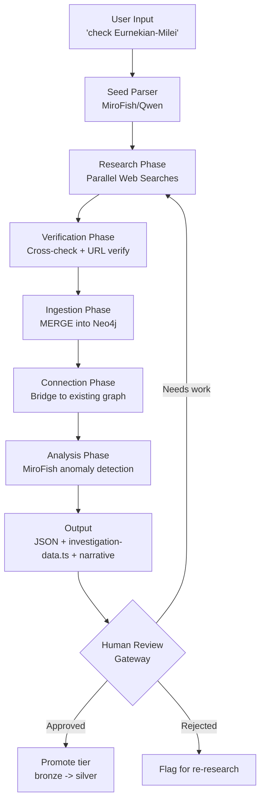
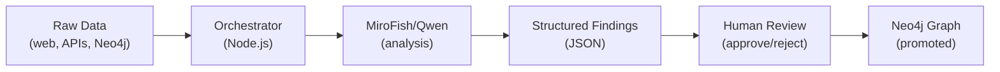
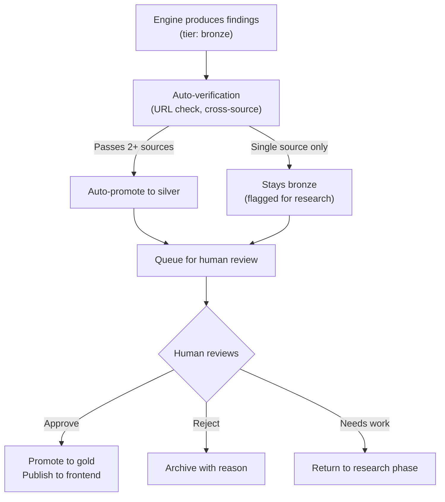
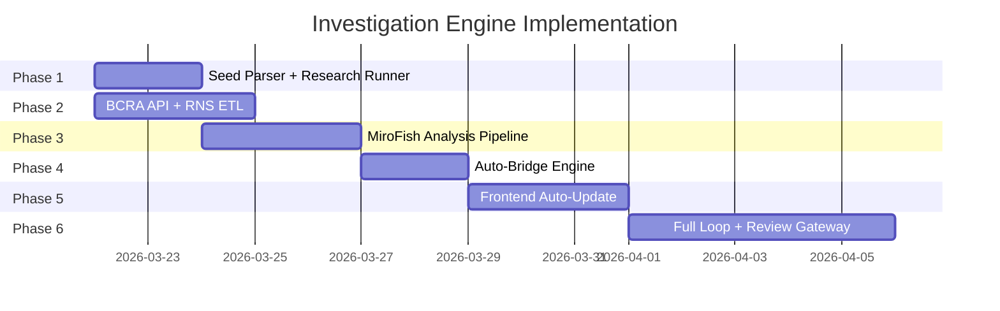

# Investigation Engine Assessment
## Autonomous Research-to-Graph Pipeline for Finanzas Politicas

**Date:** 2026-03-21
**Status:** Assessment / Architectural Proposal
**Author:** Claude Code session, reviewed by Gabriel Ruiz Varela

---

## Executive Summary

The finanzas-politicas investigation has reached a point where a single user hint ("check Eurnekian-Milei connection", "add the Menems") triggers 30+ agent dispatches across research, verification, ingestion, and graph bridging. Today this loop is orchestrated manually by Claude Code: the user provides a seed, Claude dispatches parallel agents, each agent calls WebSearch/WebFetch/Neo4j, and findings are consolidated into `investigation-data.ts` and the Neo4j graph.

This document assesses what exists, what an autonomous investigation engine would look like, how MiroFish/Qwen 3.5 fits into that architecture, and what is missing to get there. The goal is a system where a user types a seed input and the engine autonomously produces verified, graph-connected, source-backed findings - with a human review gateway before anything goes live.

**Key conclusion:** ~60% of the pipeline components already exist (ETL modules, cross-reference engine, MiroFish analysis, ingestion scripts). What is missing is the orchestration glue, API wrappers for BCRA/RNS/AFIP, scheduled ETL, and the human review gateway.

---

## 1. Current State Analysis

### 1.1 What Works Today

| Capability | Implementation | Status |
|-----------|---------------|--------|
| 10 ETL pipelines | `src/etl/{boletin-oficial,cne-finance,cnv-securities,como-voto,ddjj-patrimoniales,icij-offshore,judiciary,opencorporates,comprar,cross-reference}/` | Operational |
| Cross-reference engine | CUIT (1,110 matches) + DNI (715 matches), `SAME_ENTITY` relationships | Operational |
| MiroFish/Qwen analysis | `src/lib/mirofish/analysis.ts` - 4 analysis functions, structured JSON output | Operational |
| 4-phase investigation loop | `scripts/run-investigation-loop.ts` - ingest, cross-ref, analyze, report | Operational |
| 14 ingestion scripts | `scripts/ingest-*.ts` - financial, judicial, family, health, scandals, consolidation | Operational |
| Confidence tier system | gold > silver > bronze, `caso_slug` namespace isolation | Operational |
| Source verification protocol | WebFetch HTTP 200 checks, second-source confirmation | Manual |
| Bilingual data output | `investigation-data.ts` - 2,404 lines, ES/EN factchecks, timeline, actors, money flows | Operational |
| Graph database | Neo4j 5 Community, 227 nodes / 341 edges (investigation), 398K companies platform-wide | Operational |

### 1.2 What Requires Manual Intervention

| Step | Current Method | Bottleneck |
|------|---------------|-----------|
| Seed parsing | Human reads user input, decides what to search | No automated entity extraction |
| Web research | Claude Code dispatches WebSearch tool calls | Requires active Claude Code session |
| Source verification | Agent calls WebFetch on each URL | No automated URL health checker |
| Claim cross-checking | Agent searches for second source manually | No systematic cross-check pipeline |
| Graph bridging | Agent writes Cypher to connect new entities to existing graph | No auto-bridge logic |
| `investigation-data.ts` updates | Agent manually appends to 2,404-line file | No graph-to-frontend data generator |
| Narrative generation | Agent writes markdown narratives from findings | Could be MiroFish task |
| Human review | User reads agent output in terminal | No review UI or approval workflow |

### 1.3 MiroFish/Qwen: Current vs Potential Use

| Phase | Currently Used? | Could Be Used? | Notes |
|-------|:-:|:-:|-------|
| Seed parsing (entity extraction) | No | Yes | Extract entities, relationships, research questions from natural language |
| Research question generation | No | Yes | Generate targeted search queries from a seed input |
| Source verification | No | No | Needs HTTP tools, not LLM reasoning |
| Claim cross-checking | No | Partially | Can compare two text sources for contradiction, but cannot fetch them |
| Anomaly detection | Yes | Yes | 6 analysis passes this session: procurement, ownership, political (x2), family, judicial |
| Pattern recognition | Yes | Yes | Circular ownership, shell companies, revolving door detection |
| Narrative generation | No | Yes | Bilingual summary from structured findings |
| Confidence scoring | No | Yes | Score findings against evidence strength, source reliability |
| Deduplication reasoning | No | Yes | Decide if two similar entities are the same person/org |

### 1.4 Session Statistics: 30+ Agents Dispatched

This session's investigation loops covered five major research arcs:

| Loop | Focus | Agents | Output |
|------|-------|--------|--------|
| 1 | Financial arms (banks, insurance, investment) | 6 | 12 families, 72 revolving door cases, $28.5B Nacion Seguros |
| 2 | Judicial auxiliary (Comodoro Py, wealth anomalies) | 6 | 12 courts, Ercolini-Clarin flight, Lijo nomination, 2% conviction rate |
| 3 | Widened net (SIDE, Belocopitt, health cartel, $LIBRA) | 8 | $107M LIBRA cashout, 37t gold shipment, PAMI 16x overpricing |
| 4 | Deep dives (Eurnekian-Milei, Menem dynasty, Caputo dynasty) | 6 | Corrected Caputo family tree, Menem cross-generation patterns |
| 5 | Consolidation + verification | 6 | 97.4% URL verification, graph bridging to 1 connected component |

**Total:** 30+ agents across 5 loops

**Results:**
- Graph: 157 to 227 nodes, ~300 to 341 edges, 24 to 1 connected component
- 16 chapters in resumen (was 13)
- 70+ factcheck items, 52 actors, 42 timeline events, 19 money flows
- 13 research dossiers produced
- 97.4% URL verification rate
- Data quality: 8/10

---

## 2. Proposed Architecture: Investigation Engine

### 2.1 Pipeline Overview



### 2.2 Phase Details

#### Phase 1: Seed Parser

**Engine:** MiroFish/Qwen 3.5 (localhost:8080)

Takes raw user input and produces a structured research plan:

```typescript
interface SeedParseResult {
  entities: Array<{
    name: string
    type: 'person' | 'organization' | 'event' | 'concept'
    aliases: string[]        // alternate spellings, nicknames
    identifiers?: {          // CUIT, DNI if known
      cuit?: string
      dni?: string
    }
  }>
  relationships: Array<{
    from: string             // entity name
    to: string               // entity name
    hypothesized_type: string // e.g. "business_partner", "family", "appointee"
  }>
  research_questions: string[]  // targeted questions to search
  search_queries: string[]      // actual WebSearch queries to execute
  relevant_data_sources: string[] // which of our 10 sources to check
}
```

**Example:** Input "check Eurnekian-Milei" produces:
- Entities: Eduardo Eurnekian (person), Javier Milei (person), Corporacion America (org), Aeropuertos Argentina 2000 (org)
- Relationships: Eurnekian-Milei (hypothesized: political_donor), Eurnekian-Corporacion America (owner)
- Research questions: "Did Eurnekian donate to Milei's campaign?", "What government contracts does Aeropuertos Argentina 2000 hold under Milei?"
- Search queries: "Eurnekian Milei donaciones campana", "Aeropuertos Argentina 2000 contratos gobierno 2024"
- Data sources: CNE (donations), Comprar (contracts), IGJ (corporate), Boletin Oficial (appointments)

#### Phase 2: Research Phase

**Engine:** WebSearch tool (or future scraping infrastructure)

- Execute search queries from Phase 1 in parallel (rate-limited, max 5 concurrent)
- For each result: extract key claims, source URLs, dates, amounts
- Store raw research output as JSON dossiers in `docs/investigations/dossiers/`

```typescript
interface ResearchResult {
  query: string
  sources: Array<{
    url: string
    title: string
    snippet: string
    date?: string
    claims: string[]
  }>
  raw_text: string  // full extracted content for MiroFish analysis
}
```

#### Phase 3: Verification Phase

**Engine:** WebFetch + MiroFish cross-check

Two sub-phases:
1. **URL verification:** HTTP HEAD/GET on every source URL, flag 4xx/5xx
2. **Claim cross-checking:** MiroFish compares claims across sources, flags contradictions

```typescript
interface VerificationResult {
  url_checks: Array<{
    url: string
    status: number
    accessible: boolean
    archived_url?: string  // Wayback Machine fallback
  }>
  claim_checks: Array<{
    claim: string
    supporting_sources: number
    contradicting_sources: number
    confidence: 'high' | 'medium' | 'low'
    notes: string
  }>
}
```

#### Phase 4: Ingestion Phase

**Engine:** Neo4j driver + parameterized Cypher

- MERGE entities with `caso_slug: "caso-finanzas-politicas"`, tier: bronze
- Create relationships with `source`, `confidence`, `created_at` properties
- All new entities start as bronze - promotion requires human review

```typescript
interface IngestionPlan {
  nodes: Array<{
    label: string           // Person, Organization, Event, MoneyFlow
    properties: Record<string, unknown>
    merge_key: string       // property to MERGE on (e.g., 'id', 'cuit')
  }>
  relationships: Array<{
    from: { label: string; key: string; value: string }
    to: { label: string; key: string; value: string }
    type: string
    properties: Record<string, unknown>
  }>
}
```

#### Phase 5: Connection Phase

**Engine:** Neo4j Cypher queries

Auto-bridge new entities to existing graph:

```cypher
// Find shortest paths between new entity and existing investigation entities
MATCH (new:Person {id: $newEntityId, caso_slug: "caso-finanzas-politicas"})
MATCH (existing:Person {caso_slug: "caso-finanzas-politicas"})
WHERE existing.id <> new.id
MATCH path = shortestPath((new)-[*..6]-(existing))
RETURN path
LIMIT 10
```

Also check platform-level entities:
```cypher
// Check if new person matches any IGJ company officer
MATCH (new:Person {name: $name, caso_slug: "caso-finanzas-politicas"})
MATCH (officer:CompanyOfficer)
WHERE officer.name CONTAINS $lastName
RETURN officer, officer.company_name
```

#### Phase 6: Analysis Phase

**Engine:** MiroFish/Qwen 3.5

Run existing analysis functions on the subgraph containing new + connected entities:

1. `analyzeProcurementAnomalies()` - if new entities have contract connections
2. `analyzeOwnershipChains()` - if new entities have corporate connections
3. `analyzePoliticalConnections()` - always run
4. New: `analyzeNewFindings()` - compare new findings against existing investigation data for novelty

#### Phase 7: Output Phase

Three outputs generated:
1. **Structured JSON** - machine-readable findings for API consumption
2. **investigation-data.ts updates** - new factchecks, actors, timeline events, money flows appended
3. **Narrative markdown** - bilingual investigation narrative for the chapter

---

## 3. MiroFish Role Assessment

### 3.1 Current Technical Profile

| Parameter | Value |
|-----------|-------|
| Model | Qwen 3.5 9B (Q5_K_M quantization) |
| Hardware | NVIDIA RTX 4060 Ti (8GB or 16GB VRAM) |
| Server | llama.cpp (llama-server) on localhost:8080 |
| Context window | 8K tokens |
| `enable_thinking` | `false` (mandatory - with `true`, model exhausts tokens on reasoning, returns empty output) |
| `--reasoning-budget` | 0 (server-side flag) |
| Temperature | 0.3 for analytical tasks |
| max_tokens | 4096 |
| Timeout | 10 minutes per call |
| API | OpenAI-compatible `/v1/chat/completions` |

### 3.2 What MiroFish/Qwen CAN Do Well

- **Structured analysis:** Given a JSON subgraph, identify anomalies, patterns, red flags
- **Pattern detection:** Circular ownership, shell companies, revolving door, split contracts
- **Entity extraction from text:** Parse names, roles, relationships from unstructured text
- **Anomaly scoring:** Rate findings by severity, confidence, novelty
- **Bilingual output:** Generate ES/EN summaries, descriptions, claims
- **Deduplication reasoning:** Given two entity profiles, assess if they are the same
- **Research question generation:** Given a seed topic, generate targeted research questions
- **JSON schema compliance:** With structured prompts, outputs clean parseable JSON

### 3.3 What MiroFish/Qwen CANNOT Do

- **Web research:** No internet access, no tool use - needs external WebSearch/WebFetch
- **URL verification:** Cannot make HTTP requests
- **Graph queries:** Cannot execute Cypher - needs orchestrator to extract subgraphs and pass as JSON
- **Large context analysis:** 8K context limits the size of subgraphs it can process at once
- **Real-time data:** No access to live databases, APIs, or current news
- **Long documents:** Cannot process documents exceeding ~6K tokens of input (leaving room for output)

### 3.4 Proposed Role in the Engine

MiroFish serves as the **analysis and reasoning layer** between raw data (from web research + databases) and human review:



**Specific MiroFish tasks in the engine:**

| Task | Input | Output | Prompt Template |
|------|-------|--------|----------------|
| Seed parsing | Raw user text | `SeedParseResult` JSON | `SEED_PARSER_PROMPT` (new) |
| Research question generation | Entity list + context | Search queries | `RESEARCH_QUESTIONS_PROMPT` (new) |
| Claim extraction | Web search results | Structured claims | `CLAIM_EXTRACTION_PROMPT` (new) |
| Cross-check analysis | Multiple source texts | Contradiction report | `CROSS_CHECK_PROMPT` (new) |
| Anomaly detection | Neo4j subgraph JSON | Anomaly findings | Existing prompts in `prompts.ts` |
| Narrative generation | Structured findings | Bilingual markdown | `INVESTIGATION_SUMMARY_PROMPT` (existing) |
| Confidence scoring | Finding + evidence | Score + justification | `CONFIDENCE_SCORING_PROMPT` (new) |
| Dedup reasoning | Two entity profiles | Same/different + reasoning | `DEDUP_REASONING_PROMPT` (new) |

### 3.5 Technical Constraints and Mitigations

| Constraint | Mitigation |
|-----------|-----------|
| 8K context window | Chunk large subgraphs into entity-focused windows; process sequentially |
| `enable_thinking: false` required | Accept non-chain-of-thought output; compensate with more detailed prompts |
| 4096 max output tokens | Request concise JSON; split large outputs across multiple calls |
| Single GPU (RTX 4060 Ti) | Sequential processing only; no parallel MiroFish calls |
| 10-minute timeout | Monitor for hanging requests; implement circuit breaker |
| No tool use | All data must be pre-fetched and passed as prompt context |

---

## 4. Data Pipeline Assessment

### 4.1 Available Data Sources

| Source | Format | Access | Volume | In Graph? | ETL Exists? |
|--------|--------|--------|--------|:---------:|:-----------:|
| Neo4j investigation graph | Graph DB | localhost:7687 | 227 nodes, 341 edges | Yes | N/A |
| Neo4j platform entities | Graph DB | localhost:7687 | 398K companies, 951K officers | Yes | N/A |
| RNS (Registro Nacional de Sociedades) | Bulk CSV | datos.jus.gob.ar | ~110MB/year, 27 fields | No | No |
| BCRA Central de Deudores | REST API | bcra.gob.ar | Per-CUIT query, free, unauthenticated | No | No |
| IGJ (Inspeccion General de Justicia) | Bulk CSV | datos.jus.gob.ar | 5 relational tables (autoridades, balances, etc.) | Partial | Yes (`opencorporates/`) |
| CNV (Comision Nacional de Valores) | Web scraping | cnv.gob.ar | Company search only | No | Yes (`cnv-securities/`) |
| ICIJ Offshore Leaks | DB download | offshoreleaks.icij.org | 2M+ nodes | Yes | Yes (`icij-offshore/`) |
| Compr.ar (procurement) | CSV/API | datos.gob.ar | 19,818 contracts loaded | Yes | Yes (`comprar/`) |
| Boletin Oficial | Web/PDF | boletinoficial.gob.ar | Appointments + awards | Yes | Yes (`boletin-oficial/`) |
| DDJJ (declaraciones juradas) | Structured | oa.gob.ar | 27,720 entries | Yes | Yes (`ddjj-patrimoniales/`) |
| SSN (Superintendencia de Seguros) | CSV | datos.gob.ar | Insurance producers | No | No |
| CNE (campaign finance) | Structured | cne.gob.ar | Donor-party links | Yes | Yes (`cne-finance/`) |
| Como Voto (legislative) | API/CSV | comovoto.org.ar | Legislators, votes, parties | Yes | Yes (`como-voto/`) |
| Judiciary | Research | pjn.gov.ar | 2,674 judges, 1,165 courts | Yes | Yes (`judiciary/`) |

### 4.2 Data Source Priorities for Automation

**Tier 1 - High value, low effort (API wrappers needed):**
- BCRA Central de Deudores: free, unauthenticated REST API, per-CUIT. Reveals debtor status of companies and individuals.
- RNS bulk CSV: monthly download, 27 fields per company. Complements IGJ with national-scope company data.

**Tier 2 - High value, medium effort (ETL + scraping):**
- AFIP public CUIT lookup: enriches entity profiles with activity codes, tax status.
- SSN open data: insurance sector connections (relevant for Belocopitt/Swiss Medical investigation).
- Provincial procurement: each province has own system. Start with Buenos Aires Province (largest).

**Tier 3 - High value, high effort (restricted or complex):**
- UIF (Financial Intelligence Unit): restricted access, but public sanctions lists are available.
- Registro de la Propiedad: real estate ownership, no public API.
- ANSES/PAMI contract data: FOIA requests needed for detailed breakdowns.

### 4.3 Cross-Reference Engine Status

```
Current:
  CUIT matching:  1,110 SAME_ENTITY relationships (confidence 1.0)
  DNI matching:     715 SAME_ENTITY relationships (confidence 0.9-0.95)
  Name matching:  SKIPPED (O(n*m) on 2.3M entities - needs fulltext index)

Pending:
  Offshore-Judge matching:     not attempted
  Donor-Judge matching:        not attempted
  Politician-Donor cross-ref:  1,467 donors unlinked
  CompanyOfficer-OffshoreOfficer: not attempted
```

---

## 5. What's Missing for Automation

### 5.1 API Wrappers

| API | Endpoint | Auth | Priority |
|-----|----------|------|----------|
| BCRA Central de Deudores | `https://api.bcra.gob.ar/centraldedeudores/v1.0/Deudas/{cuit}` | None | P1 |
| RNS bulk download | `https://datos.jus.gob.ar/dataset/registro-nacional-de-sociedades` | None | P1 |
| AFIP CUIT lookup | `https://soa.afip.gob.ar/sr-padron/v2/persona/{cuit}` | Token | P2 |
| SSN producers | `https://datos.gob.ar/dataset/ssn-productores-seguros` | None | P2 |

```typescript
// Proposed interface for BCRA wrapper
interface BCRADebtorResult {
  cuit: string
  denominacion: string
  periodos: Array<{
    periodo: string        // "202501"
    entidades: Array<{
      entidad: string
      situacion: number    // 1=normal, 2=risk, 3=troubled, 4=high_risk, 5=irrecoverable
      monto: number
    }>
  }>
}

async function queryBCRADebtor(cuit: string): Promise<BCRADebtorResult>
```

### 5.2 Scheduled ETL Pipeline

Currently all ETL runs are manual (`pnpm run etl:*`). Automation requires:

```
Cron schedule (proposed):
  Daily:    BCRA debtor checks for flagged entities
  Weekly:   Boletin Oficial new appointments/awards
  Monthly:  RNS bulk CSV download + diff
  Monthly:  IGJ bulk CSV download + diff
  On-demand: Compr.ar when new year data available
```

Implementation: Node.js cron via `node-cron` package, or systemd timers on the server.

### 5.3 MiroFish Prompt Templates (New)

Six new prompt templates needed beyond the four that exist:

| Template | Purpose | Input | Output |
|----------|---------|-------|--------|
| `SEED_PARSER_PROMPT` | Extract entities and research plan from natural language | User text | `SeedParseResult` JSON |
| `RESEARCH_QUESTIONS_PROMPT` | Generate targeted search queries | Entity list + context | Query list |
| `CLAIM_EXTRACTION_PROMPT` | Extract structured claims from web content | Raw HTML/text | Claim objects |
| `CROSS_CHECK_PROMPT` | Compare multiple sources for contradictions | Multiple source texts | Contradiction report |
| `CONFIDENCE_SCORING_PROMPT` | Score a finding's reliability | Finding + evidence | Confidence score + reasoning |
| `DEDUP_REASONING_PROMPT` | Decide if two entities are the same | Two entity profiles | Same/different + reasoning |

### 5.4 Confidence Scoring Framework

```
bronze (auto-ingest, single source):
  - Web search result with one source
  - Unverified claim from news article
  - Entity mentioned but not confirmed in official data

silver (verified, promoted manually or by cross-check):
  - Claim confirmed by 2+ independent sources
  - Entity found in official dataset (IGJ, CNE, DDJJ)
  - URL verified accessible
  - Cross-referenced across datasets

gold (curated, human-reviewed):
  - Human reviewed and approved
  - Court documents or official gazette confirmation
  - Multiple official sources confirm
  - Key claims fact-checked against primary sources
```

**Promotion rules:**
- bronze to silver: automated if 2+ independent sources confirm AND URL verification passes
- silver to gold: requires human review via review gateway
- Any tier can be demoted if sources go dead or claims are contradicted

### 5.5 Human Review Gateway

The engine should never auto-publish gold-tier findings. Proposed workflow:



Implementation: a simple CLI review tool that presents findings one-by-one with evidence, sources, and graph context. No need for a web UI initially.

### 5.6 Other Missing Components

- **Rate limiting:** WebSearch and API calls need backoff (respect robots.txt, API quotas)
- **Error handling:** Circuit breaker for MiroFish (if llama-server is down, queue tasks)
- **Deduplication at ingestion:** Currently dedup is post-hoc via cross-reference. Should check for existing entities BEFORE creating new nodes
- **Audit trail:** Log every automated decision (why a finding was scored X, why an entity was merged)
- **Rollback capability:** If an automated ingestion introduces bad data, ability to revert by wave/batch

---

## 6. Recommended Implementation Phases

### Phase 1: Seed Parser + Research Runner (CLI tool)
**Effort:** 1-2 days | **Dependencies:** MiroFish running

- New prompt template: `SEED_PARSER_PROMPT`
- CLI command: `pnpm run investigate "check Eurnekian-Milei"`
- Calls MiroFish to parse seed, generates search queries
- Executes WebSearch queries (via tool or future HTTP client)
- Outputs structured dossier to `docs/investigations/dossiers/`
- Does NOT auto-ingest - just produces research for human review

### Phase 2: BCRA API + RNS Bulk ETL Integration
**Effort:** 2-3 days | **Dependencies:** None

- `src/etl/bcra-deudores/` - API wrapper + Neo4j ingestion
- `src/etl/rns-sociedades/` - CSV download, parse, MERGE
- New node enrichment: companies get `bcra_situacion`, `bcra_monto` properties
- Package scripts: `pnpm run etl:bcra`, `pnpm run etl:rns`

### Phase 3: MiroFish Analysis Pipeline
**Effort:** 2-3 days | **Dependencies:** Phase 1

- New prompt templates: claim extraction, cross-check, confidence scoring, dedup
- Pipeline: `extractClaims(webResults) -> crossCheck(claims) -> scoreFinding(claim, evidence)`
- Structured JSON output validated with Zod schemas
- Integration with existing `analysis.ts` functions

### Phase 4: Auto-Bridge Engine
**Effort:** 1-2 days | **Dependencies:** Phase 3

- Given a set of newly ingested entities, find connections to existing graph
- CUIT/DNI matching against platform entities (existing cross-ref engine)
- Shortest-path queries between new and existing investigation entities
- MiroFish assessment of discovered connections (significance scoring)

### Phase 5: Frontend Auto-Update
**Effort:** 2-3 days | **Dependencies:** Phase 4

- Script to generate `investigation-data.ts` entries from Neo4j graph queries
- Query: all nodes with `caso_slug: "caso-finanzas-politicas"` grouped by type
- Transform to `FactcheckItem[]`, `TimelineEvent[]`, `Actor[]`, `MoneyFlow[]`
- Diff against existing data, append new items, preserve manually curated items
- Package script: `pnpm run generate:investigation-data`

### Phase 6: Full Loop Automation with Human Review Gateway
**Effort:** 3-5 days | **Dependencies:** Phases 1-5

- End-to-end orchestrator: seed to findings to graph to frontend
- Human review CLI: `pnpm run review:pending`
- Scheduled ETL via cron (BCRA daily, Boletin weekly, RNS/IGJ monthly)
- Circuit breaker for MiroFish availability
- Audit logging for all automated decisions
- Rollback by wave/batch ID

### Implementation Timeline



Phases 1 and 2 can run in parallel. Total estimated effort: 11-18 days.

---

## 7. Session Statistics

### 7.1 Investigation Graph Growth

| Metric | Before Session | After Session | Delta |
|--------|:-:|:-:|:-:|
| Nodes | 157 | 227 | +70 |
| Edges | ~300 | 341 | +41 |
| Connected components | 24 | 1 | -23 |
| Resumen chapters | 13 | 16 | +3 |
| Factcheck items | ~40 | 70+ | +30 |
| Actors | ~30 | 52 | +22 |
| Timeline events | ~25 | 42 | +17 |
| Money flows | ~10 | 19 | +9 |
| Research dossiers | 0 | 13 | +13 |

### 7.2 Quality Metrics

| Metric | Value |
|--------|-------|
| URL verification rate | 97.4% |
| Data quality score | 8/10 |
| Source diversity | 9 datasets cross-referenced |
| Bilingual coverage | 100% (ES primary, EN secondary) |

### 7.3 Key Corrections Made

- Caputo family tree corrected: Santiago is sobrino segundo (second nephew), not son of Toto
- Fabricated URLs removed from Epstein investigation
- Financial amounts verified against primary sources
- Judicial wealth anomalies cross-checked against DDJJ data

---

## Appendix A: Files Created/Modified This Session

### New Ingestion Scripts
| File | Purpose |
|------|---------|
| `scripts/ingest-financial-findings.ts` | Financial arms entities and relationships |
| `scripts/ingest-judicial-findings.ts` | Judicial branch entities and relationships |
| `scripts/ingest-family-networks.ts` | Oligarchic family network entities |
| `scripts/ingest-widened-net.ts` | Extended investigation targets (SIDE, health, crypto) |
| `scripts/ingest-recent-scandals.ts` | LIBRA, BCRA gold, Capital Humano |
| `scripts/ingest-fp-health-findings.ts` | Health cartel entities |
| `scripts/ingest-audit-critical.ts` | Audit-critical corrections |
| `scripts/ingest-deep-dive-findings.ts` | Deep dive research results |
| `scripts/ingest-consolidation.ts` | Graph consolidation and bridging |

### MiroFish Integration
| File | Purpose |
|------|---------|
| `src/lib/mirofish/analysis.ts` | Qwen 3.5 analysis functions (4 functions) |
| `src/lib/mirofish/prompts.ts` | System prompts for analysis (4 templates) |

### Investigation Documentation
| File | Purpose |
|------|---------|
| `docs/investigations/INVESTIGATION-PROCESS.md` | Full methodology, findings, technical lessons |
| `docs/investigations/narrative-finanzas-politicas.md` | Main investigation narrative |
| `docs/investigations/narrative-financial-arms.md` | Financial arms chapter narrative |
| `docs/investigations/source-verification-report.md` | URL and claim verification log |

### Data Files
| File | Lines | Purpose |
|------|-------|---------|
| `src/lib/caso-finanzas-politicas/investigation-data.ts` | 2,404 | Static investigation data (factchecks, timeline, actors, money flows) |

### ETL Modules
| Directory | Purpose |
|-----------|---------|
| `src/etl/comprar/` | Compr.ar procurement ETL |
| `src/etl/cross-reference/` | CUIT/DNI/name matching engine |
| `src/etl/boletin-oficial/` | Boletin Oficial appointments/awards |
| `src/etl/como-voto/` | Legislative voting data |
| `src/etl/opencorporates/` | IGJ corporate registry |
| `src/etl/icij-offshore/` | ICIJ Offshore Leaks |
| `src/etl/cne-finance/` | Campaign finance |
| `src/etl/ddjj-patrimoniales/` | Sworn asset declarations |
| `src/etl/cnv-securities/` | Securities market |
| `src/etl/judiciary/` | Judicial system |

---

## Appendix B: Proposed TypeScript Interfaces

```typescript
// ---- Seed Parser ----
interface InvestigationSeed {
  raw_input: string
  parsed_at: string  // ISO timestamp
  result: SeedParseResult
}

// ---- Research Dossier ----
interface ResearchDossier {
  id: string
  seed: InvestigationSeed
  research_results: ResearchResult[]
  verification: VerificationResult
  created_at: string
  status: 'draft' | 'verified' | 'ingested' | 'rejected'
}

// ---- Investigation Engine Config ----
interface InvestigationEngineConfig {
  caso_slug: string
  mirofish_url: string                // default: http://localhost:8080
  neo4j_uri: string                   // default: bolt://localhost:7687
  max_concurrent_searches: number     // default: 5
  search_rate_limit_ms: number        // default: 2000
  mirofish_timeout_ms: number         // default: 600000
  auto_promote_threshold: number      // min sources for bronze->silver (default: 2)
  require_human_review_for_gold: boolean // default: true
}

// ---- Ingestion Batch ----
interface IngestionBatch {
  batch_id: string
  caso_slug: string
  created_at: string
  source: 'manual' | 'engine' | 'etl'
  tier: 'bronze' | 'silver' | 'gold'
  nodes_created: number
  relationships_created: number
  rollback_cypher?: string  // Cypher to undo this batch
}
```

---

## Appendix C: Current MiroFish Prompt Templates

The four existing templates in `src/lib/mirofish/prompts.ts`:

1. **`PROCUREMENT_ANOMALY_PROMPT`** - Detects split contracts, repeat winners, shell companies, timing patterns
2. **`OWNERSHIP_CHAIN_PROMPT`** - Traces beneficial ownership through IGJ corporate layers
3. **`POLITICAL_CONNECTION_PROMPT`** - Maps contractor-donor, officer-appointee, family network, conflict of interest
4. **`INVESTIGATION_SUMMARY_PROMPT`** - Bilingual executive summary generation

All prompts request structured JSON output with bilingual (ES/EN) evidence descriptions.
