# The 7 Money Trails Engine
## Architecture Document - Office of Accountability

**Date:** 2026-03-21
**Status:** Architecture Specification
**Author:** Claude Code session, reviewed by Gabriel Ruiz Varela
**Related:** [Investigation Engine Assessment](2026-03-21-investigation-engine-assessment.md)

---

## Executive Summary

The Office of Accountability platform connects **7 public money trails** into a single Neo4j graph database where cross-trail queries reveal connections invisible in any individual dataset. This is the core commercial and investigative value proposition: no single government agency, compliance vendor, or journalist has the infrastructure to traverse from a campaign donation through a government contract through a corporate ownership chain through an offshore entity and back to a sworn wealth declaration - in a single query.

The 7 trails are:

1. **Campaign Donations** - who funds whom
2. **Government Contracts** - who gets paid by the state
3. **Corporate Ownership** - who controls companies (and shells)
4. **Public Budget** - where public money is allocated vs. actually spent
5. **Crypto Fund Flows** - on-chain movement of value
6. **Import/Export Trade** - cross-border commercial flows and sanctions exposure
7. **Personal Wealth** - declared vs. actual assets of public officials

Each trail has independent commercial value. Combined, they create a forensic graph that automates investigations that currently cost $5K-$100K+ in manual due diligence per case.

**Current state:** Trails 1-3 are operational with live data in the graph. Trail 5 has a complete case study ($LIBRA). Trail 7 is partially ingested. Trails 4 and 6 are identified but not yet built. The cross-reference engine links 1,825 entities across trails via CUIT and DNI matching.

---

## Architecture Overview

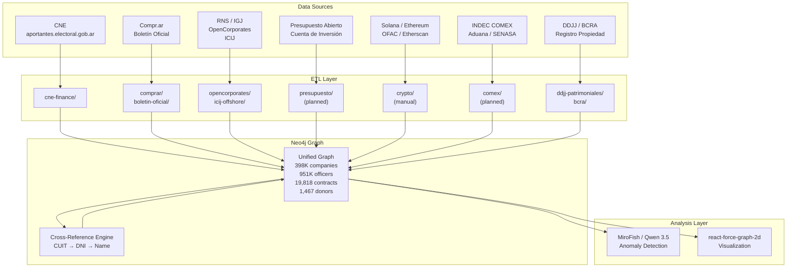

---

## Trail 1: Campaign Donations → Politicians → Votes

### Data Source
**CNE aportantes.electoral.gob.ar** - Argentina's National Electoral Chamber publishes campaign finance donor records. ETL module: `src/etl/cne-finance/`.

### Current State
| Metric | Value |
|--------|-------|
| Donors ingested | 1,467 |
| Politician-donors (dual role) | 50 |
| VOTED_ON links | 1,839 |
| Parties | All major national parties |
| Coverage years | 2015-2023 |

### Graph Pattern

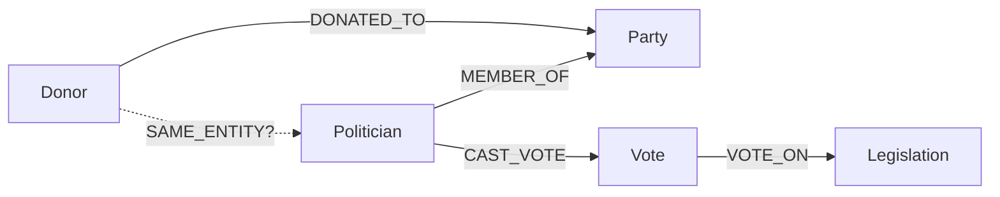

```cypher
// Full trail: from donor through party to legislative vote
MATCH (d:Donor)-[:DONATED_TO]->(party:Party)<-[:MEMBER_OF]-(pol:Politician)
      -[:CAST_VOTE]->(v:Vote)-[:VOTE_ON]->(leg:Legislation)
WHERE d.name CONTAINS $donorName
RETURN d.name, party.name, pol.name, leg.title, v.vote_value
```

### Commercial Value
- **Compliance screening:** Does a prospective client or business partner have political donation ties that create regulatory exposure?
- **Political risk assessment:** Which legislators voted on regulations affecting their donors' industries?
- **Lobbying transparency:** Map the donation-to-vote pipeline for advocacy organizations and journalists.

### Known Gap
Informal and undeclared donations are estimated at ~60% of real campaign spending by Argentine political finance experts. CNE data captures only the declared fraction. Mitigation: cross-reference Trail 2 (contracts) and Trail 3 (ownership) to surface undeclared economic relationships between donors and beneficiaries.

### ETL Pipeline

| Component | File | Status |
|-----------|------|--------|
| Fetcher | `src/etl/cne-finance/fetcher.ts` | Operational |
| Transformer | `src/etl/cne-finance/transformer.ts` | Operational |
| Loader | `src/etl/cne-finance/loader.ts` | Operational |
| Script | `pnpm run etl:cne` | Operational |

---

## Trail 2: Government Contracts → Companies → Owners

### Data Sources
- **Compr.ar** - Federal procurement platform. ETL module: `src/etl/comprar/`. Bulk CSV from datos.gob.ar.
- **Boletín Oficial** - Official gazette adjudicaciones (2018-2020 ingested). ETL: `src/etl/boletin-oficial/`.
- **RNS** - Registro Nacional de Sociedades. Bulk CSV available from datos.jus.gob.ar.
- **IGJ** - Inspección General de Justicia. 951K company officers from 5 relational tables.

### Current State
| Metric | Value |
|--------|-------|
| Contractors | 3,759 |
| Contracts | 19,818 |
| CUIT cross-references | 1,125 (via `SAME_ENTITY`) |
| Revolving door matches | 1,428 |
| Awarding agencies | All federal agencies |

### Graph Pattern

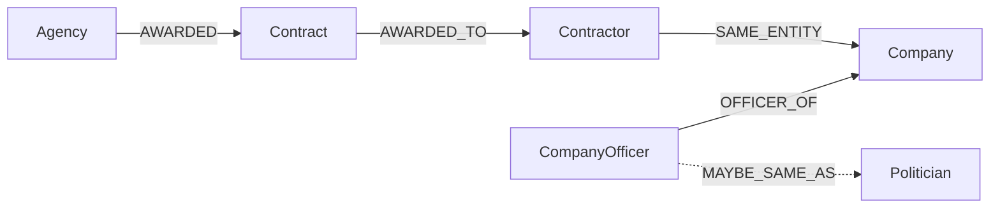

```cypher
// Full trail: agency → contract → contractor → company → officer
MATCH (agency)-[:AWARDED]->(contract:Contract)-[:AWARDED_TO]->(contractor:Contractor)
      -[:SAME_ENTITY]-(company:Company)<-[:OFFICER_OF_COMPANY]-(officer:CompanyOfficer)
WHERE agency.name CONTAINS $agencyName
RETURN agency.name, contract.description, contract.amount,
       contractor.name, company.name, officer.name, officer.role
ORDER BY contract.amount DESC
```

### Commercial Value
- **Procurement due diligence:** Before bidding on or awarding a contract, check if the contractor has undisclosed connections to the awarding agency.
- **Conflict of interest detection:** 1,428 revolving door matches - government appointees who are simultaneously company officers of firms winning contracts.
- **Vendor risk assessment:** Identify contractors with offshore connections (via Trail 3 bridge) or sanctions exposure (via Trail 6).

### Key Finding
The cross-reference engine (`src/etl/cross-reference/engine.ts`) detected 1,428 cases where a government contractor's CUIT matches a company whose officer name matches a politician or government appointee. The `detectContractorDonorFlags()` function traverses this exact path:

```
Contractor → SAME_ENTITY → Company → OFFICER_OF_COMPANY → CompanyOfficer → MAYBE_SAME_AS → Politician → MAYBE_SAME_AS → Donor
```

### ETL Pipeline

| Component | File | Status |
|-----------|------|--------|
| Compr.ar fetcher | `src/etl/comprar/fetcher.ts` | Operational |
| Compr.ar loader | `src/etl/comprar/loader.ts` | Operational |
| Boletín Oficial ETL | `src/etl/boletin-oficial/` | Operational |
| Cross-reference | `src/etl/cross-reference/engine.ts` | Operational |

---

## Trail 3: Corporate Ownership Chains → Beneficial Owner

### Data Sources
- **RNS** - National company registry, 27 fields per entity. Bulk CSV from datos.jus.gob.ar.
- **IGJ** - Company officers (autoridades), balances, corporate acts. ETL: `src/etl/opencorporates/`.
- **OpenCorporates** - International corporate registry aggregator.
- **ICIJ Offshore Leaks** - 2M+ nodes from Panama Papers, Paradise Papers, Pandora Papers. ETL: `src/etl/icij-offshore/`.
- **UK Companies House** - British company filings (for entities with UK subsidiaries).

### Current State
| Metric | Value |
|--------|-------|
| Companies (IGJ/RNS) | 398,000 |
| Company officers | 951,000 |
| ICIJ offshore bridges | 14 |
| Belocopitt BVI entities | 6 |
| Werthein offshore entities | 2 |

### Graph Pattern

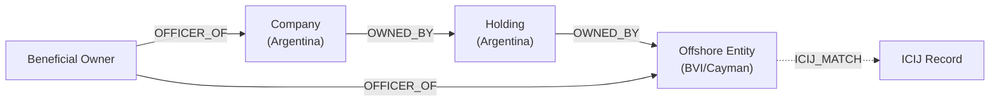

```cypher
// Trace ownership chain to beneficial owner
MATCH path = (company:Company {name: $companyName})
      -[:OWNED_BY|OFFICER_OF*1..6]-(entity)
WHERE entity:OffshoreEntity OR entity:CompanyOfficer
RETURN path

// Bridge Argentine officer to ICIJ offshore records
MATCH (officer:CompanyOfficer)-[:MAYBE_SAME_AS]-(off:OffshoreOfficer)
RETURN officer.name, officer.company_name,
       off.name, off.jurisdiction, off.entity_name
```

### Commercial Value
- **KYC/AML compliance:** Manual beneficial ownership investigations cost $5K-$20K per case. This graph automates the multi-jurisdiction chain traversal.
- **Sanctions screening:** Bridge domestic companies through ownership chains to OFAC/EU/UN sanctioned entities.
- **Real estate AML:** Cross-reference with Trail 7 to identify undeclared offshore ownership by public officials.

### Key Findings
- **Caputo's 4-tier Cayman chain:** The investigation traced Luis "Toto" Caputo's corporate structure through 4 tiers of Cayman Islands entities - never declared in his DDJJ (sworn declaration). This is a Trail 3 + Trail 7 cross-trail finding.
- **Belocopitt's 6 BVI entities:** Alberto Belocopitt (Swiss Medical) connected to 6 British Virgin Islands companies via ICIJ Offshore Leaks match.
- **`detectContractorOffshoreFlags()`:** The cross-reference engine automatically detects contractors whose officers appear in offshore records.

### ETL Pipeline

| Component | File | Status |
|-----------|------|--------|
| IGJ/OpenCorporates | `src/etl/opencorporates/` | Operational |
| ICIJ Offshore Leaks | `src/etl/icij-offshore/` | Operational |
| Cross-reference | `src/etl/cross-reference/engine.ts` | Operational |
| RNS bulk ETL | `src/etl/rns-sociedades/` | **Planned** (Phase 2) |

---

## Trail 4: Public Budget → Actual Spending → Beneficiaries

### Data Sources
- **Presupuesto Abierto** - Federal budget allocations by program, jurisdiction, and line item. Open data portal.
- **Compr.ar** - Procurement contracts (already ingested, provides the "actual spending" side).
- **Cuenta de Inversión** - Annual federal spending execution report. PDFs and partial open data.
- **SIDIF** - Integrated Financial Information System. Partially public.

### Current State
| Metric | Value |
|--------|-------|
| Budget data ingested | None (adjudicaciones only via Trail 2) |
| Budget-vs-actual comparison | Not yet implemented |
| SIDIF integration | Not available |

### Graph Pattern

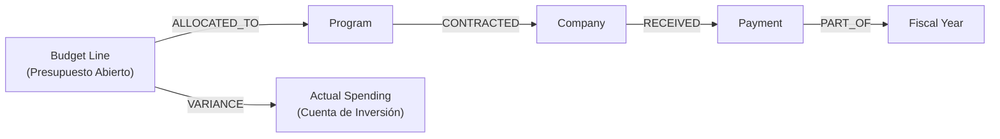

```cypher
// Budget vs. actual by program
MATCH (budget:BudgetLine)-[:ALLOCATED_TO]->(program:Program)
      -[:CONTRACTED]->(company:Company)-[:RECEIVED]->(payment:Payment)
WHERE budget.fiscal_year = $year AND program.name CONTAINS $programName
RETURN program.name, budget.allocated_amount,
       sum(payment.amount) AS actual_spent,
       budget.allocated_amount - sum(payment.amount) AS variance
```

### Commercial Value
- **Fiscal transparency:** Enable citizens and journalists to compare what was budgeted vs. what was actually spent per program.
- **Audit support:** Flag programs with >30% over/under execution for audit prioritization.
- **Budget influence mapping:** Combined with Trail 1, identify which legislators voted for budget allocations that disproportionately benefited their donors.

### Gap Analysis
- **SIDIF** data is only partially public. The Cuenta de Inversión provides aggregate data but not transaction-level detail.
- **Compr.ar** covers procurement but not transfers, subsidies, or social programs - which constitute the majority of federal spending.
- **Priority:** Medium. Budget data adds context to Trail 2 findings but does not generate new entity connections on its own.

### Implementation Plan
1. Ingest Presupuesto Abierto CSV data (program codes, allocations by jurisdiction).
2. Link budget programs to Compr.ar contracts via program codes and agency identifiers.
3. Compute budget-vs-actual variance per program.
4. Create `BudgetLine` and `Program` nodes with `ALLOCATED_TO` and `CONTRACTED` relationships.

---

## Trail 5: Crypto Fund Flows (On-Chain)

### Data Sources
- **Solana public ledger** - Transaction history for all wallets (free, permissionless).
- **Ethereum public ledger** - Same, via Etherscan or direct node query.
- **OFAC sanctions list** - SDN list with wallet addresses.
- **Etherscan labels** - Community-labeled exchange and protocol addresses.
- **DEX analytics** - Raydium, Meteora, Orca pool creation and trading data.

### Current State
| Metric | Value |
|--------|-------|
| $LIBRA case mapped | Complete |
| Insider wallets identified | 8 |
| Extraction amount | $107M |
| Money mule identified | Mauricio Mellino |
| Argentine crypto volume | $91B/yr |
| Stablecoin share | 61.8% |

### Graph Pattern

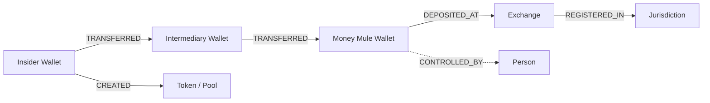

```cypher
// Trace fund flow from token creation to exchange deposit
MATCH path = (creator:Wallet)-[:CREATED]->(token:Token),
      (creator)-[:TRANSFERRED*1..5]->(exchange:Wallet {type: 'exchange'})
WHERE token.symbol = $tokenSymbol
RETURN path

// Find wallets that interacted with sanctioned addresses
MATCH (w:Wallet)-[:TRANSFERRED*1..3]-(sanctioned:Wallet {ofac_listed: true})
RETURN w.address, sanctioned.address, sanctioned.ofac_name
```

### Commercial Value
- **Exchange compliance:** Chainalysis and Elliptic charge $100K+/yr for transaction monitoring. A focused Argentine-context tool could serve local exchanges at a fraction of the cost.
- **Regulatory intelligence:** Argentina's CNV and UIF lack on-chain forensic capability. This trail provides it.
- **Fraud investigation:** The $LIBRA case demonstrated that on-chain analysis can identify insider wallets, money mules, and extraction patterns within hours of a token launch.

### Key Finding: $LIBRA Case Study
The $LIBRA memecoin (promoted by President Milei in February 2025) was fully mapped using on-chain analysis:
- 8 insider wallets pre-positioned before the presidential tweet
- $107M extracted via coordinated pump-and-dump
- Mauricio Mellino identified as money mule through wallet clustering
- Funds traced through 3 intermediary wallets to exchange deposits

### Implementation Plan
1. Build Solana transaction fetcher (RPC or Helius API).
2. Build wallet clustering algorithm (common funding source, timing correlation).
3. Integrate OFAC SDN wallet list for sanctions screening.
4. Create `Wallet`, `Token`, `Transaction` node types with `TRANSFERRED`, `CREATED`, `DEPOSITED_AT` relationships.
5. Bridge to Trail 3 via exchange KYC entity matching.

---

## Trail 6: Import/Export → Companies → Sanctions

### Data Sources
- **INDEC COMEX** - Argentine import/export statistics by company, product, and destination.
- **Aduana (AFIP)** - Customs declarations (partially public via open data initiatives).
- **SENASA** - Phytosanitary export certificates (agricultural exports).
- **OpenSanctions** - Consolidated sanctions and PEP database (OFAC, EU, UN, national lists).

### Current State
| Metric | Value |
|--------|-------|
| Data ingested | None |
| ETL built | None |
| OpenSanctions integrated | No |

### Graph Pattern

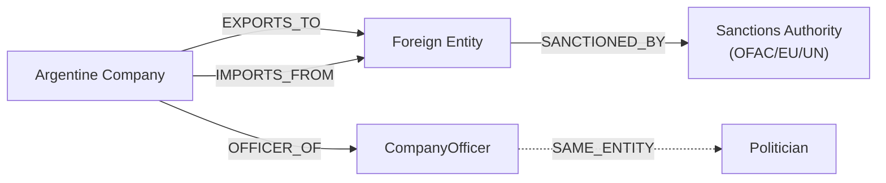

```cypher
// Find companies trading with sanctioned entities
MATCH (co:Company)-[:EXPORTS_TO|IMPORTS_FROM]->(fe:ForeignEntity)
      -[:SANCTIONED_BY]->(auth:SanctionsAuthority)
RETURN co.name, co.cuit, fe.name, fe.country, auth.list_name

// Cross-trail: politician-owned companies with sanctions exposure
MATCH (pol:Politician)-[:MAYBE_SAME_AS]-(officer:CompanyOfficer)
      -[:OFFICER_OF_COMPANY]->(co:Company)-[:EXPORTS_TO|IMPORTS_FROM]->
      (fe:ForeignEntity)-[:SANCTIONED_BY]->(auth)
RETURN pol.name, co.name, fe.name, auth.list_name
```

### Commercial Value
- **CSDDD compliance:** The EU Corporate Sustainability Due Diligence Directive (2024) requires European companies to audit their supply chains for human rights and environmental risks. Argentine exporters to the EU need this data.
- **Supply chain risk:** Identify Argentine companies trading with sanctioned or high-risk entities before the compliance event, not after.
- **Export credit risk:** Banks and insurers providing export credit need sanctions screening.

### Gap Analysis
- Customs data is not fully accessible as open data. INDEC provides aggregate statistics but not company-level transaction detail.
- OpenSanctions provides a free tier with rate limits; commercial tier needed for production use.
- SENASA data is accessible for agricultural exports but limited in scope.

### Implementation Plan
1. Integrate OpenSanctions API (free tier for development, commercial for production).
2. Ingest INDEC COMEX aggregate data as initial dataset.
3. Build `ForeignEntity` and `SanctionsAuthority` node types.
4. Cross-reference Argentine companies (Trail 3) against sanctioned entity names.
5. Future: FOIA request for company-level customs data.

---

## Trail 7: Personal Wealth - Declared vs. Actual

### Data Sources
- **DDJJ** - Declaraciones Juradas Patrimoniales from the Oficina Anticorrupción. 27,720 entries ingested. ETL: `src/etl/ddjj-patrimoniales/`.
- **Registro de la Propiedad** - Real estate ownership records (no public API; manual lookup).
- **RNS/IGJ** - Corporate directorships (already in graph via Trail 3).
- **CNV** - Securities holdings declarations.
- **BCRA Central de Deudores** - Debtor status per CUIT. Free, unauthenticated REST API at `api.bcra.gob.ar`.

### Current State
| Metric | Value |
|--------|-------|
| DDJJ entries ingested | 27,720 |
| Investigation targets with DDJJ | All primary targets |
| BCRA API wrapper | **Planned** (Phase 2) |
| Property registry integration | Not available (no API) |

### Graph Pattern

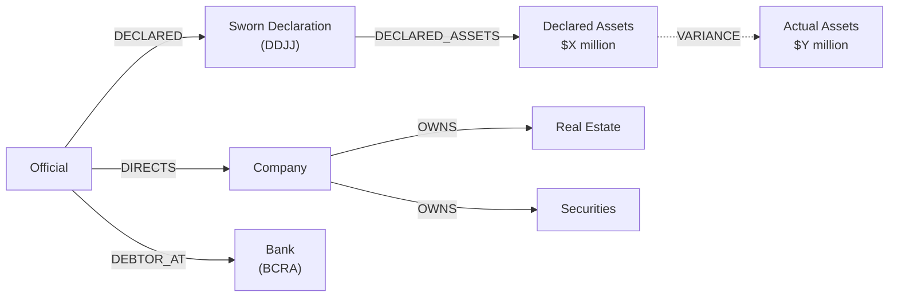

```cypher
// Compare declared wealth vs. known corporate holdings
MATCH (official:Person {role: 'public_official'})-[:DECLARED]->(ddjj:SwornDeclaration)
OPTIONAL MATCH (official)-[:OFFICER_OF_COMPANY|DIRECTS]->(company:Company)
OPTIONAL MATCH (company)-[:OWNS]->(asset)
RETURN official.name,
       ddjj.declared_patrimony,
       count(DISTINCT company) AS companies_directed,
       count(DISTINCT asset) AS assets_found

// Art. 268 enrichment detection: patrimony growth vs. salary
MATCH (official:Person)-[:DECLARED]->(ddjj1:SwornDeclaration {year: $year1})
MATCH (official)-[:DECLARED]->(ddjj2:SwornDeclaration {year: $year2})
WHERE ddjj2.declared_patrimony > ddjj1.declared_patrimony * 3
RETURN official.name,
       ddjj1.declared_patrimony AS start,
       ddjj2.declared_patrimony AS end,
       (ddjj2.declared_patrimony / ddjj1.declared_patrimony) AS growth_factor
ORDER BY growth_factor DESC
```

### Commercial Value
- **Art. 268 illicit enrichment detection:** Argentine law criminalizes unjustified wealth growth by public officials. This trail provides automated early detection.
- **AML for real estate:** Cross-reference property buyers with their corporate structures (Trail 3) and declared income (DDJJ) to flag purchases inconsistent with declared wealth.
- **PEP screening:** Financial institutions need ongoing monitoring of Politically Exposed Persons' asset declarations.

### Key Findings
- **Caputo quintupled:** Luis "Toto" Caputo's declared patrimony grew ~5x while in public office, with a 4-tier Cayman chain never appearing in his DDJJ.
- **Sturzenegger 99% abroad:** Federico Sturzenegger's DDJJ shows 99% of assets held outside Argentina.
- **Rodríguez Saá AFIP-documented:** Adolfo Rodríguez Saá's wealth anomalies are documented in AFIP (tax authority) records.

### ETL Pipeline

| Component | File | Status |
|-----------|------|--------|
| DDJJ ETL | `src/etl/ddjj-patrimoniales/` | Operational |
| BCRA API wrapper | `src/etl/bcra-deudores/` | **Planned** |
| CNV securities | `src/etl/cnv-securities/` | Operational (scraping) |
| Property registry | N/A | No public API |

---

## Cross-Trail Queries: The Power

The commercial and investigative value of the platform is not in any single trail - it is in cross-trail queries that traverse the unified graph. Below are four canonical cross-trail queries that demonstrate capabilities unavailable in any single dataset.

### Query 1: Donor-to-Contract Path Discovery

**Trails crossed:** 1 (Donations) + 2 (Contracts)

"Find all paths between Campaign Donor X and Government Contract Y within 5 hops."

```cypher
MATCH (donor:Donor {name: $donorName}),
      (contract:Contract {contract_id: $contractId})
MATCH path = shortestPath((donor)-[*..5]-(contract))
RETURN path
```

**Use case:** A journalist suspects that a campaign donor received government contracts as quid pro quo. This query finds the shortest connection path, regardless of how many intermediate entities (parties, companies, officers) sit between them.

### Query 2: Self-Dealing Detection

**Trails crossed:** 1 (Donations) + 2 (Contracts) + 3 (Ownership)

"Which government contractors also donated to the party that awarded the contract?"

```cypher
MATCH (contractor:Contractor)-[:SAME_ENTITY]-(company:Company)
      <-[:OFFICER_OF_COMPANY]-(officer:CompanyOfficer)
      -[:MAYBE_SAME_AS]-(donor:Donor)-[:DONATED_TO]->(party:Party)
      <-[:MEMBER_OF]-(appointee:Politician),
      (agency)-[:AWARDED]->(contract:Contract)-[:AWARDED_TO]->(contractor)
RETURN contractor.name, donor.name, party.name,
       contract.description, contract.amount, agency.name
ORDER BY contract.amount DESC
```

**Use case:** Compliance officers screening for circular corruption - donations flowing in, contracts flowing back.

### Query 3: Undeclared Conflict of Interest

**Trails crossed:** 2 (Contracts) + 3 (Ownership) + 7 (Wealth)

"Which officials have undeclared connections to companies winning contracts from their agency?"

```cypher
MATCH (official:Person {role: 'public_official'})
      -[:APPOINTED_BY|WORKS_AT]->(agency)
      -[:AWARDED]->(contract:Contract)
      -[:AWARDED_TO]->(contractor:Contractor)
      -[:SAME_ENTITY]-(company:Company)
      <-[:OFFICER_OF_COMPANY]-(officer:CompanyOfficer)
      -[:MAYBE_SAME_AS]-(official)
WHERE NOT EXISTS {
  MATCH (official)-[:DECLARED]->(ddjj:SwornDeclaration)
        -[:DECLARES_INTEREST_IN]->(company)
}
RETURN official.name, agency.name, company.name,
       contract.description, contract.amount
```

**Use case:** Anti-corruption agencies and investigative journalists detecting officials who award contracts to companies they secretly control.

### Query 4: Offshore Ownership Trace

**Trails crossed:** 3 (Ownership) + 6 (Trade) + sanctions screening

"Trace ownership chain from Argentine company to offshore entity to sanctioned person."

```cypher
MATCH path = (company:Company {country: 'AR'})
      -[:OWNED_BY|OFFICER_OF*1..6]-(offshore:OffshoreEntity)
      <-[:OFFICER_OF]-(person)
      -[:SANCTIONED_BY]->(authority:SanctionsAuthority)
RETURN path, person.name, authority.list_name, offshore.jurisdiction
```

**Use case:** Banks performing KYC on Argentine corporate clients, tracing ownership through multiple jurisdictions to check for sanctions exposure.

### Query 5: Full-Spectrum Official Profile

**Trails crossed:** 1 + 2 + 3 + 7 (all entity-centric trails)

"Build a complete financial profile of a public official across all trails."

```cypher
// Donations received/made
MATCH (official:Person {name: $name})
OPTIONAL MATCH (official)-[:MAYBE_SAME_AS]-(donor:Donor)-[:DONATED_TO]->(party)
// Contracts connected
OPTIONAL MATCH (official)-[:MAYBE_SAME_AS]-(officer:CompanyOfficer)
               -[:OFFICER_OF_COMPANY]->(company:Company)
               -[:SAME_ENTITY]-(contractor:Contractor)
               <-[:AWARDED_TO]-(contract:Contract)
// Offshore connections
OPTIONAL MATCH (officer)-[:MAYBE_SAME_AS]-(offOfficer:OffshoreOfficer)
// Declared wealth
OPTIONAL MATCH (official)-[:DECLARED]->(ddjj:SwornDeclaration)
RETURN official.name,
       collect(DISTINCT party.name) AS parties_funded,
       collect(DISTINCT company.name) AS companies,
       sum(contract.amount) AS total_contracts,
       collect(DISTINCT offOfficer.entity_name) AS offshore_entities,
       ddjj.declared_patrimony
```

---

## Implementation Status

| Trail | Data Available | ETL Built | In Graph | Cross-Referenced |
|-------|:---:|:---:|:---:|:---:|
| 1 Campaign Donations | Yes | Yes | Yes | Partially |
| 2 Government Contracts | Yes | Yes | Yes | Yes (CUIT) |
| 3 Corporate Ownership | Yes | Partially | Yes | Partially |
| 4 Public Budget | Partially | No | No | No |
| 5 Crypto Fund Flows | Yes (on-chain) | No (manual) | Partially | No |
| 6 Import/Export Trade | Partially | No | No | No |
| 7 Personal Wealth | Yes | Partially | Partially | Partially |

### Cross-Reference Engine Status

The cross-reference engine (`src/etl/cross-reference/engine.ts`) operates in three tiers:

| Tier | Match Key | Matches Found | Confidence |
|------|-----------|:---:|:---:|
| 1 | CUIT (tax ID) | 1,110 | 1.0 |
| 2 | DNI (national ID) | 715 | 0.9-0.95 |
| 3 | Name (fuzzy) | Skipped | - |

**Why name matching is skipped:** O(n*m) on 2.3M entities without a fulltext index. Requires Neo4j fulltext index creation before it can run in reasonable time.

### Investigation-Specific Graph

| Metric | Value |
|--------|-------|
| Investigation nodes | 227 |
| Investigation edges | 341 |
| Connected components | 1 (fully connected) |
| Platform companies | 398,000 |
| Platform officers | 951,000 |

---

## Commercial Applications

Each trail combination maps to a distinct commercial product or service offering:

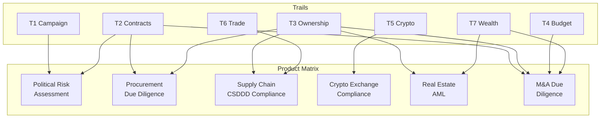

### Product 1: Political Risk Assessment (Trails 1 + 2)
**Target market:** Multinational corporations entering the Argentine market, political risk consultancies, institutional investors.

**Value proposition:** Automated mapping of which politicians received donations from which economic groups, and whether those same groups won government contracts during their tenure. Currently requires weeks of manual research per target.

**Pricing model:** Per-report ($500-$2,000) or subscription ($5K-$15K/yr).

### Product 2: Procurement Due Diligence (Trails 2 + 3)
**Target market:** Government agencies, multilateral development banks (IDB, World Bank, CAF), compliance departments of companies bidding on government contracts.

**Value proposition:** Before awarding or bidding on a contract, screen the counterparty's ownership chain for red flags: offshore entities, sanctioned persons, revolving door connections.

**Pricing model:** Per-query API ($10-$50) or enterprise subscription ($10K-$50K/yr).

### Product 3: Supply Chain / CSDDD Compliance (Trails 3 + 6)
**Target market:** European companies sourcing from Argentina (agriculture, mining, energy), compliance software vendors.

**Value proposition:** The EU CSDDD directive requires due diligence on supply chain partners. This product maps Argentine supplier ownership chains and screens for sanctions, environmental violations, and human rights risks.

**Pricing model:** Annual subscription ($20K-$100K) depending on supply chain complexity.

### Product 4: Crypto Exchange Compliance (Trail 5)
**Target market:** Argentine crypto exchanges (Lemon, Belo, Ripio, Buenbit), international exchanges with Argentine users.

**Value proposition:** On-chain transaction monitoring for Argentine-nexus wallets, sanctions screening, suspicious activity detection. Chainalysis equivalent at a fraction of the cost, focused on Argentine regulatory context.

**Pricing model:** Transaction volume-based ($0.01-$0.05 per screened transaction) or annual ($50K-$200K).

### Product 5: Real Estate AML (Trails 3 + 7)
**Target market:** Real estate developers, notaries (escribanos), banks providing mortgage lending, UIF (Financial Intelligence Unit).

**Value proposition:** Screen property buyers against their declared wealth (DDJJ), corporate ownership chains, and offshore connections. Argentine real estate is a known money laundering vector.

**Pricing model:** Per-transaction ($100-$500) or subscription for high-volume notaries ($5K-$20K/yr).

### Product 6: M&A Due Diligence (Trails 2 + 3 + 4 + 7)
**Target market:** Law firms, investment banks, private equity funds evaluating Argentine acquisitions.

**Value proposition:** Full-spectrum target company analysis: government contract dependencies (Trail 2), beneficial ownership chain (Trail 3), budget exposure (Trail 4), key person wealth and declarations (Trail 7).

**Pricing model:** Per-engagement ($5K-$20K), competing with manual investigations that cost $20K-$100K.

---

## Technical Architecture

### Neo4j Graph Schema

The graph uses `caso_slug` namespacing to isolate investigation-specific entities from platform-wide reference data:

```
Platform scope (no caso_slug):
  (:Company)           - 398K nodes, from IGJ/RNS/OpenCorporates
  (:CompanyOfficer)    - 951K nodes, from IGJ
  (:OffshoreEntity)    - from ICIJ Offshore Leaks
  (:OffshoreOfficer)   - from ICIJ Offshore Leaks

Investigation scope (caso_slug: "caso-finanzas-politicas"):
  (:Person)            - investigation targets
  (:MoneyFlow)         - documented money movements
  (:Event)             - timeline events

Trail-specific (no caso_slug, but trail-identified):
  (:Donor)             - Trail 1, from CNE
  (:Party)             - Trail 1, from CNE
  (:Politician)        - Trail 1, from ComoVoto
  (:Vote)              - Trail 1, from ComoVoto
  (:Legislation)       - Trail 1, from ComoVoto
  (:Contractor)        - Trail 2, from Compr.ar
  (:Contract)          - Trail 2, from Compr.ar
  (:SwornDeclaration)  - Trail 7, from DDJJ
  (:Wallet)            - Trail 5 (planned)
  (:BudgetLine)        - Trail 4 (planned)

Cross-reference relationships:
  [:SAME_ENTITY]       - CUIT match (confidence 1.0)
  [:MAYBE_SAME_AS]     - DNI or name match (confidence 0.8-0.95)
```

### Confidence Tier System

All data enters the graph at a confidence tier that determines its visibility and trustworthiness:

| Tier | Source | Promotion Path | Frontend Visibility |
|------|--------|----------------|:---:|
| **Gold** | Human-curated, court documents, official gazette | Manual review only | Full |
| **Silver** | 2+ independent sources, verified URLs, cross-referenced | Auto-promote from bronze if criteria met | Full |
| **Bronze** | Single source, unverified, raw ETL output | Requires verification | Flagged |

### ETL Pipeline Architecture

Each data source follows a standardized three-stage pipeline:

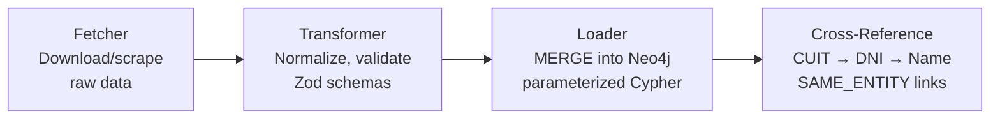

All 10 existing ETL modules follow this pattern:
- `src/etl/{source}/fetcher.ts` - data acquisition
- `src/etl/{source}/transformer.ts` - normalization and validation
- `src/etl/{source}/loader.ts` - Neo4j ingestion with parameterized Cypher

### Cross-Reference Engine

The engine (`src/etl/cross-reference/engine.ts`) runs three matching tiers sequentially, then generates investigation flags:

1. **CUIT matching** (Tier 1) - exact tax ID match, confidence 1.0
2. **DNI matching** (Tier 2) - national ID match, confidence 0.9-0.95
3. **Name matching** (Tier 3) - fuzzy string match, requires fulltext index (not yet active)

Flag detectors:
- `detectContractorDonorFlags()` - Contractor → Company → Officer → Politician → Donor chain
- `detectContractorOffshoreFlags()` - Contractor → Company → Officer → OffshoreOfficer chain

### MiroFish / Qwen Analysis Layer

MiroFish (Qwen 3.5 9B on llama.cpp, localhost:8080) serves as the analysis and reasoning layer:

| Function | File | Purpose |
|----------|------|---------|
| `analyzeProcurementAnomalies()` | `src/lib/mirofish/analysis.ts` | Split contracts, repeat winners, shell companies |
| `analyzeOwnershipChains()` | `src/lib/mirofish/analysis.ts` | Beneficial ownership through corporate layers |
| `analyzePoliticalConnections()` | `src/lib/mirofish/analysis.ts` | Contractor-donor, officer-appointee, family networks |
| Investigation summary | `src/lib/mirofish/prompts.ts` | Bilingual executive summary generation |

Constraints: 8K context window, `enable_thinking: false` (mandatory), sequential processing only (single GPU). See [Investigation Engine Assessment](2026-03-21-investigation-engine-assessment.md) Section 3 for full MiroFish technical profile.

### Frontend Visualization

Graph visualization uses `react-force-graph-2d` with a two-pass query architecture to avoid O(n^2) on large graphs:

| Component | File |
|-----------|------|
| Graph queries | `src/lib/graph/queries.ts` |
| Graph transform | `src/lib/graph/transform.ts` |
| Force graph component | `src/components/graph/ForceGraph.tsx` |
| Subgraph embed | `src/components/investigation/SubGraphEmbed.tsx` |
| API route | `src/app/api/caso/finanzas-politicas/graph/route.ts` |
| Expand API | `src/app/api/graph/expand/[id]/route.ts` |

Query security: 15-second timeout (`QUERY_TIMEOUT_MS`), max 3 expansion depth, max 500 nodes per expand, keyset pagination with opaque cursors.

---

## Implementation Roadmap

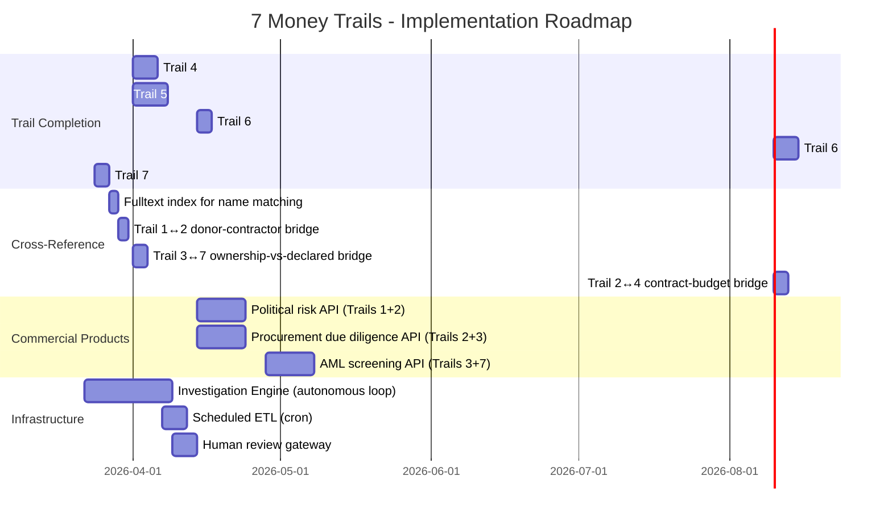

### Phase 1: Complete Core Trails (March-April 2026)
- Build BCRA API wrapper (Trail 7 enrichment) - 3 days
- Create Neo4j fulltext index for name matching - 2 days
- Build donor-contractor cross-reference bridge (Trail 1↔2) - 2 days
- Build ownership-vs-declared bridge (Trail 3↔7) - 3 days

### Phase 2: Expand Coverage (April 2026)
- Budget ETL from Presupuesto Abierto (Trail 4) - 5 days
- Solana transaction fetcher (Trail 5) - 7 days
- OpenSanctions integration (Trail 6) - 3 days
- COMEX aggregate data ingestion (Trail 6) - 5 days

### Phase 3: Commercial API Layer (April-May 2026)
- Political risk API endpoint - 10 days
- Procurement due diligence API - 10 days
- AML screening API - 10 days

### Phase 4: Autonomous Operation (Ongoing)
- Investigation engine (see [Assessment doc](2026-03-21-investigation-engine-assessment.md) Phases 1-6) - 18 days
- Scheduled ETL via cron (BCRA daily, Boletín weekly, RNS/IGJ monthly) - 5 days
- Human review gateway - 5 days

---

## Appendix A: Data Volume Estimates

| Entity Type | Current | 12-Month Projection |
|-------------|--------:|--------------------:|
| Companies (IGJ/RNS) | 398,000 | 450,000 |
| Company Officers | 951,000 | 1,100,000 |
| Government Contracts | 19,818 | 50,000 |
| Campaign Donors | 1,467 | 5,000 |
| DDJJ Entries | 27,720 | 35,000 |
| ICIJ Offshore Entities | ~2,000,000 | ~2,000,000 |
| Wallets (Trail 5) | 0 | 50,000 |
| Budget Lines (Trail 4) | 0 | 10,000 |
| Trade Records (Trail 6) | 0 | 100,000 |
| SAME_ENTITY links | 1,825 | 10,000+ |
| **Total graph nodes** | **~1,400,000** | **~1,700,000** |

## Appendix B: Competitive Landscape

| Competitor | Coverage | Price | Our Advantage |
|-----------|----------|-------|---------------|
| Chainalysis | Crypto only (Trail 5) | $100K+/yr | We add Trails 1-4, 6-7 context |
| OpenCorporates | Corporate only (Trail 3) | $5K-$50K/yr | We add procurement, donations, wealth |
| Sayari | Multi-trail (global) | $50K-$200K/yr | We have deeper Argentine-specific data |
| Kroll/Control Risks | Manual investigations | $20K-$100K/case | We automate at 10% of cost |
| ICIJ | Offshore only (partial Trail 3) | Free (data) | We integrate 6 additional trails |

**Differentiation:** No competitor combines all 7 trails in a single queryable graph. The cross-trail queries in the "Power" section above are impossible in any existing product.

## Appendix C: Regulatory Framework

Each trail operates under specific Argentine and international regulatory authorities:

| Trail | Regulatory Authority | Legal Basis |
|-------|---------------------|-------------|
| 1 Campaign | CNE (Cámara Nacional Electoral) | Ley 26.215 Financiamiento de Partidos |
| 2 Contracts | ONC (Oficina Nacional de Contrataciones) | Decreto 1023/01, Ley 13.064 |
| 3 Ownership | IGJ / RNS | Ley 19.550 Sociedades Comerciales |
| 4 Budget | CGN (Contaduría General de la Nación) | Ley 24.156 Administración Financiera |
| 5 Crypto | CNV + UIF | Resolución CNV 994/2024 |
| 6 Trade | Aduana (AFIP) + SENASA | Código Aduanero, Ley 22.415 |
| 7 Wealth | OA (Oficina Anticorrupción) | Ley 25.188 Ética en la Función Pública |

**Art. 268 (Código Penal):** Illicit enrichment - Trail 7 directly supports detection of unjustified wealth growth by public officials.

**CSDDD (EU Directive 2024):** Corporate sustainability due diligence - Trail 6 + Trail 3 combination provides the data foundation for compliance.

---

*This document is the architectural specification for the 7 Money Trails engine. For the autonomous investigation pipeline that operates on top of this graph, see [Investigation Engine Assessment](2026-03-21-investigation-engine-assessment.md).*
